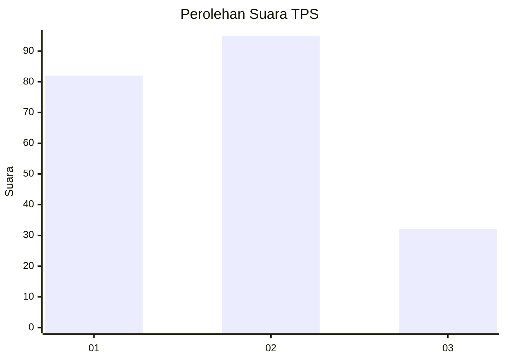
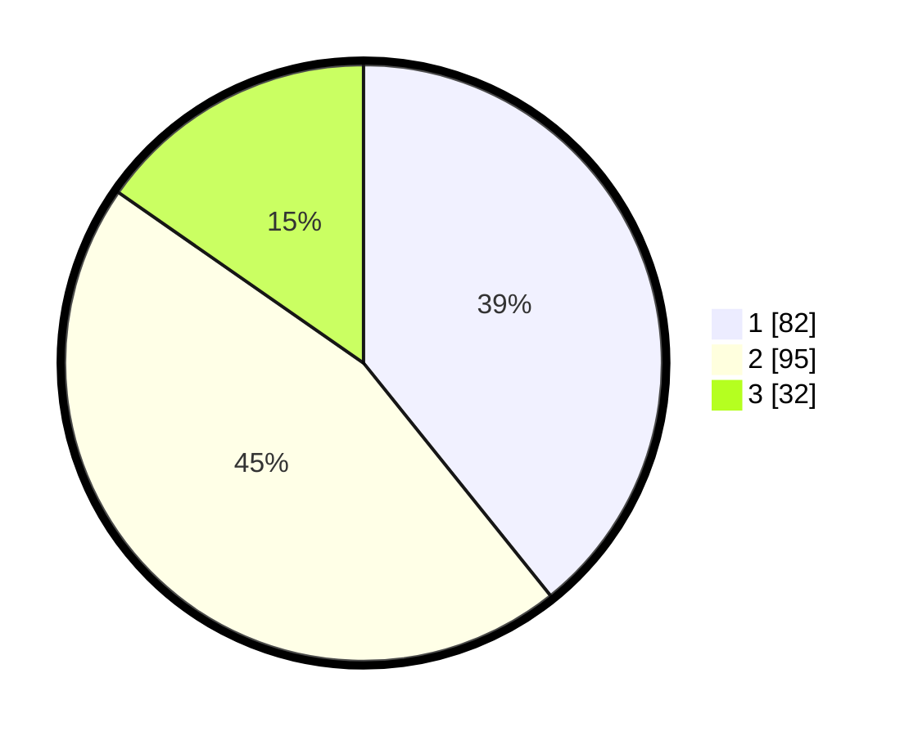

# Hasil

## Grafik

## Tabel

| No. | Nama Paslon    | Suara | Suara (raw) | Persentase |
|:--- |:-------------- | -----:| -----------:| ----------:|
| 1   | ANIES MUHAIMIN | 82    | [82][p-1]   | 39,23      |
| 2   | PRABOWO GIBRAN | 95    | [95][p-2]   | 45,45      |
| 3   | GANJAR MAHFUD  | 32    | [32][p-3]   | 15,31      |

[p-1]: https://github.com/gigit-pemilu/pemilu-2024/blob/main/pilpres/hitung-suara/sub/32-jawa-barat/sub/76-kota-depok/sub/05-sukmajaya/sub/1008-cisalak/sub/030-tps/sub/paslon-1.txt
[p-2]: https://github.com/gigit-pemilu/pemilu-2024/blob/main/pilpres/hitung-suara/sub/32-jawa-barat/sub/76-kota-depok/sub/05-sukmajaya/sub/1008-cisalak/sub/030-tps/sub/paslon-2.txt
[p-3]: https://github.com/gigit-pemilu/pemilu-2024/blob/main/pilpres/hitung-suara/sub/32-jawa-barat/sub/76-kota-depok/sub/05-sukmajaya/sub/1008-cisalak/sub/030-tps/sub/paslon-3.txt

## Foto C Plano

https://sirekap-obj-formc.kpu.go.id/4504/pemilu/ppwp/32/76/05/10/08/3276051008030-20240219-115439--ee48b4f2-9b9e-4a46-a853-e9c0b2bf229e.jpg

https://sirekap-obj-formc.kpu.go.id/4504/pemilu/ppwp/32/76/05/10/08/3276051008030-20240219-115110--7c731d21-3c7a-484f-87f1-839592a9d19b.jpg

https://sirekap-obj-formc.kpu.go.id/4504/pemilu/ppwp/32/76/05/10/08/3276051008030-20240219-115149--3c4b448c-481c-4674-b34b-901b2020fd45.jpg

## Metadata

| Key        | Value               |
| ---------- | ------------------- |
| Time Stamp | 2024-02-19 16:00:00 |

## DATA PEMILIH TETAP

Jumlah pemilih dalam DPT: **255**.
 * L: **522**.
 * P: **579**.

## DATA PENGGUNA HAK PILIH

Jumlah pengguna hak pilih dalam DPT: **254**.
 * L: **304**.
 * P: **407**.

Jumlah pengguna hak pilih dalam DPTb: **562**.
 * L: **255**.
 * P: **582**.

Jumlah pengguna hak pilih dalam DPK: **835**.
 * L: **888**.
 * P: **854**.

Jumlah pengguna hak pilih: **333**.
 * L: **4**.
 * P: **793**.

## JUMLAH SUARA SAH DAN TIDAK SAH

JUMLAH SELURUH SUARA SAH: **209**.

JUMLAH SUARA TIDAK SAH: **4**.

JUMLAH SELURUH SUARA SAH DAN SUARA TIDAK SAH: **213**.

