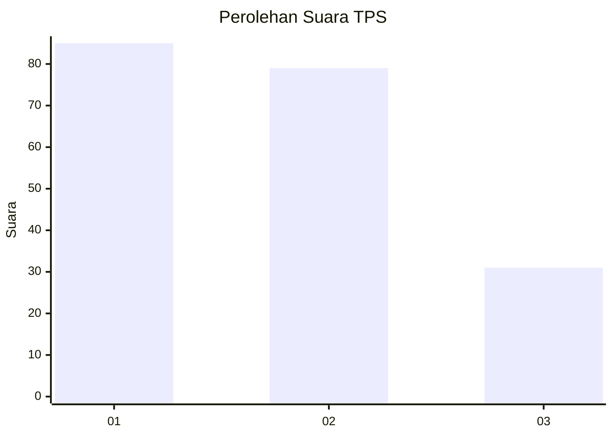
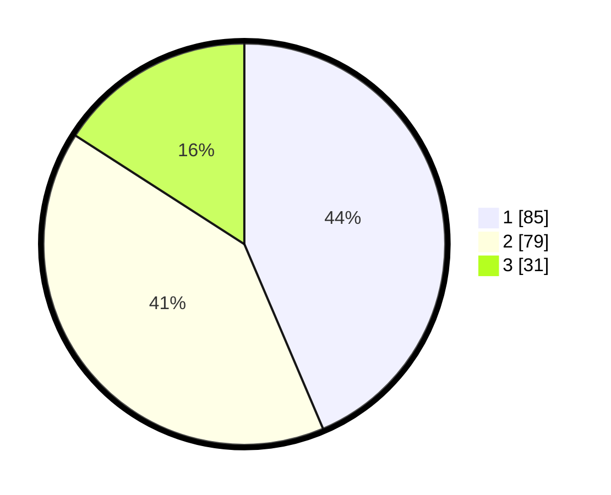

# Hasil

## Grafik

## Tabel

| No. | Nama Paslon    | Suara | Suara (raw) | Persentase |
|:--- |:-------------- | -----:| -----------:| ----------:|
| 1   | ANIES MUHAIMIN | 85    | [85][p-1]   | 43,59      |
| 2   | PRABOWO GIBRAN | 79    | [79][p-2]   | 40,51      |
| 3   | GANJAR MAHFUD  | 31    | [31][p-3]   | 15,90      |

[p-1]: https://github.com/gigit-pemilu/pemilu-2024/blob/main/pilpres/hitung-suara/sub/32-jawa-barat/sub/76-kota-depok/sub/05-sukmajaya/sub/1008-cisalak/sub/035-tps/sub/paslon-1.txt
[p-2]: https://github.com/gigit-pemilu/pemilu-2024/blob/main/pilpres/hitung-suara/sub/32-jawa-barat/sub/76-kota-depok/sub/05-sukmajaya/sub/1008-cisalak/sub/035-tps/sub/paslon-2.txt
[p-3]: https://github.com/gigit-pemilu/pemilu-2024/blob/main/pilpres/hitung-suara/sub/32-jawa-barat/sub/76-kota-depok/sub/05-sukmajaya/sub/1008-cisalak/sub/035-tps/sub/paslon-3.txt

## Foto C Plano

https://sirekap-obj-formc.kpu.go.id/bcd9/pemilu/ppwp/32/76/05/10/08/3276051008035-20240219-134939--7a10c866-7c42-4b1e-a315-e60a69a0cc3a.jpg

https://sirekap-obj-formc.kpu.go.id/bcd9/pemilu/ppwp/32/76/05/10/08/3276051008035-20240219-135336--6beea875-26df-4fee-85d6-0671d5022add.jpg

https://sirekap-obj-formc.kpu.go.id/bcd9/pemilu/ppwp/32/76/05/10/08/3276051008035-20240219-135033--e3249708-2968-496d-888c-fa5ef834a246.jpg

## Metadata

| Key        | Value               |
| ---------- | ------------------- |
| Time Stamp | 2024-02-19 14:00:00 |

## DATA PEMILIH TETAP

Jumlah pemilih dalam DPT: **249**.
 * L: **816**.
 * P: **733**.

## DATA PENGGUNA HAK PILIH

Jumlah pengguna hak pilih dalam DPT: **804**.
 * L: **96**.
 * P: **203**.

Jumlah pengguna hak pilih dalam DPTb: **355**.
 * L: **0**.
 * P: **8**.

Jumlah pengguna hak pilih dalam DPK: **4**.
 * L: **84**.
 * P: **0**.

Jumlah pengguna hak pilih: **695**.
 * L: **55**.
 * P: **803**.

## JUMLAH SUARA SAH DAN TIDAK SAH

JUMLAH SELURUH SUARA SAH: **195**.

JUMLAH SUARA TIDAK SAH: **3**.

JUMLAH SELURUH SUARA SAH DAN SUARA TIDAK SAH: **198**.

