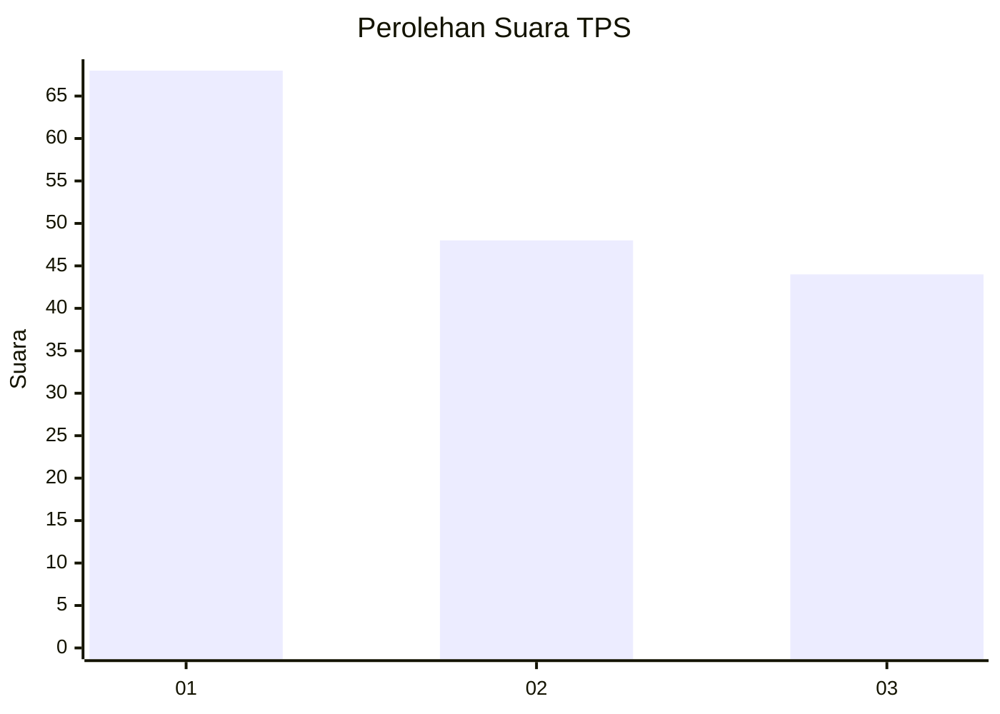
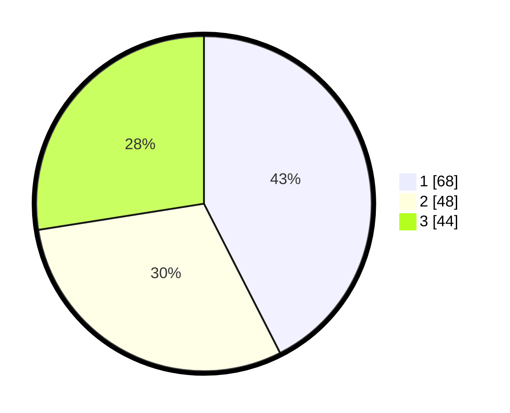

# Hasil

## Grafik

## Tabel

| No. | Nama Paslon    | Suara | Suara (raw) | Persentase |
|:--- |:-------------- | -----:| -----------:| ----------:|
| 1   | ANIES MUHAIMIN | 68    | [68][p-1]   | 42,50      |
| 2   | PRABOWO GIBRAN | 48    | [48][p-2]   | 30,00      |
| 3   | GANJAR MAHFUD  | 44    | [44][p-3]   | 27,50      |

[p-1]: https://github.com/gigit-pemilu/pemilu-2024/blob/main/pilpres/hitung-suara/sub/32-jawa-barat/sub/76-kota-depok/sub/05-sukmajaya/sub/1008-cisalak/sub/042-tps/sub/paslon-1.txt
[p-2]: https://github.com/gigit-pemilu/pemilu-2024/blob/main/pilpres/hitung-suara/sub/32-jawa-barat/sub/76-kota-depok/sub/05-sukmajaya/sub/1008-cisalak/sub/042-tps/sub/paslon-2.txt
[p-3]: https://github.com/gigit-pemilu/pemilu-2024/blob/main/pilpres/hitung-suara/sub/32-jawa-barat/sub/76-kota-depok/sub/05-sukmajaya/sub/1008-cisalak/sub/042-tps/sub/paslon-3.txt

## Foto C Plano

https://sirekap-obj-formc.kpu.go.id/b611/pemilu/ppwp/32/76/05/10/08/3276051008042-20240219-141510--4a487d42-fa84-4b58-8acc-7bf1635ce052.jpg

https://sirekap-obj-formc.kpu.go.id/b611/pemilu/ppwp/32/76/05/10/08/3276051008042-20240219-141722--e55150ab-aa55-4651-870a-97d9d8fa0568.jpg

https://sirekap-obj-formc.kpu.go.id/b611/pemilu/ppwp/32/76/05/10/08/3276051008042-20240219-141635--08ee321e-d144-4acd-a371-01ae96d7fe1b.jpg

## Metadata

| Key        | Value               |
| ---------- | ------------------- |
| Time Stamp | 2024-02-19 16:00:00 |

## DATA PEMILIH TETAP

Jumlah pemilih dalam DPT: **192**.
 * L: **20**.
 * P: **412**.

## DATA PENGGUNA HAK PILIH

Jumlah pengguna hak pilih dalam DPT: **40**.
 * L: **54**.
 * P: **986**.

Jumlah pengguna hak pilih dalam DPTb: **505**.
 * L: **206**.
 * P: **253**.

Jumlah pengguna hak pilih dalam DPK: **220**.
 * L: **30**.
 * P: **192**.

Jumlah pengguna hak pilih: **300**.
 * L: **399**.
 * P: **616**.

## JUMLAH SUARA SAH DAN TIDAK SAH

JUMLAH SELURUH SUARA SAH: **160**.

JUMLAH SUARA TIDAK SAH: **3**.

JUMLAH SELURUH SUARA SAH DAN SUARA TIDAK SAH: **163**.

