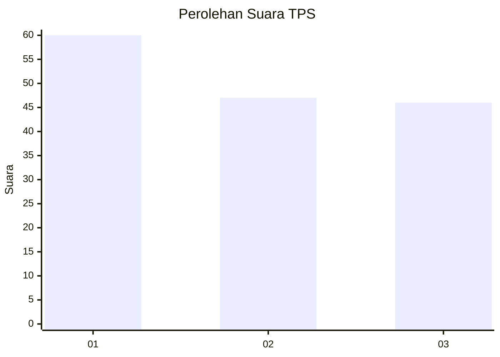
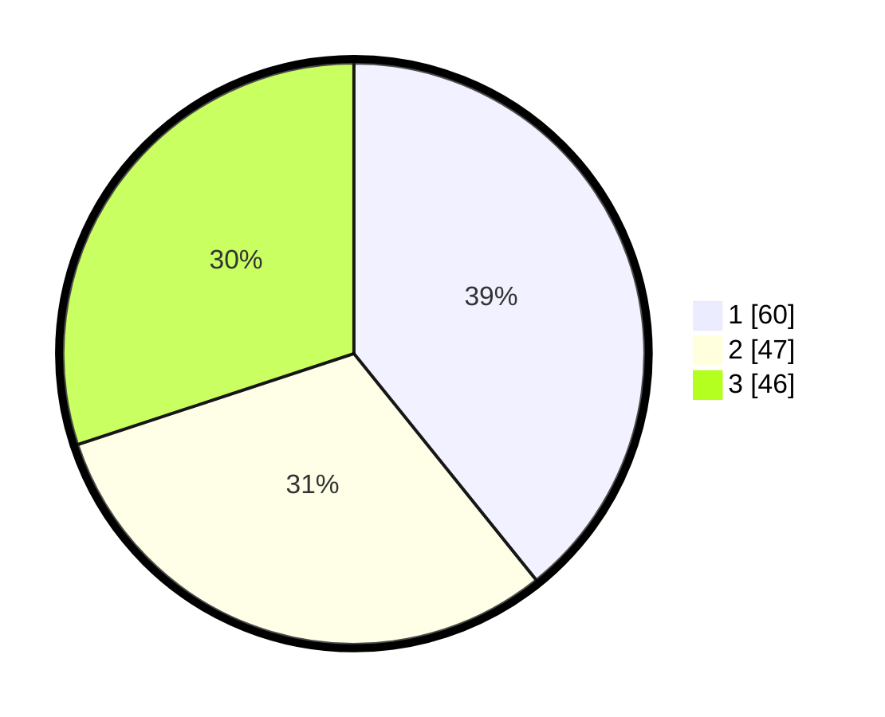

# Hasil

## Grafik

## Tabel

| No. | Nama Paslon    | Suara | Suara (raw) | Persentase |
|:--- |:-------------- | -----:| -----------:| ----------:|
| 1   | ANIES MUHAIMIN | 60    | [60][p-1]   | 39,22      |
| 2   | PRABOWO GIBRAN | 47    | [47][p-2]   | 30,72      |
| 3   | GANJAR MAHFUD  | 46    | [46][p-3]   | 30,07      |

[p-1]: https://github.com/gigit-pemilu/pemilu-2024/blob/main/pilpres/hitung-suara/sub/32-jawa-barat/sub/76-kota-depok/sub/05-sukmajaya/sub/1008-cisalak/sub/043-tps/sub/paslon-1.txt
[p-2]: https://github.com/gigit-pemilu/pemilu-2024/blob/main/pilpres/hitung-suara/sub/32-jawa-barat/sub/76-kota-depok/sub/05-sukmajaya/sub/1008-cisalak/sub/043-tps/sub/paslon-2.txt
[p-3]: https://github.com/gigit-pemilu/pemilu-2024/blob/main/pilpres/hitung-suara/sub/32-jawa-barat/sub/76-kota-depok/sub/05-sukmajaya/sub/1008-cisalak/sub/043-tps/sub/paslon-3.txt

## Foto C Plano

https://sirekap-obj-formc.kpu.go.id/2253/pemilu/ppwp/32/76/05/10/08/3276051008043-20240219-141958--71fc569a-066d-4da1-aeb1-4a8e170a3a94.jpg

https://sirekap-obj-formc.kpu.go.id/2253/pemilu/ppwp/32/76/05/10/08/3276051008043-20240219-142025--2a323463-fc9c-4437-99bc-0cb7f9f8fa94.jpg

https://sirekap-obj-formc.kpu.go.id/2253/pemilu/ppwp/32/76/05/10/08/3276051008043-20240219-142213--fb528201-e51e-4e14-b557-ad8a491efdb5.jpg

## Metadata

| Key        | Value               |
| ---------- | ------------------- |
| Time Stamp | 2024-02-19 16:00:00 |

## DATA PEMILIH TETAP

Jumlah pemilih dalam DPT: **108**.
 * L: **80**.
 * P: **409**.

## DATA PENGGUNA HAK PILIH

Jumlah pengguna hak pilih dalam DPT: **349**.
 * L: **66**.
 * P: **533**.

Jumlah pengguna hak pilih dalam DPTb: **57**.
 * L: **303**.
 * P: **707**.

Jumlah pengguna hak pilih dalam DPK: **300**.
 * L: **848**.
 * P: **480**.

Jumlah pengguna hak pilih: **156**.
 * L: **669**.
 * P: **552**.

## JUMLAH SUARA SAH DAN TIDAK SAH

JUMLAH SELURUH SUARA SAH: **153**.

JUMLAH SUARA TIDAK SAH: **3**.

JUMLAH SELURUH SUARA SAH DAN SUARA TIDAK SAH: **156**.

