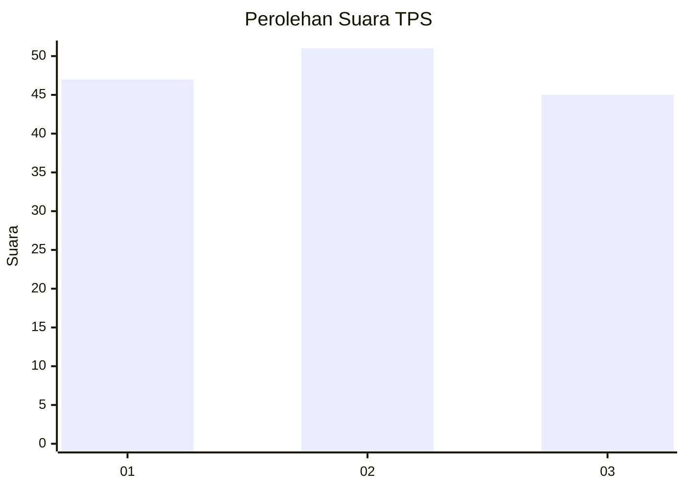
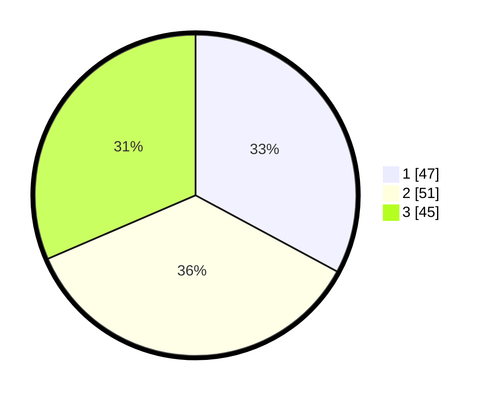

# Hasil

## Grafik

## Tabel

| No. | Nama Paslon    | Suara | Suara (raw) | Persentase |
|:--- |:-------------- | -----:| -----------:| ----------:|
| 1   | ANIES MUHAIMIN | 47    | [47][p-1]   | 32,87      |
| 2   | PRABOWO GIBRAN | 51    | [51][p-2]   | 35,66      |
| 3   | GANJAR MAHFUD  | 45    | [45][p-3]   | 31,47      |

[p-1]: https://github.com/gigit-pemilu/pemilu-2024/blob/main/pilpres/hitung-suara/sub/32-jawa-barat/sub/76-kota-depok/sub/05-sukmajaya/sub/1008-cisalak/sub/044-tps/sub/paslon-1.txt
[p-2]: https://github.com/gigit-pemilu/pemilu-2024/blob/main/pilpres/hitung-suara/sub/32-jawa-barat/sub/76-kota-depok/sub/05-sukmajaya/sub/1008-cisalak/sub/044-tps/sub/paslon-2.txt
[p-3]: https://github.com/gigit-pemilu/pemilu-2024/blob/main/pilpres/hitung-suara/sub/32-jawa-barat/sub/76-kota-depok/sub/05-sukmajaya/sub/1008-cisalak/sub/044-tps/sub/paslon-3.txt

## Foto C Plano

https://sirekap-obj-formc.kpu.go.id/5ce0/pemilu/ppwp/32/76/05/10/08/3276051008044-20240219-142643--b5bd5e90-bec8-47e5-8219-482d0e72cc99.jpg

https://sirekap-obj-formc.kpu.go.id/5ce0/pemilu/ppwp/32/76/05/10/08/3276051008044-20240219-142829--b3c10b2e-3ef5-4ccd-889b-abaeab3de334.jpg

https://sirekap-obj-formc.kpu.go.id/5ce0/pemilu/ppwp/32/76/05/10/08/3276051008044-20240219-142945--d56bd947-83d6-4202-b5ff-e77bd71ffd3f.jpg

## Metadata

| Key        | Value               |
| ---------- | ------------------- |
| Time Stamp | 2024-02-19 16:00:00 |

## DATA PEMILIH TETAP

Jumlah pemilih dalam DPT: **738**.
 * L: **240**.
 * P: **894**.

## DATA PENGGUNA HAK PILIH

Jumlah pengguna hak pilih dalam DPT: **340**.
 * L: **853**.
 * P: **73**.

Jumlah pengguna hak pilih dalam DPTb: **809**.
 * L: **802**.
 * P: **83**.

Jumlah pengguna hak pilih dalam DPK: **0**.
 * L: **8**.
 * P: **20**.

Jumlah pengguna hak pilih: **344**.
 * L: **53**.
 * P: **22**.

## JUMLAH SUARA SAH DAN TIDAK SAH

JUMLAH SELURUH SUARA SAH: **143**.

JUMLAH SUARA TIDAK SAH: **1**.

JUMLAH SELURUH SUARA SAH DAN SUARA TIDAK SAH: **144**.

