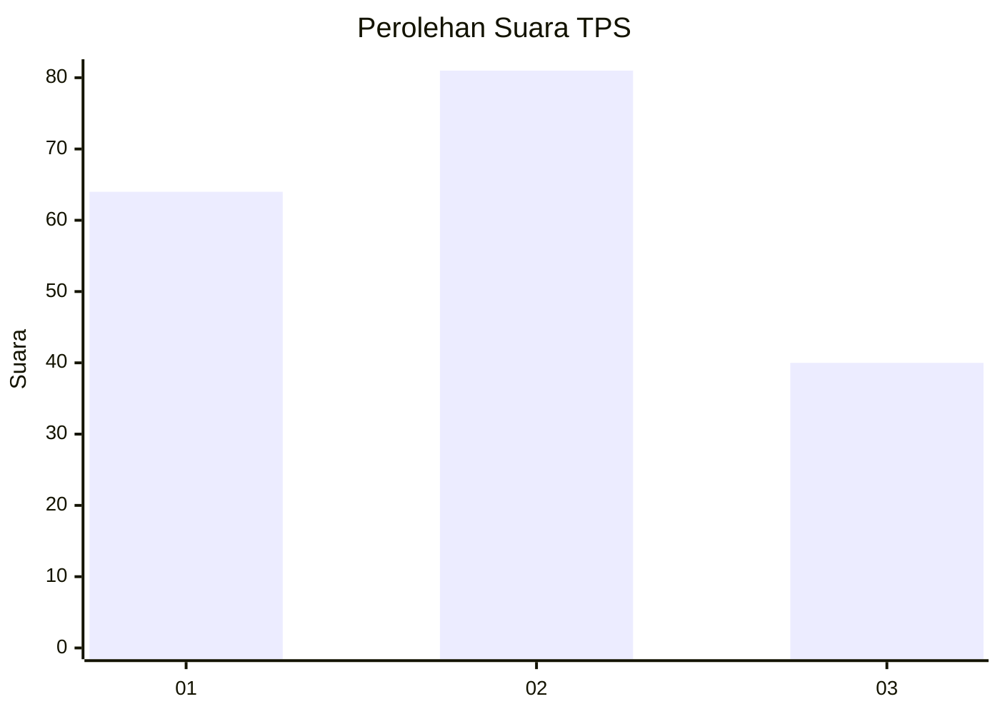
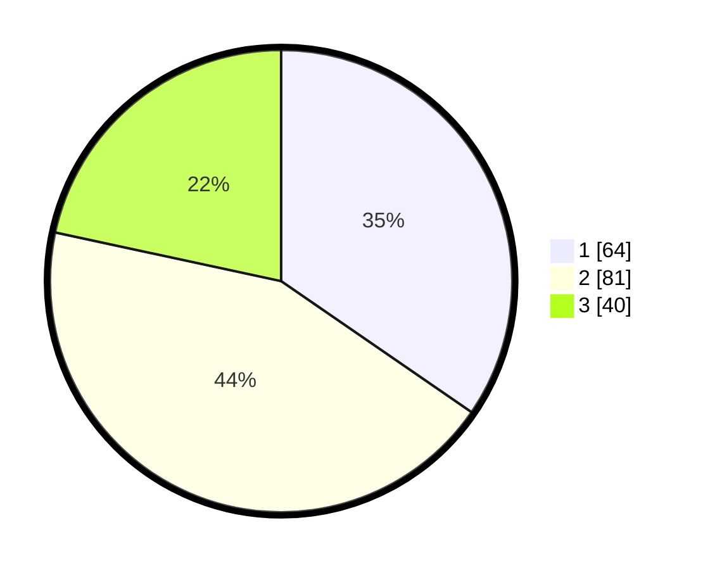

# Hasil

## Grafik

## Tabel

| No. | Nama Paslon    | Suara | Suara (raw) | Persentase |
|:--- |:-------------- | -----:| -----------:| ----------:|
| 1   | ANIES MUHAIMIN | 64    | [64][p-1]   | 34,59      |
| 2   | PRABOWO GIBRAN | 81    | [81][p-2]   | 43,78      |
| 3   | GANJAR MAHFUD  | 40    | [40][p-3]   | 21,62      |

[p-1]: https://github.com/gigit-pemilu/pemilu-2024/blob/main/pilpres/hitung-suara/sub/32-jawa-barat/sub/76-kota-depok/sub/05-sukmajaya/sub/1008-cisalak/sub/048-tps/sub/paslon-1.txt
[p-2]: https://github.com/gigit-pemilu/pemilu-2024/blob/main/pilpres/hitung-suara/sub/32-jawa-barat/sub/76-kota-depok/sub/05-sukmajaya/sub/1008-cisalak/sub/048-tps/sub/paslon-2.txt
[p-3]: https://github.com/gigit-pemilu/pemilu-2024/blob/main/pilpres/hitung-suara/sub/32-jawa-barat/sub/76-kota-depok/sub/05-sukmajaya/sub/1008-cisalak/sub/048-tps/sub/paslon-3.txt

## Foto C Plano

https://sirekap-obj-formc.kpu.go.id/7fd4/pemilu/ppwp/32/76/05/10/08/3276051008048-20240219-144150--5425e9dd-8df3-4e87-abbf-367bcd8ce0c1.jpg

https://sirekap-obj-formc.kpu.go.id/7fd4/pemilu/ppwp/32/76/05/10/08/3276051008048-20240219-144341--06836d13-99d3-42d9-a4e9-6c5438b7897c.jpg

https://sirekap-obj-formc.kpu.go.id/7fd4/pemilu/ppwp/32/76/05/10/08/3276051008048-20240219-144304--005587b3-9eb4-420b-9b40-818a8b998b5d.jpg

## Metadata

| Key        | Value               |
| ---------- | ------------------- |
| Time Stamp | 2024-02-19 16:00:00 |

## DATA PEMILIH TETAP

Jumlah pemilih dalam DPT: **220**.
 * L: **109**.
 * P: **111**.

## DATA PENGGUNA HAK PILIH

Jumlah pengguna hak pilih dalam DPT: **187**.
 * L: **882**.
 * P: **898**.

Jumlah pengguna hak pilih dalam DPTb: **3**.
 * L: **888**.
 * P: **882**.

Jumlah pengguna hak pilih dalam DPK: **82**.
 * L: **881**.
 * P: **888**.

Jumlah pengguna hak pilih: **743**.
 * L: **898**.
 * P: **804**.

## JUMLAH SUARA SAH DAN TIDAK SAH

JUMLAH SELURUH SUARA SAH: **185**.

JUMLAH SUARA TIDAK SAH: **6**.

JUMLAH SELURUH SUARA SAH DAN SUARA TIDAK SAH: **191**.

