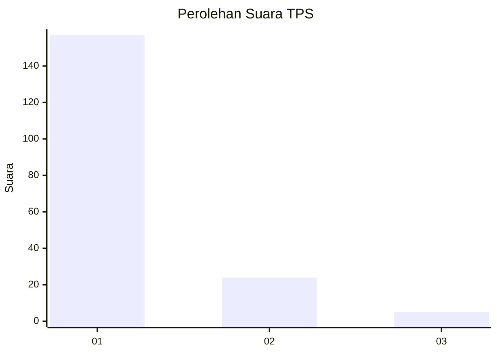
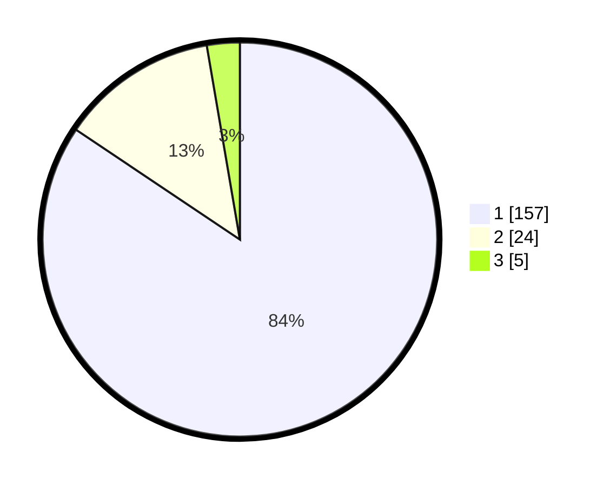

# Hasil

## Grafik

## Tabel

| No. | Nama Paslon    | Suara | Suara (raw) | Persentase |
|:--- |:-------------- | -----:| -----------:| ----------:|
| 1   | ANIES MUHAIMIN | 157   | [157][p-1]  | 84,41      |
| 2   | PRABOWO GIBRAN | 24    | [24][p-2]   | 12,90      |
| 3   | GANJAR MAHFUD  | 5     | [5][p-3]    | 2,69       |

[p-1]: https://github.com/gigit-pemilu/pemilu-2024-32-jawa-barat/blob/main/pilpres/hitung-suara/sub/32-jawa-barat/sub/76-kota-depok/sub/05-sukmajaya/sub/1010-tirtajaya/sub/055-tps/sub/paslon-1.txt
[p-2]: https://github.com/gigit-pemilu/pemilu-2024-32-jawa-barat/blob/main/pilpres/hitung-suara/sub/32-jawa-barat/sub/76-kota-depok/sub/05-sukmajaya/sub/1010-tirtajaya/sub/055-tps/sub/paslon-2.txt
[p-3]: https://github.com/gigit-pemilu/pemilu-2024-32-jawa-barat/blob/main/pilpres/hitung-suara/sub/32-jawa-barat/sub/76-kota-depok/sub/05-sukmajaya/sub/1010-tirtajaya/sub/055-tps/sub/paslon-3.txt

## Foto C Plano

https://sirekap-obj-formc.kpu.go.id/6133/pemilu/ppwp/32/76/05/10/10/3276051010055-20240214-232929--c93ce2f6-7354-4a22-a3e0-960f1380dd79.jpg

https://sirekap-obj-formc.kpu.go.id/6133/pemilu/ppwp/32/76/05/10/10/3276051010055-20240214-231350--54c7339d-67b8-4445-b724-c52ffecf1ba1.jpg

https://sirekap-obj-formc.kpu.go.id/6133/pemilu/ppwp/32/76/05/10/10/3276051010055-20240214-232948--4d7b8fb9-e9d6-4a63-9e61-2c63b518cd85.jpg

## Metadata

| Key        | Value               |
| ---------- | ------------------- |
| Time Stamp | 2024-02-15 20:30:46 |

