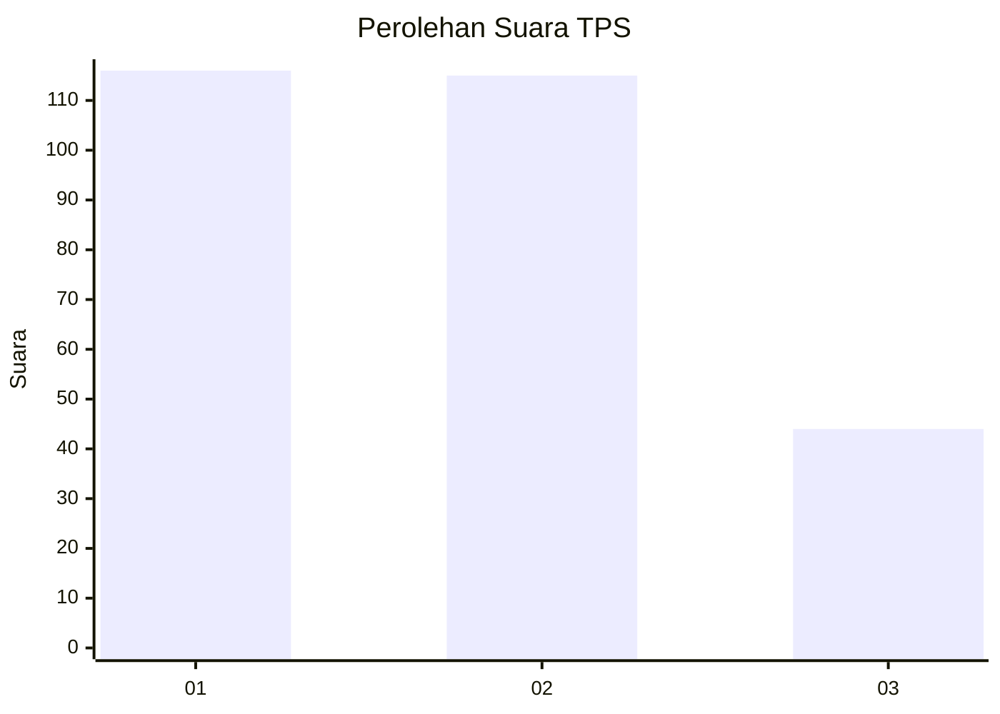
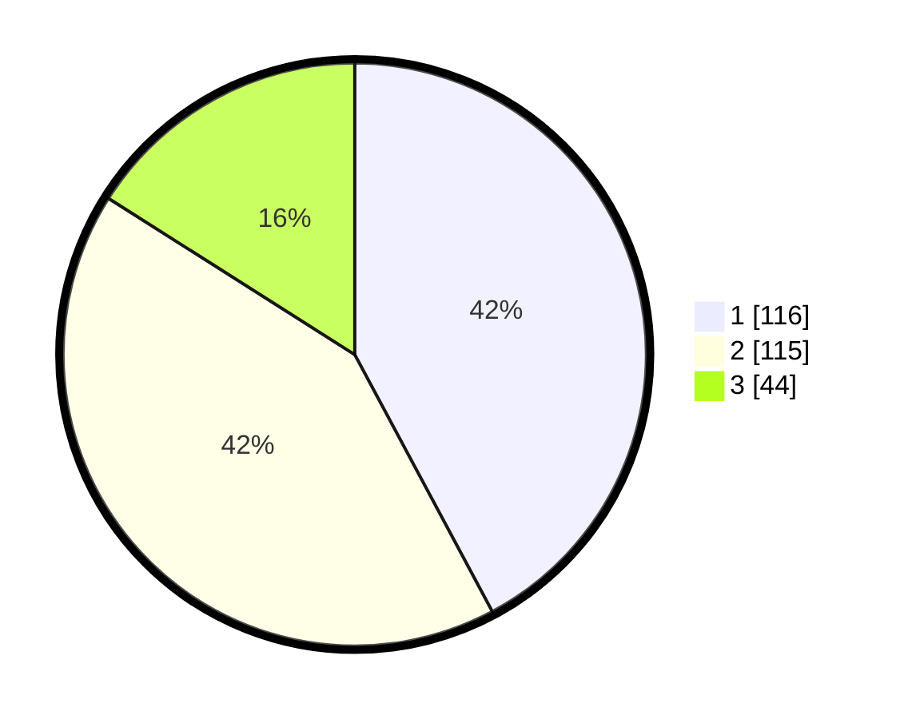

# Hasil

## Grafik

## Tabel

| No. | Nama Paslon    | Suara | Suara (raw) | Persentase |
|:--- |:-------------- | -----:| -----------:| ----------:|
| 1   | ANIES MUHAIMIN | 116   | [116][p-1]  | 42,18      |
| 2   | PRABOWO GIBRAN | 115   | [115][p-2]  | 41,82      |
| 3   | GANJAR MAHFUD  | 44    | [44][p-3]   | 16,00      |

[p-1]: https://github.com/gigit-pemilu/pemilu-2024-32-jawa-barat/blob/main/pilpres/hitung-suara/sub/32-jawa-barat/sub/76-kota-depok/sub/05-sukmajaya/sub/1010-tirtajaya/sub/068-tps/sub/paslon-1.txt
[p-2]: https://github.com/gigit-pemilu/pemilu-2024-32-jawa-barat/blob/main/pilpres/hitung-suara/sub/32-jawa-barat/sub/76-kota-depok/sub/05-sukmajaya/sub/1010-tirtajaya/sub/068-tps/sub/paslon-2.txt
[p-3]: https://github.com/gigit-pemilu/pemilu-2024-32-jawa-barat/blob/main/pilpres/hitung-suara/sub/32-jawa-barat/sub/76-kota-depok/sub/05-sukmajaya/sub/1010-tirtajaya/sub/068-tps/sub/paslon-3.txt

## Foto C Plano

https://sirekap-obj-formc.kpu.go.id/f8c6/pemilu/ppwp/32/76/05/10/10/3276051010068-20240215-233455--47e51715-4531-4c8b-8bb6-fc3a3014ae08.jpg

https://sirekap-obj-formc.kpu.go.id/f8c6/pemilu/ppwp/32/76/05/10/10/3276051010068-20240215-234104--16805e7d-a1f4-481a-a6a7-ed6d6c29153b.jpg

https://sirekap-obj-formc.kpu.go.id/f8c6/pemilu/ppwp/32/76/05/10/10/3276051010068-20240215-234331--96076adb-8928-4408-863f-0d1da41162b6.jpg

## Metadata

| Key        | Value               |
| ---------- | ------------------- |
| Time Stamp | 2024-02-19 17:00:00 |

## DATA PEMILIH TETAP

Jumlah pemilih dalam DPT: **294**.
 * L: **335**.
 * P: **711**.

## DATA PENGGUNA HAK PILIH

Jumlah pengguna hak pilih dalam DPT: **240**.
 * L: **353**.
 * P: **355**.

Jumlah pengguna hak pilih dalam DPTb: **20**.
 * L: **333**.
 * P: **370**.

Jumlah pengguna hak pilih dalam DPK: **18**.
 * L: **533**.
 * P: **350**.

Jumlah pengguna hak pilih: **278**.
 * L: **333**.
 * P: **355**.

## JUMLAH SUARA SAH DAN TIDAK SAH

JUMLAH SELURUH SUARA SAH: **275**.

JUMLAH SUARA TIDAK SAH: **3**.

JUMLAH SELURUH SUARA SAH DAN SUARA TIDAK SAH: **278**.

