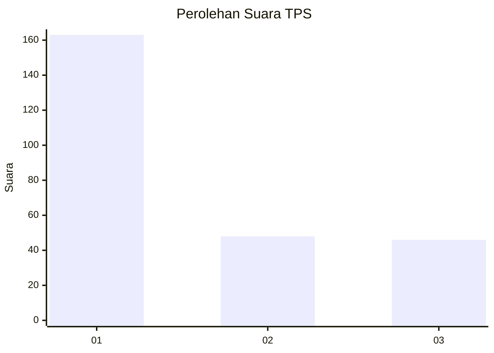
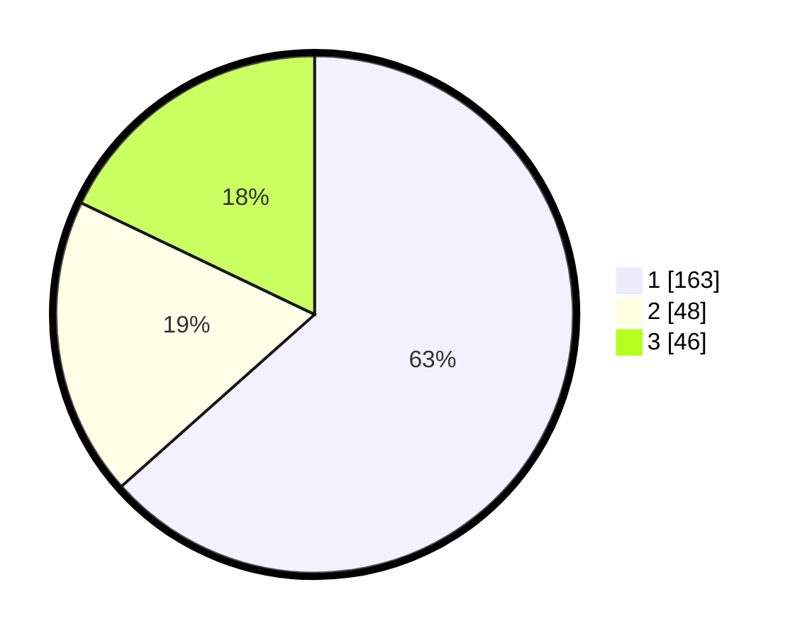

# Hasil

## Grafik

## Tabel

| No. | Nama Paslon    | Suara | Suara (raw) | Persentase |
|:--- |:-------------- | -----:| -----------:| ----------:|
| 1   | ANIES MUHAIMIN | 163   | [163][p-1]  | 63,42      |
| 2   | PRABOWO GIBRAN | 48    | [48][p-2]   | 18,68      |
| 3   | GANJAR MAHFUD  | 46    | [46][p-3]   | 17,90      |

[p-1]: https://github.com/gigit-pemilu/pemilu-2024/blob/main/pilpres/hitung-suara/sub/32-jawa-barat/sub/76-kota-depok/sub/06-beji/sub/1003-tanah-baru/sub/092-tps/sub/paslon-1.txt
[p-2]: https://github.com/gigit-pemilu/pemilu-2024/blob/main/pilpres/hitung-suara/sub/32-jawa-barat/sub/76-kota-depok/sub/06-beji/sub/1003-tanah-baru/sub/092-tps/sub/paslon-2.txt
[p-3]: https://github.com/gigit-pemilu/pemilu-2024/blob/main/pilpres/hitung-suara/sub/32-jawa-barat/sub/76-kota-depok/sub/06-beji/sub/1003-tanah-baru/sub/092-tps/sub/paslon-3.txt

## Foto C Plano

https://sirekap-obj-formc.kpu.go.id/0eb0/pemilu/ppwp/32/76/06/10/03/3276061003092-20240214-214004--441929d0-f416-435e-abfe-7998cdfebba0.jpg

https://sirekap-obj-formc.kpu.go.id/0eb0/pemilu/ppwp/32/76/06/10/03/3276061003092-20240214-214201--cc31dda7-743f-4feb-8bf3-52eb21ff4dc2.jpg

https://sirekap-obj-formc.kpu.go.id/0eb0/pemilu/ppwp/32/76/06/10/03/3276061003092-20240214-214317--5429e28d-f029-48d4-a99b-91e359c68114.jpg

## Metadata

| Key        | Value               |
| ---------- | ------------------- |
| Time Stamp | 2024-02-24 22:31:28 |

