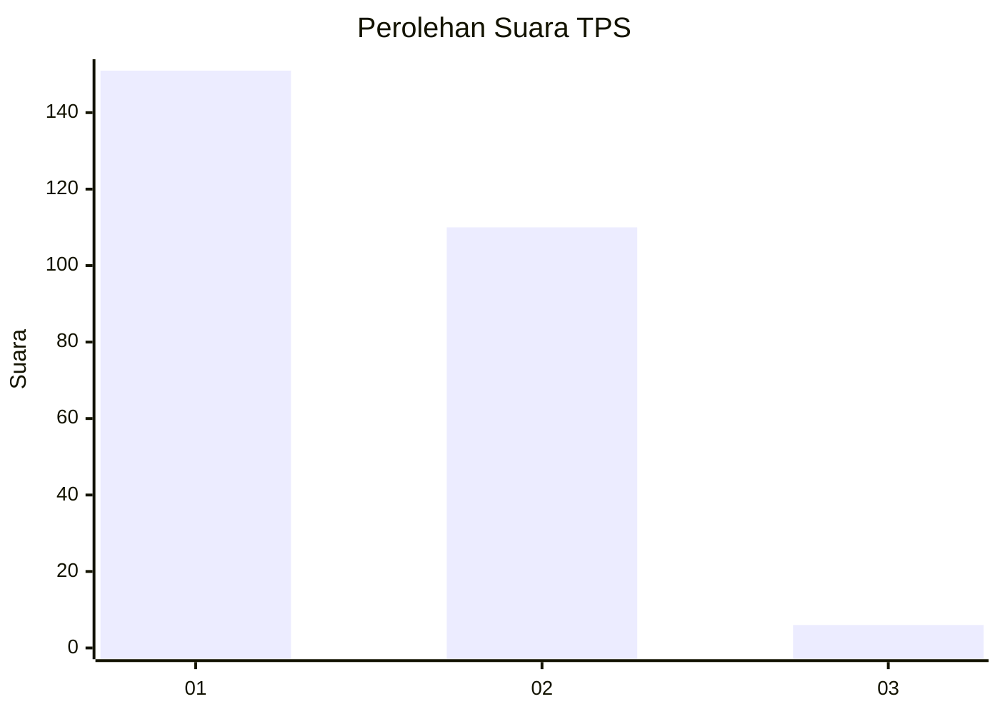
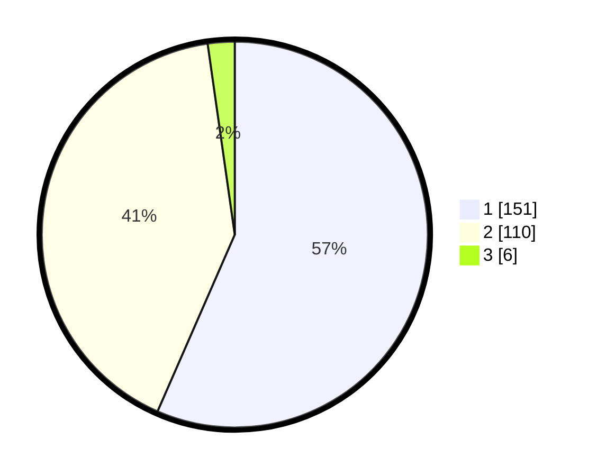

# Hasil

## Grafik

## Tabel

| No. | Nama Paslon    | Suara | Suara (raw) | Persentase |
|:--- |:-------------- | -----:| -----------:| ----------:|
| 1   | ANIES MUHAIMIN | 151   | [151][p-1]  | 56,55      |
| 2   | PRABOWO GIBRAN | 110   | [110][p-2]  | 41,20      |
| 3   | GANJAR MAHFUD  | 6     | [6][p-3]    | 2,25       |

[p-1]: https://github.com/gigit-pemilu/pemilu-2024/blob/main/pilpres/hitung-suara/sub/32-jawa-barat/sub/76-kota-depok/sub/07-cipayung/sub/1002-cipayung-jaya/sub/009-tps/sub/paslon-1.txt
[p-2]: https://github.com/gigit-pemilu/pemilu-2024/blob/main/pilpres/hitung-suara/sub/32-jawa-barat/sub/76-kota-depok/sub/07-cipayung/sub/1002-cipayung-jaya/sub/009-tps/sub/paslon-2.txt
[p-3]: https://github.com/gigit-pemilu/pemilu-2024/blob/main/pilpres/hitung-suara/sub/32-jawa-barat/sub/76-kota-depok/sub/07-cipayung/sub/1002-cipayung-jaya/sub/009-tps/sub/paslon-3.txt

## Foto C Plano

https://sirekap-obj-formc.kpu.go.id/0de2/pemilu/ppwp/32/76/07/10/02/3276071002009-20240216-192010--9210e7ac-0512-4d6b-ac20-21186eb64c76.jpg

https://sirekap-obj-formc.kpu.go.id/0de2/pemilu/ppwp/32/76/07/10/02/3276071002009-20240216-192102--90aa7fca-38ca-40af-9443-0e9f01a9f372.jpg

https://sirekap-obj-formc.kpu.go.id/0de2/pemilu/ppwp/32/76/07/10/02/3276071002009-20240216-192150--167afaf3-5742-4a4f-aa21-b11db3aff111.jpg

## Metadata

| Key        | Value               |
| ---------- | ------------------- |
| Time Stamp | 2024-02-19 06:16:00 |

