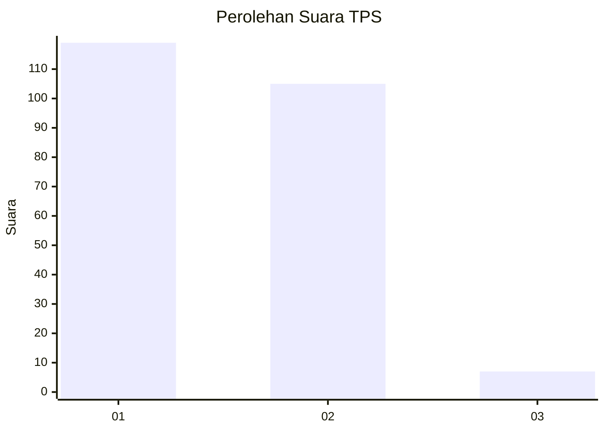
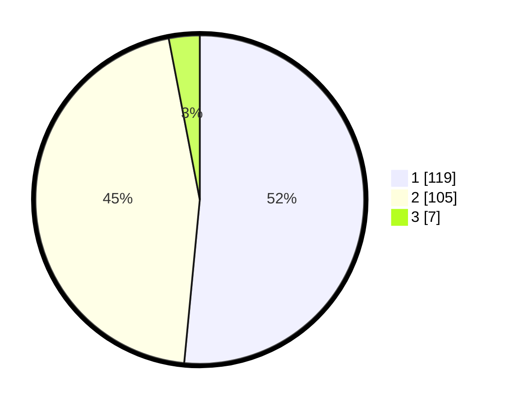

# Hasil

## Grafik

## Tabel

| No. | Nama Paslon    | Suara | Suara (raw) | Persentase |
|:--- |:-------------- | -----:| -----------:| ----------:|
| 1   | ANIES MUHAIMIN | 119   | [119][p-1]  | 51,52      |
| 2   | PRABOWO GIBRAN | 105   | [105][p-2]  | 45,45      |
| 3   | GANJAR MAHFUD  | 7     | [7][p-3]    | 3,03       |

[p-1]: https://github.com/gigit-pemilu/pemilu-2024/blob/main/pilpres/hitung-suara/sub/32-jawa-barat/sub/76-kota-depok/sub/07-cipayung/sub/1004-bojong-pondok-terong/sub/001-tps/sub/paslon-1.txt
[p-2]: https://github.com/gigit-pemilu/pemilu-2024/blob/main/pilpres/hitung-suara/sub/32-jawa-barat/sub/76-kota-depok/sub/07-cipayung/sub/1004-bojong-pondok-terong/sub/001-tps/sub/paslon-2.txt
[p-3]: https://github.com/gigit-pemilu/pemilu-2024/blob/main/pilpres/hitung-suara/sub/32-jawa-barat/sub/76-kota-depok/sub/07-cipayung/sub/1004-bojong-pondok-terong/sub/001-tps/sub/paslon-3.txt

## Foto C Plano

https://sirekap-obj-formc.kpu.go.id/f98a/pemilu/ppwp/32/76/07/10/04/3276071004001-20240214-230717--a4b0c55d-e557-4f24-9864-64b9ca73ac22.jpg

https://sirekap-obj-formc.kpu.go.id/f98a/pemilu/ppwp/32/76/07/10/04/3276071004001-20240214-231326--310f7124-aff2-4f5e-b405-f72aab41a330.jpg

https://sirekap-obj-formc.kpu.go.id/f98a/pemilu/ppwp/32/76/07/10/04/3276071004001-20240214-231618--fae6f546-e941-45e3-8c84-762b605791ce.jpg

## Metadata

| Key        | Value               |
| ---------- | ------------------- |
| Time Stamp | 2024-02-15 16:00:26 |

