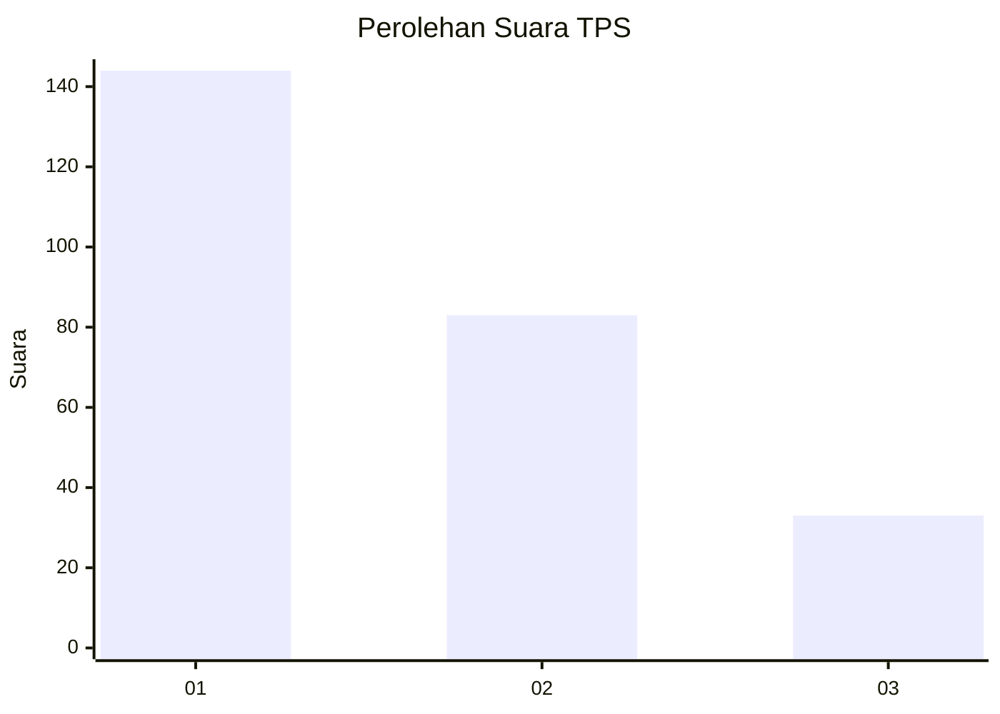
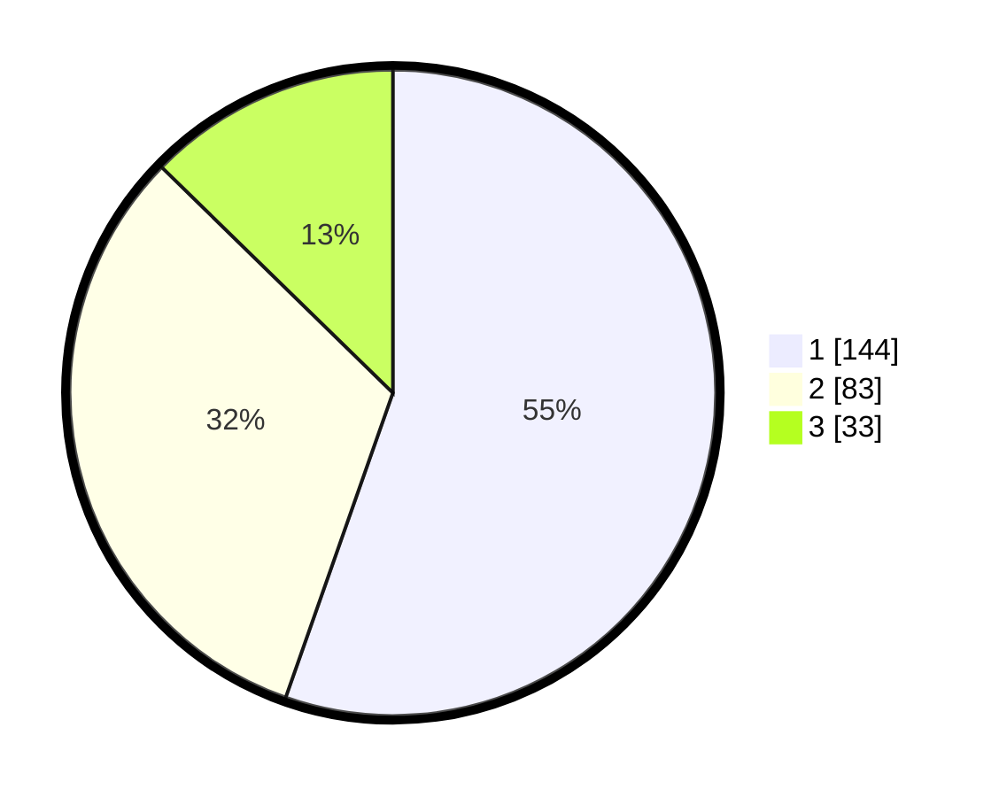

# Hasil

## Grafik

## Tabel

| No. | Nama Paslon    | Suara | Suara (raw) | Persentase |
|:--- |:-------------- | -----:| -----------:| ----------:|
| 1   | ANIES MUHAIMIN | 144   | [144][p-1]  | 55,38      |
| 2   | PRABOWO GIBRAN | 83    | [83][p-2]   | 31,92      |
| 3   | GANJAR MAHFUD  | 33    | [33][p-3]   | 12,69      |

[p-1]: https://github.com/gigit-pemilu/pemilu-2024/blob/main/pilpres/hitung-suara/sub/32-jawa-barat/sub/76-kota-depok/sub/07-cipayung/sub/1005-pondok-jaya/sub/069-tps/sub/paslon-1.txt
[p-2]: https://github.com/gigit-pemilu/pemilu-2024/blob/main/pilpres/hitung-suara/sub/32-jawa-barat/sub/76-kota-depok/sub/07-cipayung/sub/1005-pondok-jaya/sub/069-tps/sub/paslon-2.txt
[p-3]: https://github.com/gigit-pemilu/pemilu-2024/blob/main/pilpres/hitung-suara/sub/32-jawa-barat/sub/76-kota-depok/sub/07-cipayung/sub/1005-pondok-jaya/sub/069-tps/sub/paslon-3.txt

## Foto C Plano

https://sirekap-obj-formc.kpu.go.id/0808/pemilu/ppwp/32/76/07/10/05/3276071005069-20240215-052617--c9355f39-f516-4580-bc5b-872ac81df798.jpg

https://sirekap-obj-formc.kpu.go.id/0808/pemilu/ppwp/32/76/07/10/05/3276071005069-20240215-052645--50cda081-66ec-4291-890e-5ddbdf134e92.jpg

https://sirekap-obj-formc.kpu.go.id/0808/pemilu/ppwp/32/76/07/10/05/3276071005069-20240215-052708--e45a217c-b289-4701-b5f7-393d8566425a.jpg

## Metadata

| Key        | Value               |
| ---------- | ------------------- |
| Time Stamp | 2024-02-15 17:30:25 |

