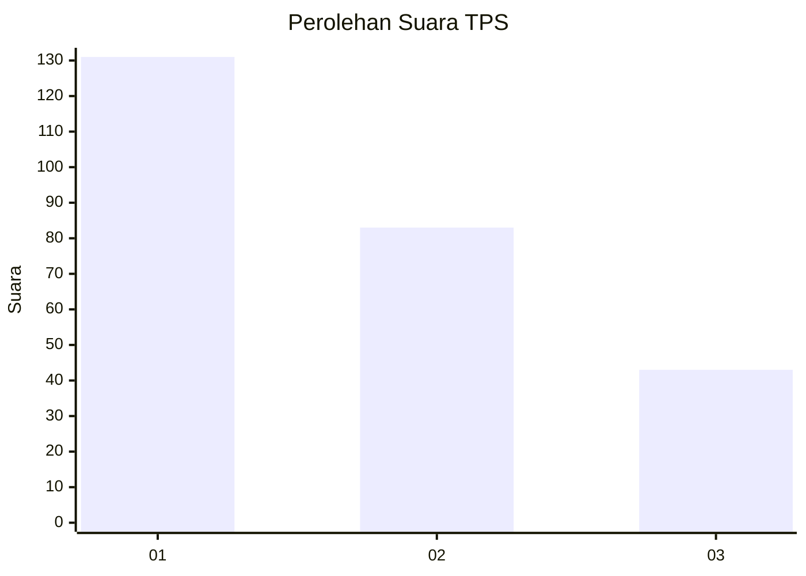
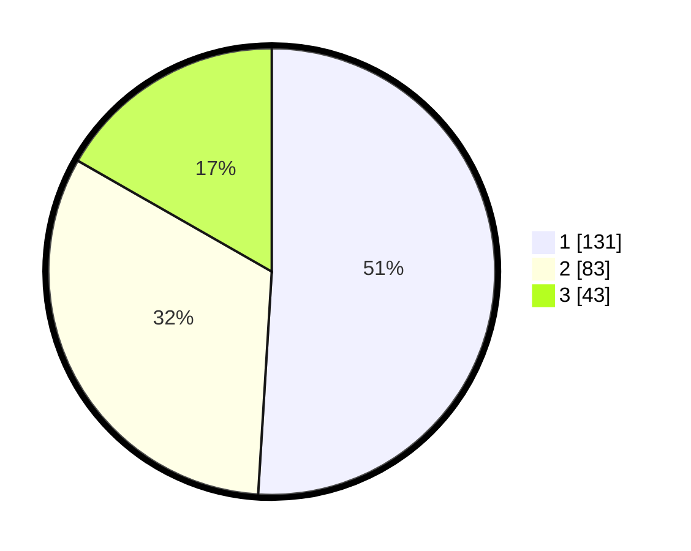

# Hasil

## Grafik

## Tabel

| No. | Nama Paslon    | Suara | Suara (raw) | Persentase |
|:--- |:-------------- | -----:| -----------:| ----------:|
| 1   | ANIES MUHAIMIN | 131   | [131][p-1]  | 50,97      |
| 2   | PRABOWO GIBRAN | 83    | [83][p-2]   | 32,30      |
| 3   | GANJAR MAHFUD  | 43    | [43][p-3]   | 16,73      |

[p-1]: https://github.com/gigit-pemilu/pemilu-2024/blob/main/pilpres/hitung-suara/sub/32-jawa-barat/sub/76-kota-depok/sub/07-cipayung/sub/1005-pondok-jaya/sub/071-tps/sub/paslon-1.txt
[p-2]: https://github.com/gigit-pemilu/pemilu-2024/blob/main/pilpres/hitung-suara/sub/32-jawa-barat/sub/76-kota-depok/sub/07-cipayung/sub/1005-pondok-jaya/sub/071-tps/sub/paslon-2.txt
[p-3]: https://github.com/gigit-pemilu/pemilu-2024/blob/main/pilpres/hitung-suara/sub/32-jawa-barat/sub/76-kota-depok/sub/07-cipayung/sub/1005-pondok-jaya/sub/071-tps/sub/paslon-3.txt

## Foto C Plano

https://sirekap-obj-formc.kpu.go.id/5148/pemilu/ppwp/32/76/07/10/05/3276071005071-20240215-013259--beb45078-2502-40a5-811a-3cc503b60471.jpg

https://sirekap-obj-formc.kpu.go.id/5148/pemilu/ppwp/32/76/07/10/05/3276071005071-20240215-013352--bed16013-3a3b-403e-8b0a-36ac74fb53b3.jpg

https://sirekap-obj-formc.kpu.go.id/5148/pemilu/ppwp/32/76/07/10/05/3276071005071-20240215-013438--55ff0492-12f9-4f5d-b261-464a1999a244.jpg

## Metadata

| Key        | Value               |
| ---------- | ------------------- |
| Time Stamp | 2024-02-15 17:30:25 |

