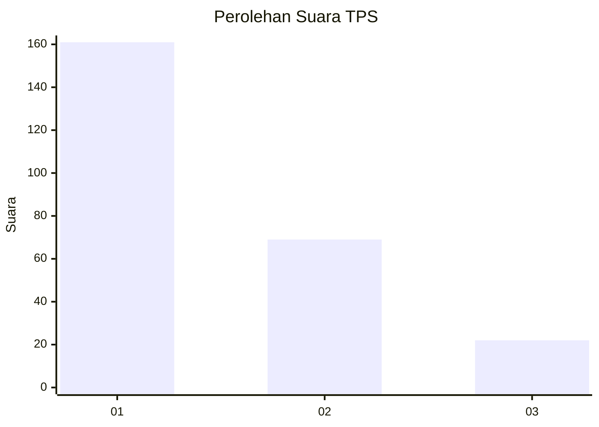
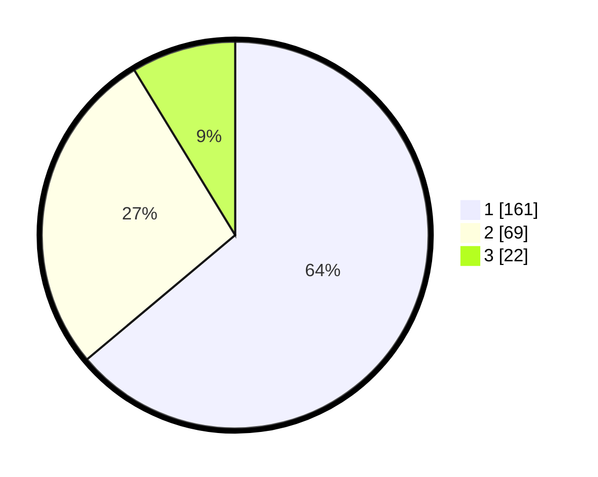

# Hasil

## Grafik

## Tabel

| No. | Nama Paslon    | Suara | Suara (raw) | Persentase |
|:--- |:-------------- | -----:| -----------:| ----------:|
| 1   | ANIES MUHAIMIN | 161   | [161][p-1]  | 63,89      |
| 2   | PRABOWO GIBRAN | 69    | [69][p-2]   | 27,38      |
| 3   | GANJAR MAHFUD  | 22    | [22][p-3]   | 8,73       |

[p-1]: https://github.com/gigit-pemilu/pemilu-2024/blob/main/pilpres/hitung-suara/sub/32-jawa-barat/sub/76-kota-depok/sub/08-cilodong/sub/1001-sukamaju/sub/146-tps/sub/paslon-1.txt
[p-2]: https://github.com/gigit-pemilu/pemilu-2024/blob/main/pilpres/hitung-suara/sub/32-jawa-barat/sub/76-kota-depok/sub/08-cilodong/sub/1001-sukamaju/sub/146-tps/sub/paslon-2.txt
[p-3]: https://github.com/gigit-pemilu/pemilu-2024/blob/main/pilpres/hitung-suara/sub/32-jawa-barat/sub/76-kota-depok/sub/08-cilodong/sub/1001-sukamaju/sub/146-tps/sub/paslon-3.txt

## Foto C Plano

https://sirekap-obj-formc.kpu.go.id/17f6/pemilu/ppwp/32/76/08/10/01/3276081001146-20240214-225122--93d2b33f-966a-4fb1-8a8e-a2fe7fdbe888.jpg

https://sirekap-obj-formc.kpu.go.id/17f6/pemilu/ppwp/32/76/08/10/01/3276081001146-20240215-022139--7947a2d9-7390-4947-9e71-d914f8aac185.jpg

https://sirekap-obj-formc.kpu.go.id/17f6/pemilu/ppwp/32/76/08/10/01/3276081001146-20240215-022254--9a6abf60-4460-47cd-ae67-7701f6e7b3e0.jpg

## Metadata

| Key        | Value               |
| ---------- | ------------------- |
| Time Stamp | 2024-02-15 15:00:29 |

