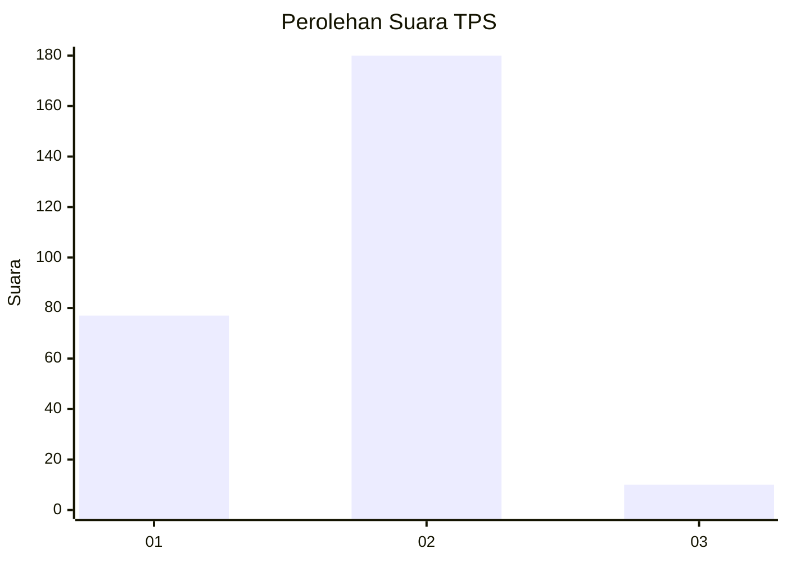
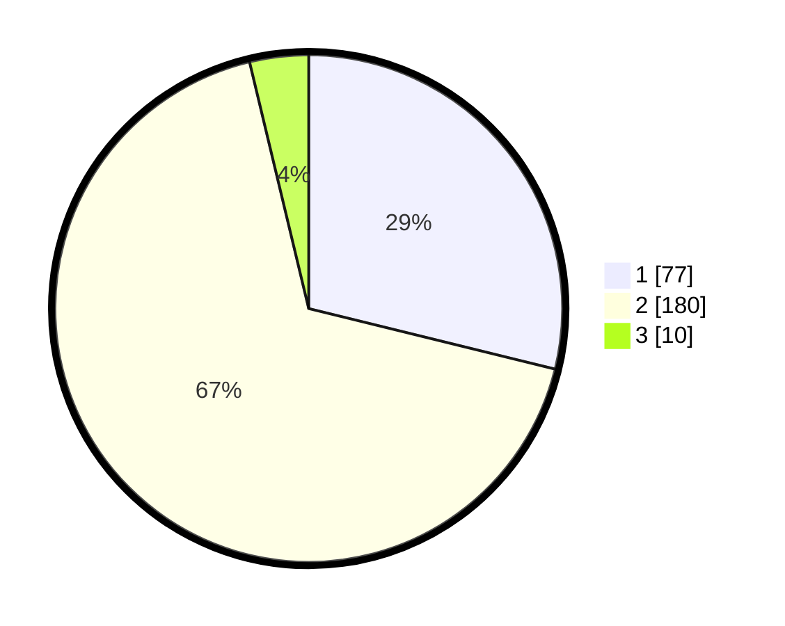

# Hasil

## Grafik

## Tabel

| No. | Nama Paslon    | Suara | Suara (raw) | Persentase |
|:--- |:-------------- | -----:| -----------:| ----------:|
| 1   | ANIES MUHAIMIN | 77    | [77][p-1]   | 28,84      |
| 2   | PRABOWO GIBRAN | 180   | [180][p-2]  | 67,42      |
| 3   | GANJAR MAHFUD  | 10    | [10][p-3]   | 3,75       |

[p-1]: https://github.com/gigit-pemilu/pemilu-2024-32-jawa-barat/blob/main/pilpres/hitung-suara/sub/32-jawa-barat/sub/76-kota-depok/sub/08-cilodong/sub/1002-cilodong/sub/017-tps/sub/paslon-1.txt
[p-2]: https://github.com/gigit-pemilu/pemilu-2024-32-jawa-barat/blob/main/pilpres/hitung-suara/sub/32-jawa-barat/sub/76-kota-depok/sub/08-cilodong/sub/1002-cilodong/sub/017-tps/sub/paslon-2.txt
[p-3]: https://github.com/gigit-pemilu/pemilu-2024-32-jawa-barat/blob/main/pilpres/hitung-suara/sub/32-jawa-barat/sub/76-kota-depok/sub/08-cilodong/sub/1002-cilodong/sub/017-tps/sub/paslon-3.txt

## Foto C Plano

https://sirekap-obj-formc.kpu.go.id/5757/pemilu/ppwp/32/76/08/10/02/3276081002017-20240214-213447--15bdd99b-7d07-4f6f-94af-db0ceeb3a880.jpg

https://sirekap-obj-formc.kpu.go.id/5757/pemilu/ppwp/32/76/08/10/02/3276081002017-20240215-032000--86e0487d-a9d7-4cca-91f4-8e786503e565.jpg

https://sirekap-obj-formc.kpu.go.id/5757/pemilu/ppwp/32/76/08/10/02/3276081002017-20240215-031732--928a8ce9-43b5-42eb-93ed-55e1afbe4fb0.jpg

## Metadata

| Key        | Value               |
| ---------- | ------------------- |
| Time Stamp | 2024-02-15 18:30:25 |

