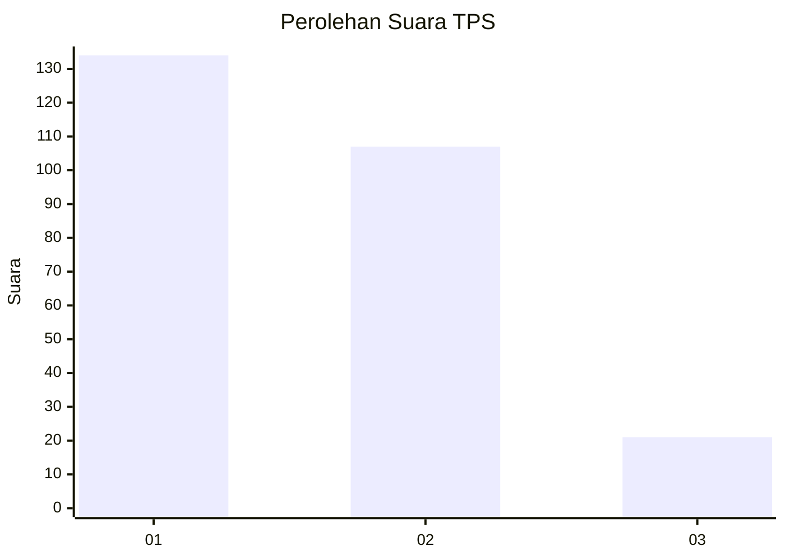
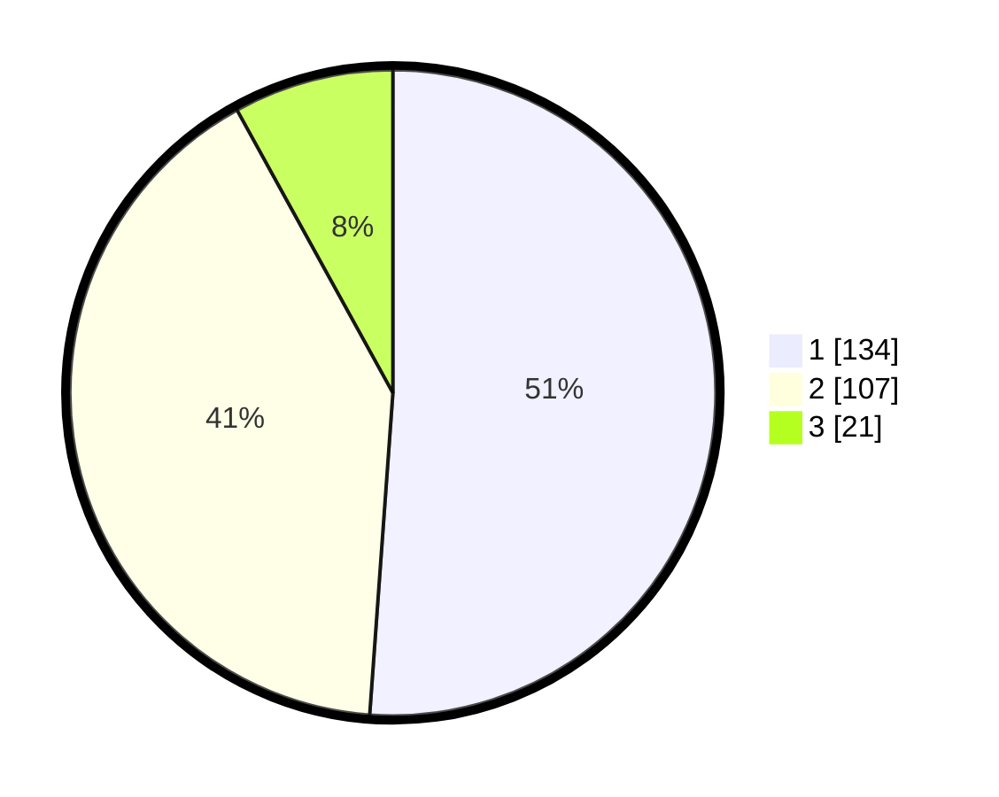

# Hasil

## Grafik

## Tabel

| No. | Nama Paslon    | Suara | Suara (raw) | Persentase |
|:--- |:-------------- | -----:| -----------:| ----------:|
| 1   | ANIES MUHAIMIN | 134   | [134][p-1]  | 51,15      |
| 2   | PRABOWO GIBRAN | 107   | [107][p-2]  | 40,84      |
| 3   | GANJAR MAHFUD  | 21    | [21][p-3]   | 8,02       |

[p-1]: https://github.com/gigit-pemilu/pemilu-2024/blob/main/pilpres/hitung-suara/sub/32-jawa-barat/sub/76-kota-depok/sub/08-cilodong/sub/1004-kalimulya/sub/005-tps/sub/paslon-1.txt
[p-2]: https://github.com/gigit-pemilu/pemilu-2024/blob/main/pilpres/hitung-suara/sub/32-jawa-barat/sub/76-kota-depok/sub/08-cilodong/sub/1004-kalimulya/sub/005-tps/sub/paslon-2.txt
[p-3]: https://github.com/gigit-pemilu/pemilu-2024/blob/main/pilpres/hitung-suara/sub/32-jawa-barat/sub/76-kota-depok/sub/08-cilodong/sub/1004-kalimulya/sub/005-tps/sub/paslon-3.txt

## Foto C Plano

https://sirekap-obj-formc.kpu.go.id/a73e/pemilu/ppwp/32/76/08/10/04/3276081004005-20240219-210951--20017301-fdfe-48db-8c99-effc4720d0f4.jpg

https://sirekap-obj-formc.kpu.go.id/a73e/pemilu/ppwp/32/76/08/10/04/3276081004005-20240219-210811--63af9e93-586b-45b9-9228-ecb3cc901400.jpg

https://sirekap-obj-formc.kpu.go.id/a73e/pemilu/ppwp/32/76/08/10/04/3276081004005-20240219-210427--55b890e0-ad6a-4679-9f3e-eca08e2cbf6c.jpg

## Metadata

| Key        | Value               |
| ---------- | ------------------- |
| Time Stamp | 2024-02-22 12:00:00 |

