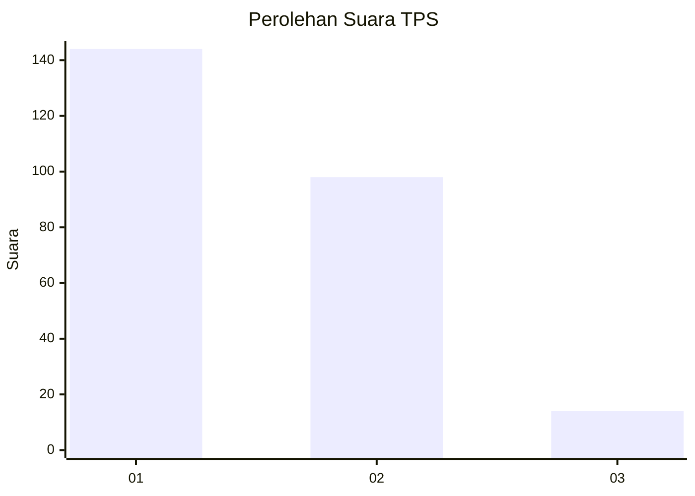
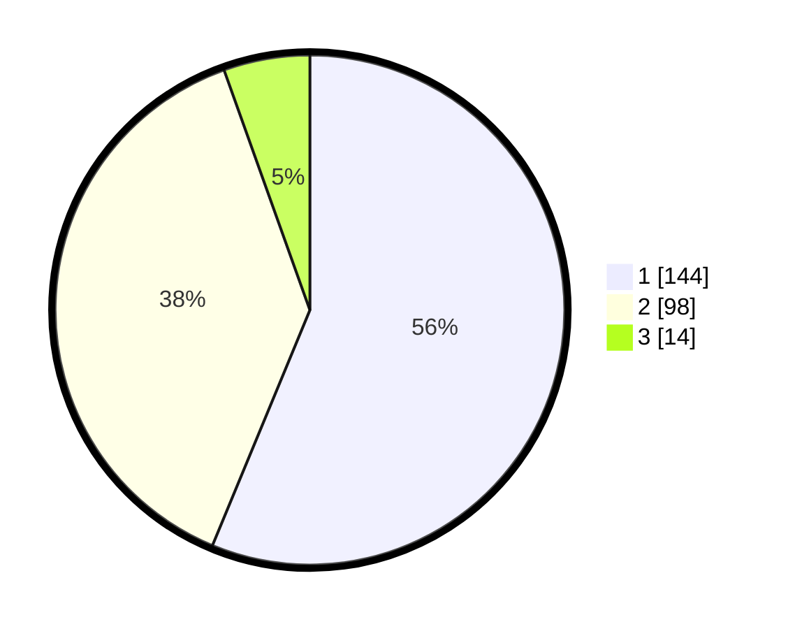

# Hasil

## Grafik

## Tabel

| No. | Nama Paslon    | Suara | Suara (raw) | Persentase |
|:--- |:-------------- | -----:| -----------:| ----------:|
| 1   | ANIES MUHAIMIN | 144   | [144][p-1]  | 56,25      |
| 2   | PRABOWO GIBRAN | 98    | [98][p-2]   | 38,28      |
| 3   | GANJAR MAHFUD  | 14    | [14][p-3]   | 5,47       |

[p-1]: https://github.com/gigit-pemilu/pemilu-2024/blob/main/pilpres/hitung-suara/sub/32-jawa-barat/sub/76-kota-depok/sub/08-cilodong/sub/1004-kalimulya/sub/040-tps/sub/paslon-1.txt
[p-2]: https://github.com/gigit-pemilu/pemilu-2024/blob/main/pilpres/hitung-suara/sub/32-jawa-barat/sub/76-kota-depok/sub/08-cilodong/sub/1004-kalimulya/sub/040-tps/sub/paslon-2.txt
[p-3]: https://github.com/gigit-pemilu/pemilu-2024/blob/main/pilpres/hitung-suara/sub/32-jawa-barat/sub/76-kota-depok/sub/08-cilodong/sub/1004-kalimulya/sub/040-tps/sub/paslon-3.txt

## Foto C Plano

https://sirekap-obj-formc.kpu.go.id/3606/pemilu/ppwp/32/76/08/10/04/3276081004040-20240214-215736--7c6e7393-4d76-4f22-a268-7431b877ba81.jpg

https://sirekap-obj-formc.kpu.go.id/3606/pemilu/ppwp/32/76/08/10/04/3276081004040-20240214-220132--26d0f11e-97b8-4e47-884c-8bf1d7c4d47a.jpg

https://sirekap-obj-formc.kpu.go.id/3606/pemilu/ppwp/32/76/08/10/04/3276081004040-20240214-220032--2afc399c-9258-44c3-867a-ad93a98eb9f0.jpg

## Metadata

| Key        | Value               |
| ---------- | ------------------- |
| Time Stamp | 2024-02-16 00:00:26 |

