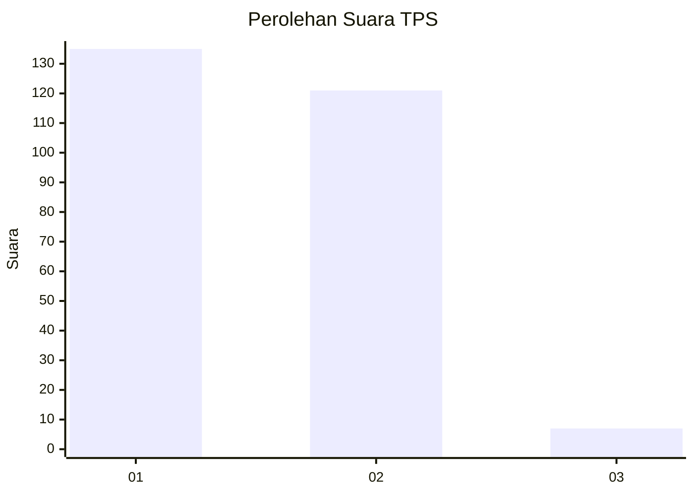
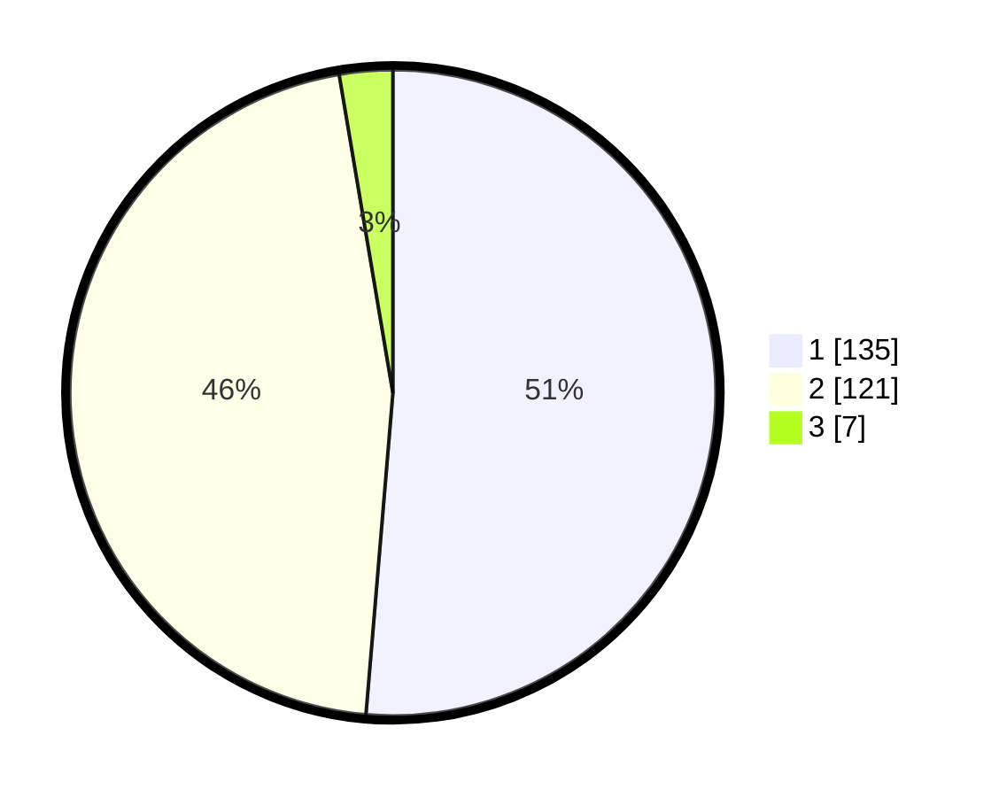

# Hasil

## Grafik

## Tabel

| No. | Nama Paslon    | Suara | Suara (raw) | Persentase |
|:--- |:-------------- | -----:| -----------:| ----------:|
| 1   | ANIES MUHAIMIN | 135   | [135][p-1]  | 51,33      |
| 2   | PRABOWO GIBRAN | 121   | [121][p-2]  | 46,01      |
| 3   | GANJAR MAHFUD  | 7     | [7][p-3]    | 2,66       |

[p-1]: https://github.com/gigit-pemilu/pemilu-2024-32-jawa-barat/blob/main/pilpres/hitung-suara/sub/32-jawa-barat/sub/76-kota-depok/sub/08-cilodong/sub/1005-jatimulya/sub/009-tps/sub/paslon-1.txt
[p-2]: https://github.com/gigit-pemilu/pemilu-2024-32-jawa-barat/blob/main/pilpres/hitung-suara/sub/32-jawa-barat/sub/76-kota-depok/sub/08-cilodong/sub/1005-jatimulya/sub/009-tps/sub/paslon-2.txt
[p-3]: https://github.com/gigit-pemilu/pemilu-2024-32-jawa-barat/blob/main/pilpres/hitung-suara/sub/32-jawa-barat/sub/76-kota-depok/sub/08-cilodong/sub/1005-jatimulya/sub/009-tps/sub/paslon-3.txt

## Foto C Plano

https://sirekap-obj-formc.kpu.go.id/ed2f/pemilu/ppwp/32/76/08/10/05/3276081005009-20240215-105922--5ed498cc-c7b7-41f1-94eb-026656e53a37.jpg

https://sirekap-obj-formc.kpu.go.id/ed2f/pemilu/ppwp/32/76/08/10/05/3276081005009-20240215-105946--1a7a121d-d300-4a8b-a3f4-06bcd8c22aaa.jpg

https://sirekap-obj-formc.kpu.go.id/ed2f/pemilu/ppwp/32/76/08/10/05/3276081005009-20240215-110855--5b18d96b-fac9-43d6-adec-6ed1be21d0f7.jpg

## Metadata

| Key        | Value               |
| ---------- | ------------------- |
| Time Stamp | 2024-02-15 16:30:25 |

