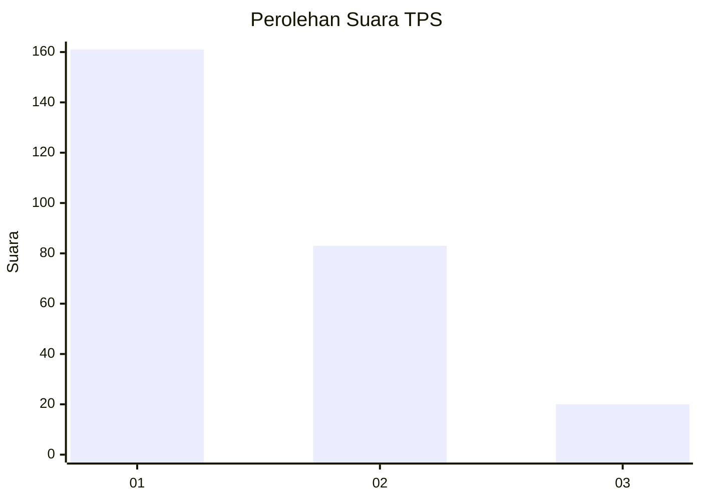
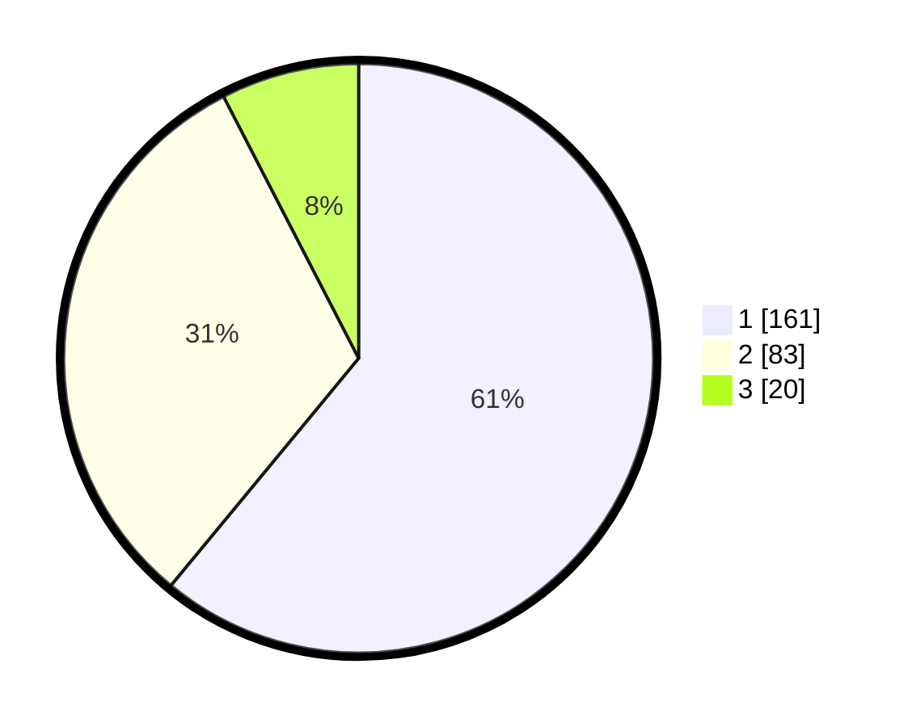

# Hasil

## Grafik

## Tabel

| No. | Nama Paslon    | Suara | Suara (raw) | Persentase |
|:--- |:-------------- | -----:| -----------:| ----------:|
| 1   | ANIES MUHAIMIN | 161   | [161][p-1]  | 60,98      |
| 2   | PRABOWO GIBRAN | 83    | [83][p-2]   | 31,44      |
| 3   | GANJAR MAHFUD  | 20    | [20][p-3]   | 7,58       |

[p-1]: https://github.com/gigit-pemilu/pemilu-2024-32-jawa-barat/blob/main/pilpres/hitung-suara/sub/32-jawa-barat/sub/76-kota-depok/sub/08-cilodong/sub/1005-jatimulya/sub/034-tps/sub/paslon-1.txt
[p-2]: https://github.com/gigit-pemilu/pemilu-2024-32-jawa-barat/blob/main/pilpres/hitung-suara/sub/32-jawa-barat/sub/76-kota-depok/sub/08-cilodong/sub/1005-jatimulya/sub/034-tps/sub/paslon-2.txt
[p-3]: https://github.com/gigit-pemilu/pemilu-2024-32-jawa-barat/blob/main/pilpres/hitung-suara/sub/32-jawa-barat/sub/76-kota-depok/sub/08-cilodong/sub/1005-jatimulya/sub/034-tps/sub/paslon-3.txt

## Foto C Plano

https://sirekap-obj-formc.kpu.go.id/b41a/pemilu/ppwp/32/76/08/10/05/3276081005034-20240214-202501--2034a6e6-288e-4983-82c7-ecf126bfa9e2.jpg

https://sirekap-obj-formc.kpu.go.id/b41a/pemilu/ppwp/32/76/08/10/05/3276081005034-20240214-184921--5fc1a125-bbf2-40fe-b823-1d12688b968f.jpg

https://sirekap-obj-formc.kpu.go.id/b41a/pemilu/ppwp/32/76/08/10/05/3276081005034-20240214-202625--bb0e9a49-dc29-4ad2-9ab6-c95f0a22605b.jpg

## Metadata

| Key        | Value               |
| ---------- | ------------------- |
| Time Stamp | 2024-02-15 17:00:25 |

