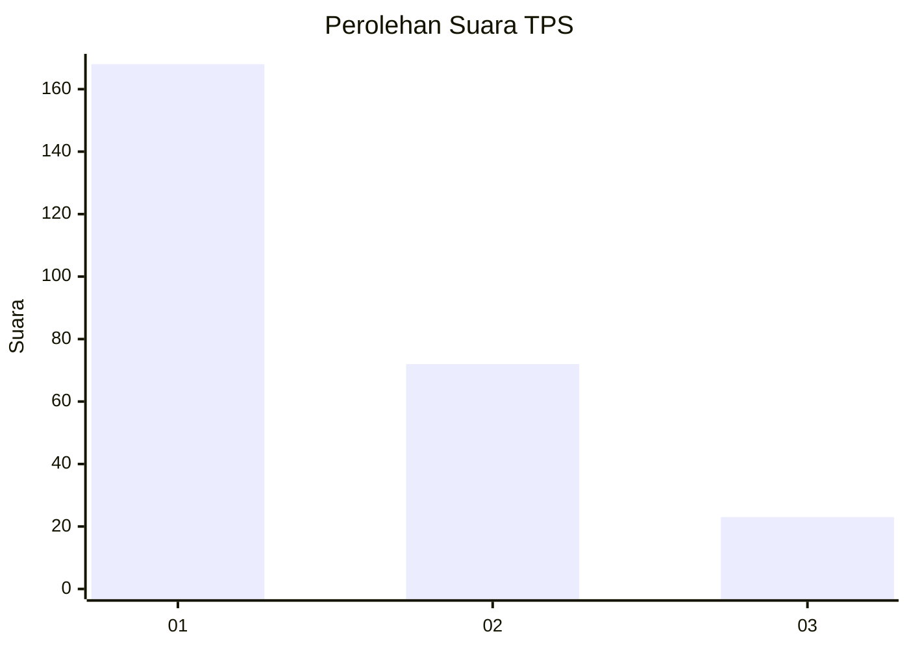
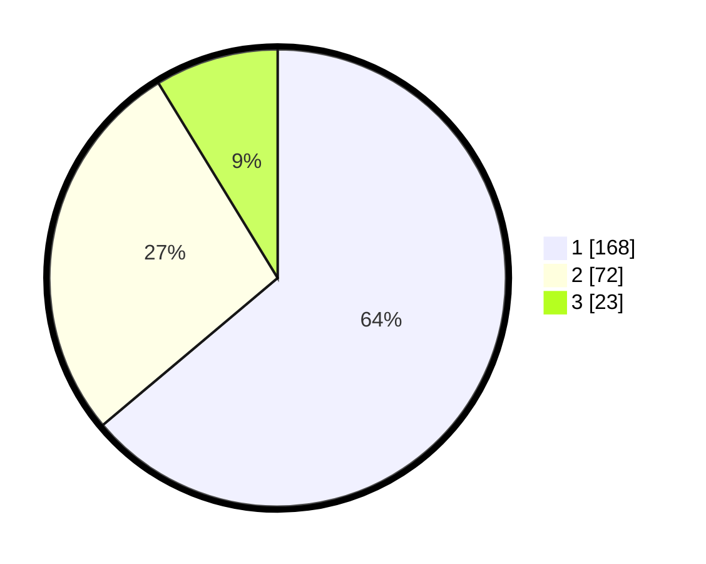

# Hasil

## Grafik

## Tabel

| No. | Nama Paslon    | Suara | Suara (raw) | Persentase |
|:--- |:-------------- | -----:| -----------:| ----------:|
| 1   | ANIES MUHAIMIN | 168   | [168][p-1]  | 63,88      |
| 2   | PRABOWO GIBRAN | 72    | [72][p-2]   | 27,38      |
| 3   | GANJAR MAHFUD  | 23    | [23][p-3]   | 8,75       |

[p-1]: https://github.com/gigit-pemilu/pemilu-2024/blob/main/pilpres/hitung-suara/sub/32-jawa-barat/sub/76-kota-depok/sub/08-cilodong/sub/1005-jatimulya/sub/038-tps/sub/paslon-1.txt
[p-2]: https://github.com/gigit-pemilu/pemilu-2024/blob/main/pilpres/hitung-suara/sub/32-jawa-barat/sub/76-kota-depok/sub/08-cilodong/sub/1005-jatimulya/sub/038-tps/sub/paslon-2.txt
[p-3]: https://github.com/gigit-pemilu/pemilu-2024/blob/main/pilpres/hitung-suara/sub/32-jawa-barat/sub/76-kota-depok/sub/08-cilodong/sub/1005-jatimulya/sub/038-tps/sub/paslon-3.txt

## Foto C Plano

https://sirekap-obj-formc.kpu.go.id/6115/pemilu/ppwp/32/76/08/10/05/3276081005038-20240215-144216--3037ea3c-4e53-4366-9a92-458a63e89c68.jpg

https://sirekap-obj-formc.kpu.go.id/6115/pemilu/ppwp/32/76/08/10/05/3276081005038-20240215-144345--49cf6871-bcfb-49f2-8e77-c70855d34df5.jpg

https://sirekap-obj-formc.kpu.go.id/6115/pemilu/ppwp/32/76/08/10/05/3276081005038-20240215-144450--689c92eb-1436-4580-8fbd-adbb42d38113.jpg

## Metadata

| Key        | Value               |
| ---------- | ------------------- |
| Time Stamp | 2024-02-22 12:00:00 |

