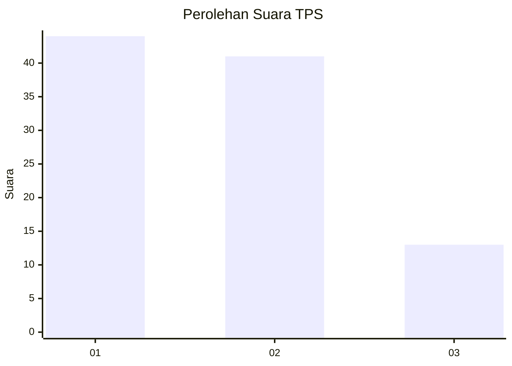
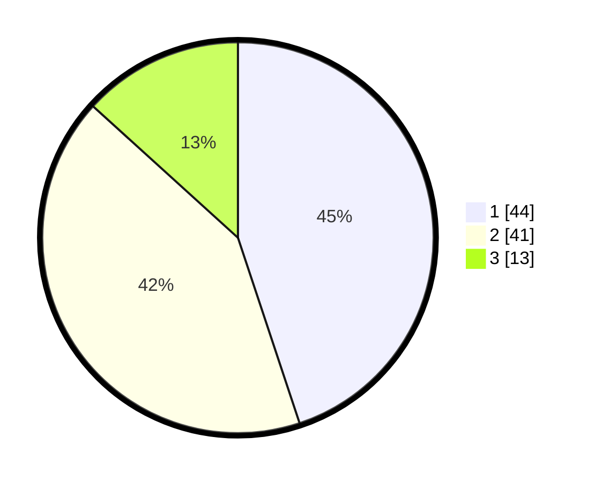

# Hasil

## Grafik

## Tabel

| No. | Nama Paslon    | Suara | Suara (raw) | Persentase |
|:--- |:-------------- | -----:| -----------:| ----------:|
| 1   | ANIES MUHAIMIN | 44    | [44][p-1]   | 44,90      |
| 2   | PRABOWO GIBRAN | 41    | [41][p-2]   | 41,84      |
| 3   | GANJAR MAHFUD  | 13    | [13][p-3]   | 13,27      |

[p-1]: https://github.com/gigit-pemilu/pemilu-2024-32-jawa-barat/blob/main/pilpres/hitung-suara/sub/32-jawa-barat/sub/76-kota-depok/sub/09-cinere/sub/1002-gandul/sub/056-tps/sub/paslon-1.txt
[p-2]: https://github.com/gigit-pemilu/pemilu-2024-32-jawa-barat/blob/main/pilpres/hitung-suara/sub/32-jawa-barat/sub/76-kota-depok/sub/09-cinere/sub/1002-gandul/sub/056-tps/sub/paslon-2.txt
[p-3]: https://github.com/gigit-pemilu/pemilu-2024-32-jawa-barat/blob/main/pilpres/hitung-suara/sub/32-jawa-barat/sub/76-kota-depok/sub/09-cinere/sub/1002-gandul/sub/056-tps/sub/paslon-3.txt

## Foto C Plano

https://sirekap-obj-formc.kpu.go.id/d2ce/pemilu/ppwp/32/76/09/10/02/3276091002056-20240214-195729--8f517ee5-a219-4fe1-a815-12039f5fb81f.jpg

https://sirekap-obj-formc.kpu.go.id/d2ce/pemilu/ppwp/32/76/09/10/02/3276091002056-20240214-193646--638ff457-5987-4272-96fa-2c2e25acf02f.jpg

https://sirekap-obj-formc.kpu.go.id/d2ce/pemilu/ppwp/32/76/09/10/02/3276091002056-20240214-195504--4b40fb5e-7b92-43ab-8ec4-8334722a02cc.jpg

## Metadata

| Key        | Value               |
| ---------- | ------------------- |
| Time Stamp | 2024-02-22 12:00:00 |

