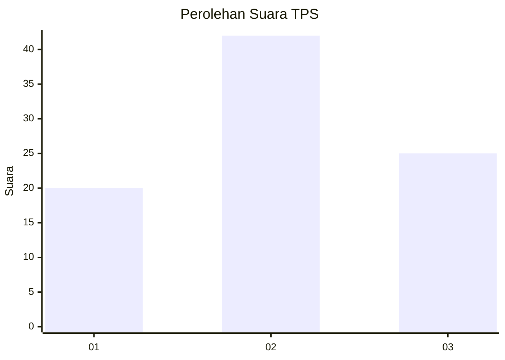
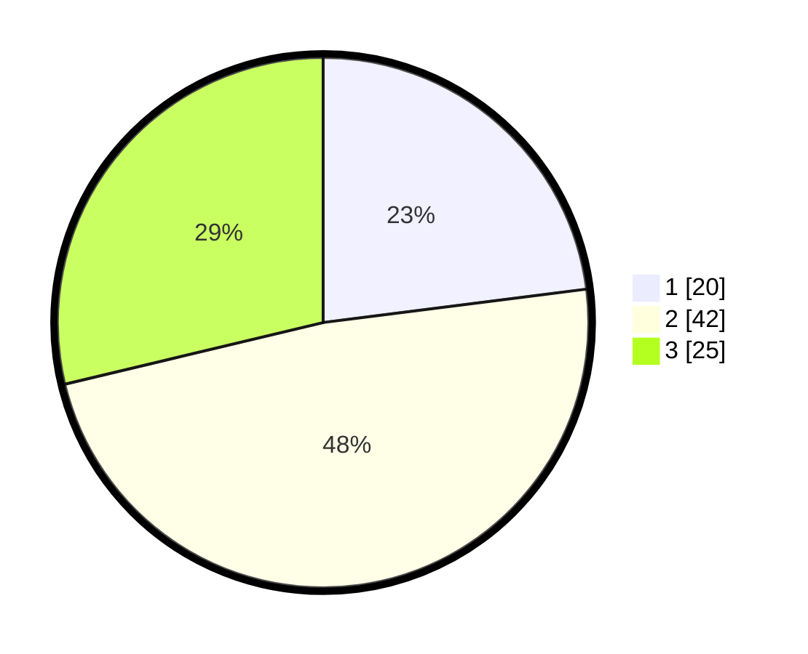

# Hasil

## Grafik

## Tabel

| No. | Nama Paslon    | Suara | Suara (raw) | Persentase |
|:--- |:-------------- | -----:| -----------:| ----------:|
| 1   | ANIES MUHAIMIN | 20    | [20][p-1]   | 22,99      |
| 2   | PRABOWO GIBRAN | 42    | [42][p-2]   | 48,28      |
| 3   | GANJAR MAHFUD  | 25    | [25][p-3]   | 28,74      |

[p-1]: https://github.com/gigit-pemilu/pemilu-2024-32-jawa-barat/blob/main/pilpres/hitung-suara/sub/32-jawa-barat/sub/76-kota-depok/sub/10-tapos/sub/1004-sukamaju-baru/sub/003-tps/sub/paslon-1.txt
[p-2]: https://github.com/gigit-pemilu/pemilu-2024-32-jawa-barat/blob/main/pilpres/hitung-suara/sub/32-jawa-barat/sub/76-kota-depok/sub/10-tapos/sub/1004-sukamaju-baru/sub/003-tps/sub/paslon-2.txt
[p-3]: https://github.com/gigit-pemilu/pemilu-2024-32-jawa-barat/blob/main/pilpres/hitung-suara/sub/32-jawa-barat/sub/76-kota-depok/sub/10-tapos/sub/1004-sukamaju-baru/sub/003-tps/sub/paslon-3.txt

## Foto C Plano

https://sirekap-obj-formc.kpu.go.id/72fe/pemilu/ppwp/32/76/10/10/04/3276101004003-20240215-081243--6506bcdc-470e-4afc-97bb-4fa8c98ea272.jpg

https://sirekap-obj-formc.kpu.go.id/72fe/pemilu/ppwp/32/76/10/10/04/3276101004003-20240215-081346--ee1913cb-9119-45c7-9666-9d9e753d2cc9.jpg

https://sirekap-obj-formc.kpu.go.id/72fe/pemilu/ppwp/32/76/10/10/04/3276101004003-20240215-081451--67f563ff-5168-4e37-b35f-263b073d7579.jpg

## Metadata

| Key        | Value               |
| ---------- | ------------------- |
| Time Stamp | 2024-02-15 20:30:46 |

