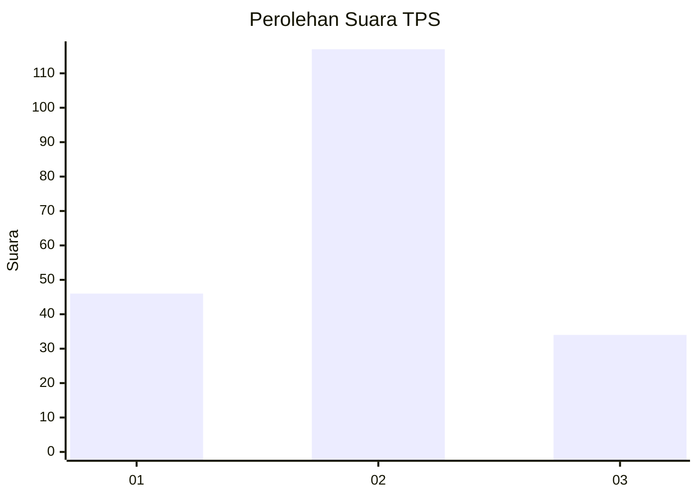

# Hasil

## Grafik

## Tabel

| No. | Nama Paslon    | Suara | Suara (raw) | Persentase |
|:--- |:-------------- | -----:| -----------:| ----------:|
| 1   | ANIES MUHAIMIN | 46    | [46][p-1]   | 23,35      |
| 2   | PRABOWO GIBRAN | 117   | [117][p-2]  | 59,39      |
| 3   | GANJAR MAHFUD  | 34    | [34][p-3]   | 17,26      |

[p-1]: https://github.com/gigit-pemilu/pemilu-2024/blob/main/pilpres/hitung-suara/sub/32-jawa-barat/sub/76-kota-depok/sub/10-tapos/sub/1004-sukamaju-baru/sub/005-tps/sub/paslon-1.txt
[p-2]: https://github.com/gigit-pemilu/pemilu-2024/blob/main/pilpres/hitung-suara/sub/32-jawa-barat/sub/76-kota-depok/sub/10-tapos/sub/1004-sukamaju-baru/sub/005-tps/sub/paslon-2.txt
[p-3]: https://github.com/gigit-pemilu/pemilu-2024/blob/main/pilpres/hitung-suara/sub/32-jawa-barat/sub/76-kota-depok/sub/10-tapos/sub/1004-sukamaju-baru/sub/005-tps/sub/paslon-3.txt

## Foto C Plano

https://sirekap-obj-formc.kpu.go.id/93ce/pemilu/ppwp/32/76/10/10/04/3276101004005-20240215-071746--3a1a7315-366c-4d59-94ca-a9f98ee37118.jpg

https://sirekap-obj-formc.kpu.go.id/93ce/pemilu/ppwp/32/76/10/10/04/3276101004005-20240215-071821--e36774a3-0efd-4fa9-964d-4e1d8cfa8f9e.jpg

https://sirekap-obj-formc.kpu.go.id/93ce/pemilu/ppwp/32/76/10/10/04/3276101004005-20240215-071900--7652f243-d77f-47d2-98f6-567f03aae1b9.jpg

## Metadata

| Key        | Value               |
| ---------- | ------------------- |
| Time Stamp | 2024-02-15 16:30:25 |

