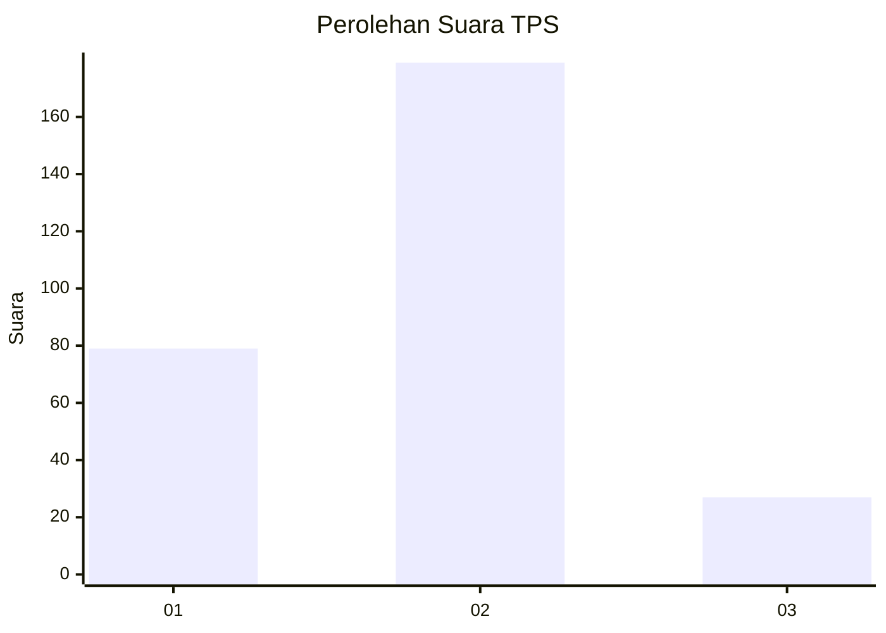
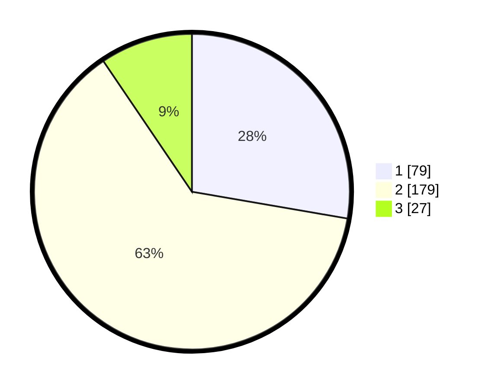

# Hasil

## Grafik

## Tabel

| No. | Nama Paslon    | Suara | Suara (raw) | Persentase |
|:--- |:-------------- | -----:| -----------:| ----------:|
| 1   | ANIES MUHAIMIN | 79    | [79][p-1]   | 27,72      |
| 2   | PRABOWO GIBRAN | 179   | [179][p-2]  | 62,81      |
| 3   | GANJAR MAHFUD  | 27    | [27][p-3]   | 9,47       |

[p-1]: https://github.com/gigit-pemilu/pemilu-2024-32-jawa-barat/blob/main/pilpres/hitung-suara/sub/32-jawa-barat/sub/76-kota-depok/sub/10-tapos/sub/1004-sukamaju-baru/sub/089-tps/sub/paslon-1.txt
[p-2]: https://github.com/gigit-pemilu/pemilu-2024-32-jawa-barat/blob/main/pilpres/hitung-suara/sub/32-jawa-barat/sub/76-kota-depok/sub/10-tapos/sub/1004-sukamaju-baru/sub/089-tps/sub/paslon-2.txt
[p-3]: https://github.com/gigit-pemilu/pemilu-2024-32-jawa-barat/blob/main/pilpres/hitung-suara/sub/32-jawa-barat/sub/76-kota-depok/sub/10-tapos/sub/1004-sukamaju-baru/sub/089-tps/sub/paslon-3.txt

## Foto C Plano

https://sirekap-obj-formc.kpu.go.id/ce64/pemilu/ppwp/32/76/10/10/04/3276101004089-20240214-233010--4c7be94c-e7d5-452c-9700-a354d3de1df8.jpg

https://sirekap-obj-formc.kpu.go.id/ce64/pemilu/ppwp/32/76/10/10/04/3276101004089-20240214-233107--5c047d07-5110-4fd2-bd72-5918a0983dcc.jpg

https://sirekap-obj-formc.kpu.go.id/ce64/pemilu/ppwp/32/76/10/10/04/3276101004089-20240214-233202--ad6b0d68-5361-48d3-9063-7ad210f5627a.jpg

## Metadata

| Key        | Value               |
| ---------- | ------------------- |
| Time Stamp | 2024-02-15 16:00:26 |

