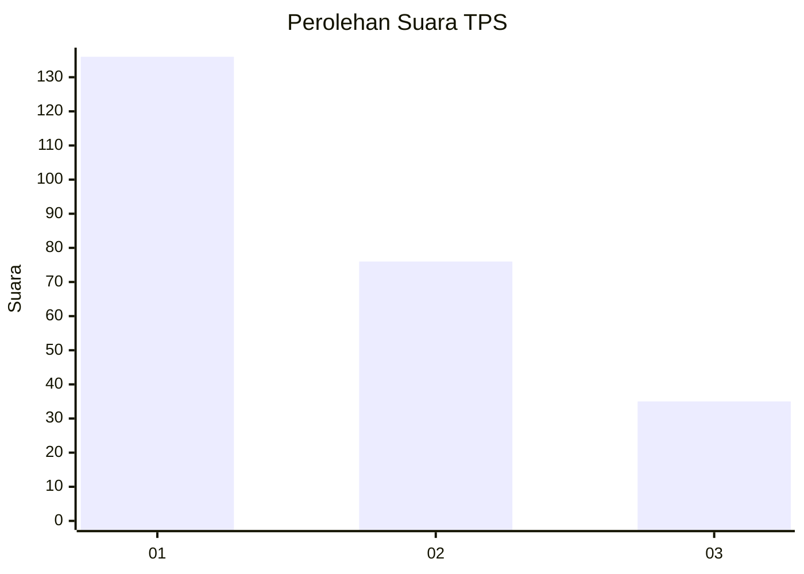
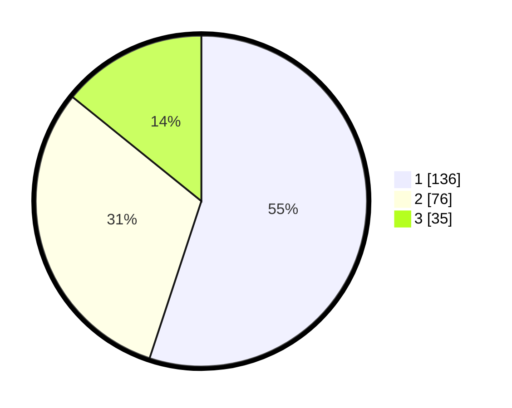

# Hasil

## Grafik

## Tabel

| No. | Nama Paslon    | Suara | Suara (raw) | Persentase |
|:--- |:-------------- | -----:| -----------:| ----------:|
| 1   | ANIES MUHAIMIN | 136   | [136][p-1]  | 55,06      |
| 2   | PRABOWO GIBRAN | 76    | [76][p-2]   | 30,77      |
| 3   | GANJAR MAHFUD  | 35    | [35][p-3]   | 14,17      |

[p-1]: https://github.com/gigit-pemilu/pemilu-2024-32-jawa-barat/blob/main/pilpres/hitung-suara/sub/32-jawa-barat/sub/76-kota-depok/sub/10-tapos/sub/1006-cilangkap/sub/127-tps/sub/paslon-1.txt
[p-2]: https://github.com/gigit-pemilu/pemilu-2024-32-jawa-barat/blob/main/pilpres/hitung-suara/sub/32-jawa-barat/sub/76-kota-depok/sub/10-tapos/sub/1006-cilangkap/sub/127-tps/sub/paslon-2.txt
[p-3]: https://github.com/gigit-pemilu/pemilu-2024-32-jawa-barat/blob/main/pilpres/hitung-suara/sub/32-jawa-barat/sub/76-kota-depok/sub/10-tapos/sub/1006-cilangkap/sub/127-tps/sub/paslon-3.txt

## Foto C Plano

https://sirekap-obj-formc.kpu.go.id/ffd8/pemilu/ppwp/32/76/10/10/06/3276101006127-20240215-143702--72369974-cdfc-4fde-85ca-3886caefb637.jpg

https://sirekap-obj-formc.kpu.go.id/ffd8/pemilu/ppwp/32/76/10/10/06/3276101006127-20240216-145120--a53cdf5f-1107-4b6b-8245-6a97d334dc3c.jpg

https://sirekap-obj-formc.kpu.go.id/ffd8/pemilu/ppwp/32/76/10/10/06/3276101006127-20240216-145507--f7d5472c-0f89-4cc1-8433-3262be15beca.jpg

## Metadata

| Key        | Value               |
| ---------- | ------------------- |
| Time Stamp | 2024-02-19 06:16:00 |

