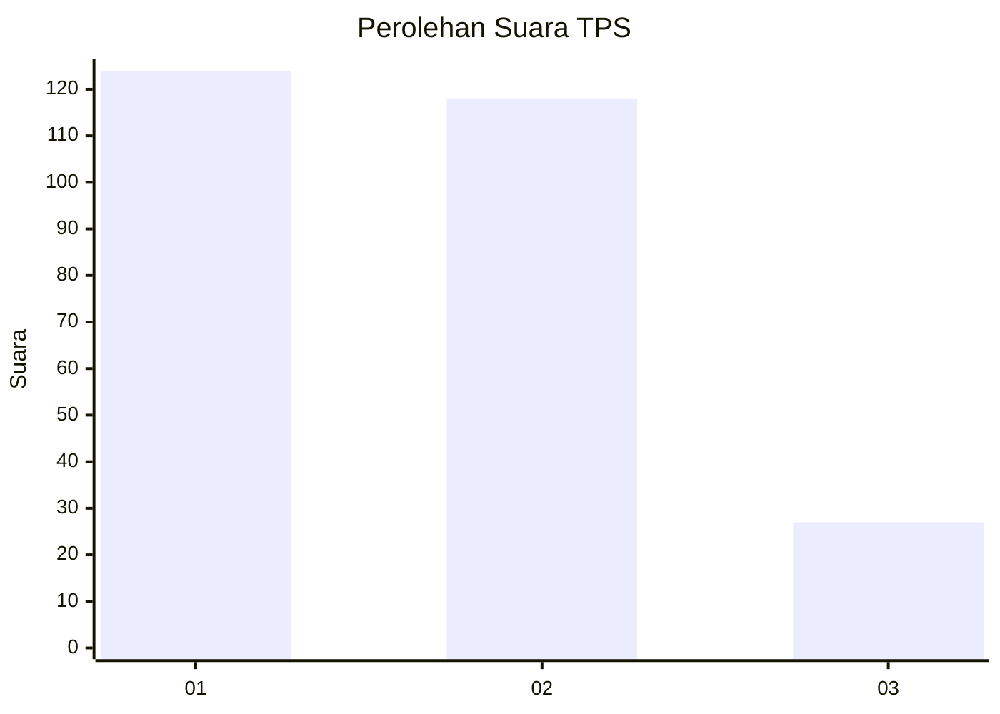
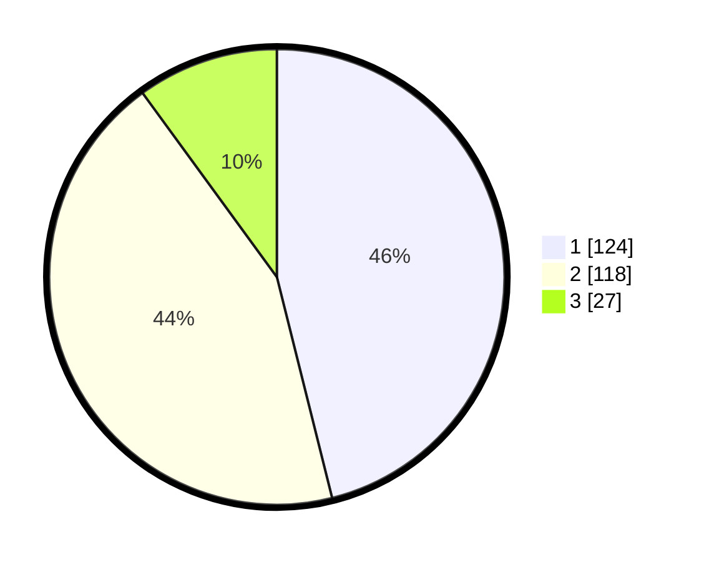

# Hasil

## Grafik

## Tabel

| No. | Nama Paslon    | Suara | Suara (raw) | Persentase |
|:--- |:-------------- | -----:| -----------:| ----------:|
| 1   | ANIES MUHAIMIN | 124   | [124][p-1]  | 46,10      |
| 2   | PRABOWO GIBRAN | 118   | [118][p-2]  | 43,87      |
| 3   | GANJAR MAHFUD  | 27    | [27][p-3]   | 10,04      |

[p-1]: https://github.com/gigit-pemilu/pemilu-2024/blob/main/pilpres/hitung-suara/sub/32-jawa-barat/sub/76-kota-depok/sub/11-bojongsari/sub/1004-pondok-petir/sub/012-tps/sub/paslon-1.txt
[p-2]: https://github.com/gigit-pemilu/pemilu-2024/blob/main/pilpres/hitung-suara/sub/32-jawa-barat/sub/76-kota-depok/sub/11-bojongsari/sub/1004-pondok-petir/sub/012-tps/sub/paslon-2.txt
[p-3]: https://github.com/gigit-pemilu/pemilu-2024/blob/main/pilpres/hitung-suara/sub/32-jawa-barat/sub/76-kota-depok/sub/11-bojongsari/sub/1004-pondok-petir/sub/012-tps/sub/paslon-3.txt

## Foto C Plano

https://sirekap-obj-formc.kpu.go.id/1359/pemilu/ppwp/32/76/11/10/04/3276111004012-20240214-214940--7f79bb82-9693-473e-8ce6-4443ba5342df.jpg

https://sirekap-obj-formc.kpu.go.id/1359/pemilu/ppwp/32/76/11/10/04/3276111004012-20240214-215057--2176f4f7-a5c1-4cd0-bf9d-a5bf735affff.jpg

https://sirekap-obj-formc.kpu.go.id/1359/pemilu/ppwp/32/76/11/10/04/3276111004012-20240214-215504--addba738-9051-4c41-90f2-89b47f274067.jpg

## Metadata

| Key        | Value               |
| ---------- | ------------------- |
| Time Stamp | 2024-02-15 15:00:29 |

