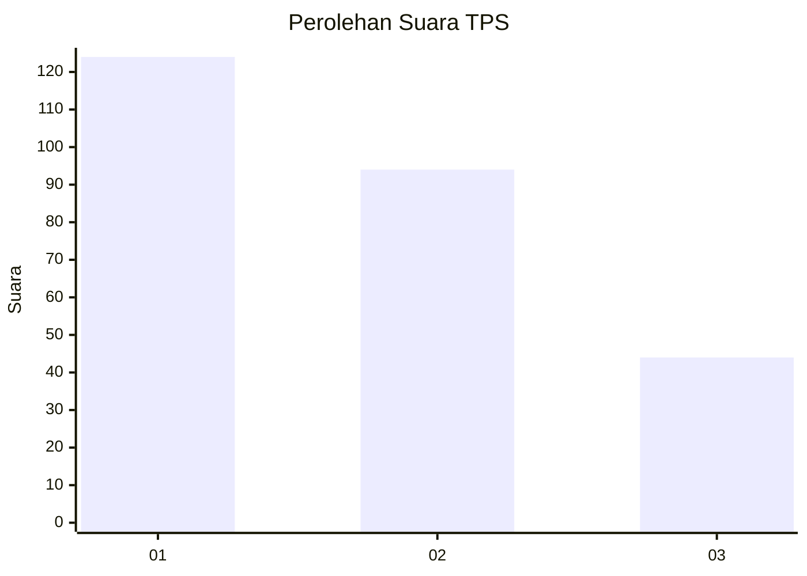
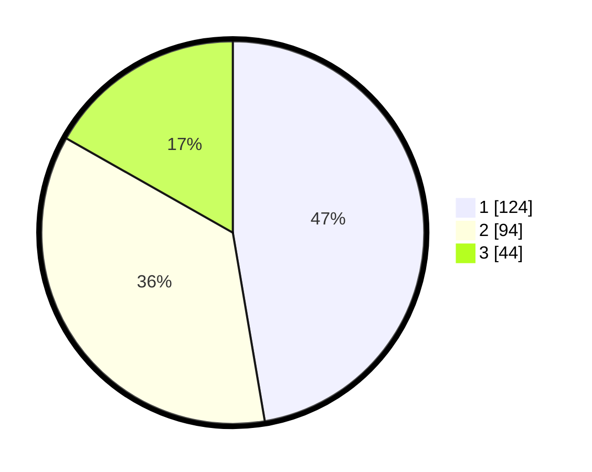

# Hasil

## Grafik

## Tabel

| No. | Nama Paslon    | Suara | Suara (raw) | Persentase |
|:--- |:-------------- | -----:| -----------:| ----------:|
| 1   | ANIES MUHAIMIN | 124   | [124][p-1]  | 47,33      |
| 2   | PRABOWO GIBRAN | 94    | [94][p-2]   | 35,88      |
| 3   | GANJAR MAHFUD  | 44    | [44][p-3]   | 16,79      |

[p-1]: https://github.com/gigit-pemilu/pemilu-2024/blob/main/pilpres/hitung-suara/sub/32-jawa-barat/sub/76-kota-depok/sub/11-bojongsari/sub/1007-duren-seribu/sub/005-tps/sub/paslon-1.txt
[p-2]: https://github.com/gigit-pemilu/pemilu-2024/blob/main/pilpres/hitung-suara/sub/32-jawa-barat/sub/76-kota-depok/sub/11-bojongsari/sub/1007-duren-seribu/sub/005-tps/sub/paslon-2.txt
[p-3]: https://github.com/gigit-pemilu/pemilu-2024/blob/main/pilpres/hitung-suara/sub/32-jawa-barat/sub/76-kota-depok/sub/11-bojongsari/sub/1007-duren-seribu/sub/005-tps/sub/paslon-3.txt

## Foto C Plano

https://sirekap-obj-formc.kpu.go.id/11c6/pemilu/ppwp/32/76/11/10/07/3276111007005-20240215-060332--f655c6d2-cde2-4e24-a2d8-e4671cdeeb05.jpg

https://sirekap-obj-formc.kpu.go.id/11c6/pemilu/ppwp/32/76/11/10/07/3276111007005-20240215-062958--bcb67c7e-1be0-4ad9-803d-6ff4d0855d75.jpg

https://sirekap-obj-formc.kpu.go.id/11c6/pemilu/ppwp/32/76/11/10/07/3276111007005-20240215-063453--ca4e63ff-be98-4ec6-badd-6f271ac14c52.jpg

## Metadata

| Key        | Value               |
| ---------- | ------------------- |
| Time Stamp | 2024-02-24 22:31:28 |

