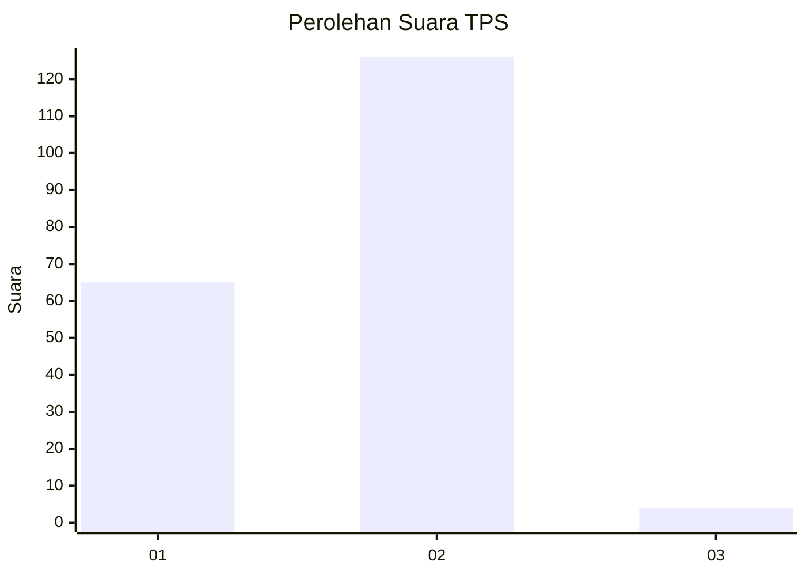
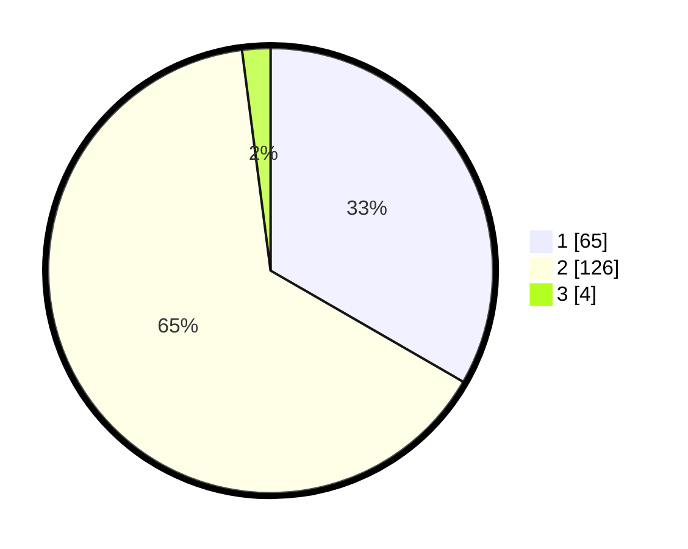

# Hasil

## Grafik

## Tabel

| No. | Nama Paslon    | Suara | Suara (raw) | Persentase |
|:--- |:-------------- | -----:| -----------:| ----------:|
| 1   | ANIES MUHAIMIN | 65    | [65][p-1]   | 33,33      |
| 2   | PRABOWO GIBRAN | 126   | [126][p-2]  | 64,62      |
| 3   | GANJAR MAHFUD  | 4     | [4][p-3]    | 2,05       |

[p-1]: https://github.com/gigit-pemilu/pemilu-2024/blob/main/pilpres/hitung-suara/sub/32-jawa-barat/sub/77-kota-cimahi/sub/01-cimahi-selatan/sub/1001-melong/sub/001-tps/sub/paslon-1.txt
[p-2]: https://github.com/gigit-pemilu/pemilu-2024/blob/main/pilpres/hitung-suara/sub/32-jawa-barat/sub/77-kota-cimahi/sub/01-cimahi-selatan/sub/1001-melong/sub/001-tps/sub/paslon-2.txt
[p-3]: https://github.com/gigit-pemilu/pemilu-2024/blob/main/pilpres/hitung-suara/sub/32-jawa-barat/sub/77-kota-cimahi/sub/01-cimahi-selatan/sub/1001-melong/sub/001-tps/sub/paslon-3.txt

## Foto C Plano

https://sirekap-obj-formc.kpu.go.id/bd63/pemilu/ppwp/32/77/01/10/01/3277011001001-20240215-022721--6434737e-ae4a-4b0e-b2e5-239d845a33c7.jpg

https://sirekap-obj-formc.kpu.go.id/bd63/pemilu/ppwp/32/77/01/10/01/3277011001001-20240215-022809--9d80a42b-57e0-42e1-a410-7915fe2f6383.jpg

https://sirekap-obj-formc.kpu.go.id/bd63/pemilu/ppwp/32/77/01/10/01/3277011001001-20240215-022842--74c52651-a2c3-434e-8d8c-57cac08a2791.jpg

## Metadata

| Key        | Value               |
| ---------- | ------------------- |
| Time Stamp | 2024-02-15 15:00:29 |

