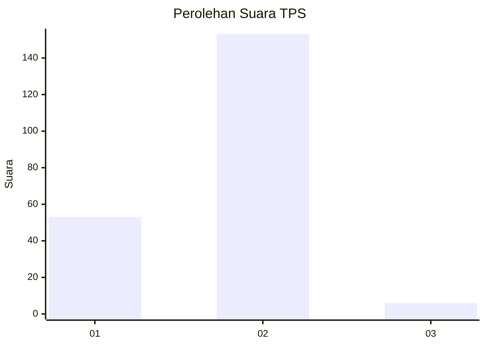
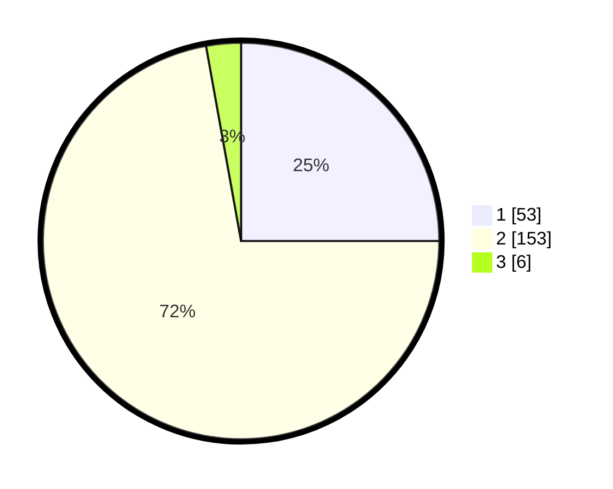

# Hasil

## Grafik

## Tabel

| No. | Nama Paslon    | Suara | Suara (raw) | Persentase |
|:--- |:-------------- | -----:| -----------:| ----------:|
| 1   | ANIES MUHAIMIN | 53    | [53][p-1]   | 25,00      |
| 2   | PRABOWO GIBRAN | 153   | [153][p-2]  | 72,17      |
| 3   | GANJAR MAHFUD  | 6     | [6][p-3]    | 2,83       |

[p-1]: https://github.com/gigit-pemilu/pemilu-2024/blob/main/pilpres/hitung-suara/sub/32-jawa-barat/sub/77-kota-cimahi/sub/01-cimahi-selatan/sub/1001-melong/sub/004-tps/sub/paslon-1.txt
[p-2]: https://github.com/gigit-pemilu/pemilu-2024/blob/main/pilpres/hitung-suara/sub/32-jawa-barat/sub/77-kota-cimahi/sub/01-cimahi-selatan/sub/1001-melong/sub/004-tps/sub/paslon-2.txt
[p-3]: https://github.com/gigit-pemilu/pemilu-2024/blob/main/pilpres/hitung-suara/sub/32-jawa-barat/sub/77-kota-cimahi/sub/01-cimahi-selatan/sub/1001-melong/sub/004-tps/sub/paslon-3.txt

## Foto C Plano

https://sirekap-obj-formc.kpu.go.id/37db/pemilu/ppwp/32/77/01/10/01/3277011001004-20240214-214459--63497c0a-c4b6-48b4-904c-477a5f299001.jpg

https://sirekap-obj-formc.kpu.go.id/37db/pemilu/ppwp/32/77/01/10/01/3277011001004-20240214-214540--9349f1e5-996b-4ad0-88fb-1079e3cf36d0.jpg

https://sirekap-obj-formc.kpu.go.id/37db/pemilu/ppwp/32/77/01/10/01/3277011001004-20240214-214602--12840008-f833-4611-adc6-2b8c2f2bc6c1.jpg

## Metadata

| Key        | Value               |
| ---------- | ------------------- |
| Time Stamp | 2024-02-16 14:30:33 |

