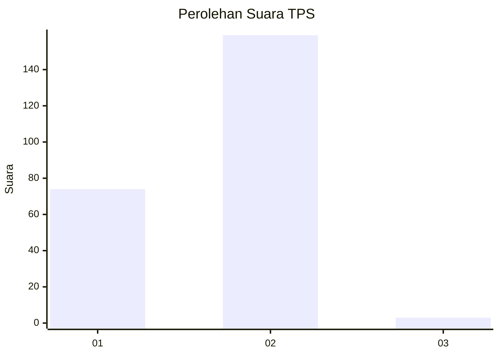
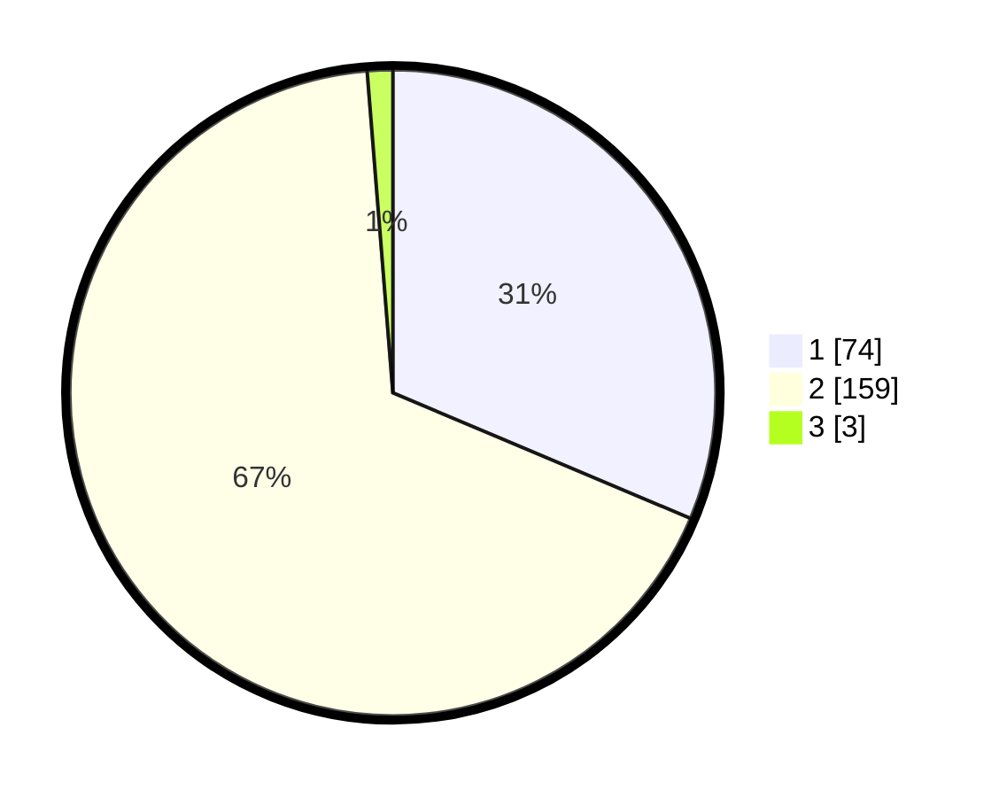

# Hasil

## Grafik

## Tabel

| No. | Nama Paslon    | Suara | Suara (raw) | Persentase |
|:--- |:-------------- | -----:| -----------:| ----------:|
| 1   | ANIES MUHAIMIN | 74    | [74][p-1]   | 31,36      |
| 2   | PRABOWO GIBRAN | 159   | [159][p-2]  | 67,37      |
| 3   | GANJAR MAHFUD  | 3     | [3][p-3]    | 1,27       |

[p-1]: https://github.com/gigit-pemilu/pemilu-2024-32-jawa-barat/blob/main/pilpres/hitung-suara/sub/32-jawa-barat/sub/77-kota-cimahi/sub/01-cimahi-selatan/sub/1001-melong/sub/006-tps/sub/paslon-1.txt
[p-2]: https://github.com/gigit-pemilu/pemilu-2024-32-jawa-barat/blob/main/pilpres/hitung-suara/sub/32-jawa-barat/sub/77-kota-cimahi/sub/01-cimahi-selatan/sub/1001-melong/sub/006-tps/sub/paslon-2.txt
[p-3]: https://github.com/gigit-pemilu/pemilu-2024-32-jawa-barat/blob/main/pilpres/hitung-suara/sub/32-jawa-barat/sub/77-kota-cimahi/sub/01-cimahi-selatan/sub/1001-melong/sub/006-tps/sub/paslon-3.txt

## Foto C Plano

https://sirekap-obj-formc.kpu.go.id/7d8c/pemilu/ppwp/32/77/01/10/01/3277011001006-20240214-204048--a363b084-c096-4fd4-b975-95b25a2621f4.jpg

https://sirekap-obj-formc.kpu.go.id/7d8c/pemilu/ppwp/32/77/01/10/01/3277011001006-20240214-204408--4b55666c-d780-43d5-b89e-e8d30df5355f.jpg

https://sirekap-obj-formc.kpu.go.id/7d8c/pemilu/ppwp/32/77/01/10/01/3277011001006-20240214-221154--b38eb5f7-4f80-45e0-81f4-0b755c10f929.jpg

## Metadata

| Key        | Value               |
| ---------- | ------------------- |
| Time Stamp | 2024-02-15 03:06:03 |

