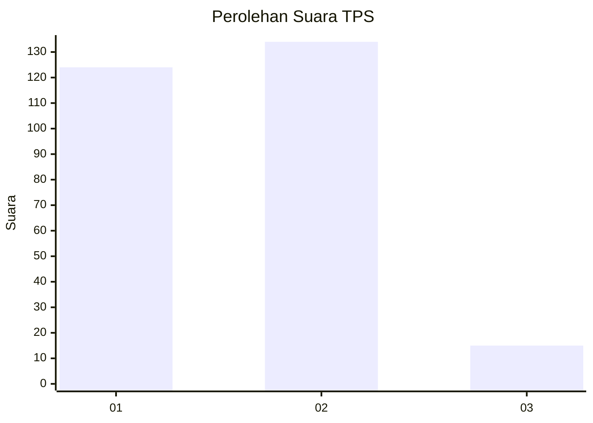
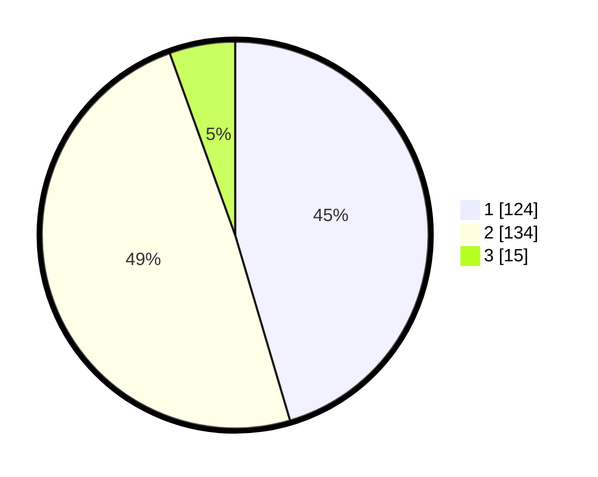

# Hasil

## Grafik

## Tabel

| No. | Nama Paslon    | Suara | Suara (raw) | Persentase |
|:--- |:-------------- | -----:| -----------:| ----------:|
| 1   | ANIES MUHAIMIN | 124   | [124][p-1]  | 45,42      |
| 2   | PRABOWO GIBRAN | 134   | [134][p-2]  | 49,08      |
| 3   | GANJAR MAHFUD  | 15    | [15][p-3]   | 5,49       |

[p-1]: https://github.com/gigit-pemilu/pemilu-2024/blob/main/pilpres/hitung-suara/sub/32-jawa-barat/sub/77-kota-cimahi/sub/01-cimahi-selatan/sub/1001-melong/sub/044-tps/sub/paslon-1.txt
[p-2]: https://github.com/gigit-pemilu/pemilu-2024/blob/main/pilpres/hitung-suara/sub/32-jawa-barat/sub/77-kota-cimahi/sub/01-cimahi-selatan/sub/1001-melong/sub/044-tps/sub/paslon-2.txt
[p-3]: https://github.com/gigit-pemilu/pemilu-2024/blob/main/pilpres/hitung-suara/sub/32-jawa-barat/sub/77-kota-cimahi/sub/01-cimahi-selatan/sub/1001-melong/sub/044-tps/sub/paslon-3.txt

## Foto C Plano

https://sirekap-obj-formc.kpu.go.id/234c/pemilu/ppwp/32/77/01/10/01/3277011001044-20240215-141135--0dea9e4f-784d-4793-bc1d-71ab6fd69bdb.jpg

https://sirekap-obj-formc.kpu.go.id/234c/pemilu/ppwp/32/77/01/10/01/3277011001044-20240215-141150--2174d6ec-3a45-4931-a699-46983633b137.jpg

https://sirekap-obj-formc.kpu.go.id/234c/pemilu/ppwp/32/77/01/10/01/3277011001044-20240215-141220--5680f62a-12fb-43e4-b81f-be171b4b46c0.jpg

## Metadata

| Key        | Value               |
| ---------- | ------------------- |
| Time Stamp | 2024-02-16 23:00:00 |

