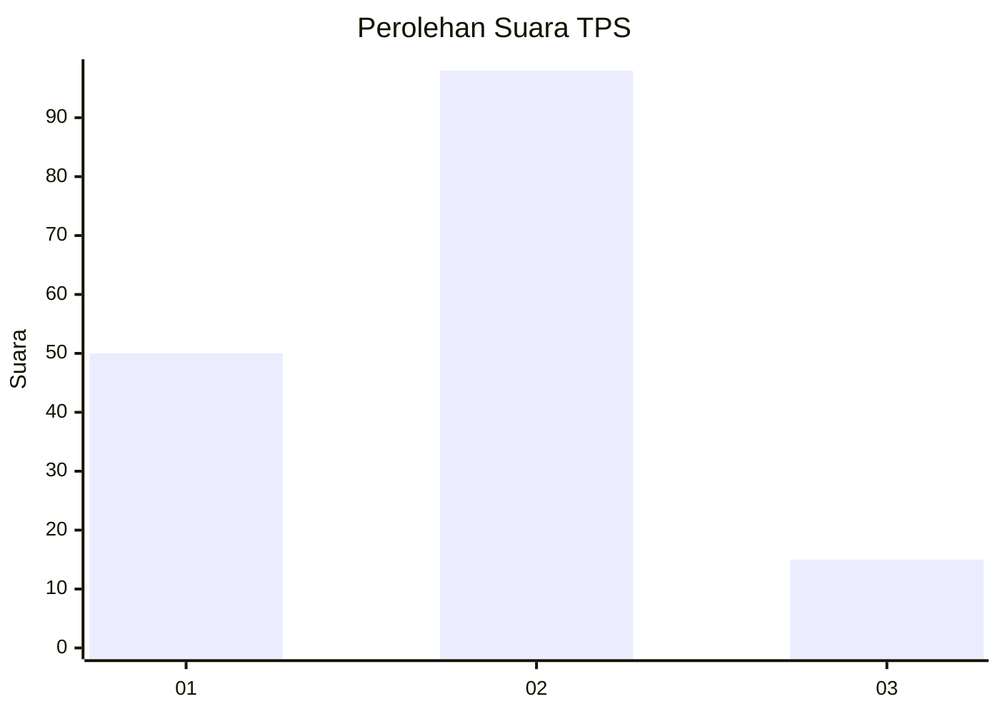
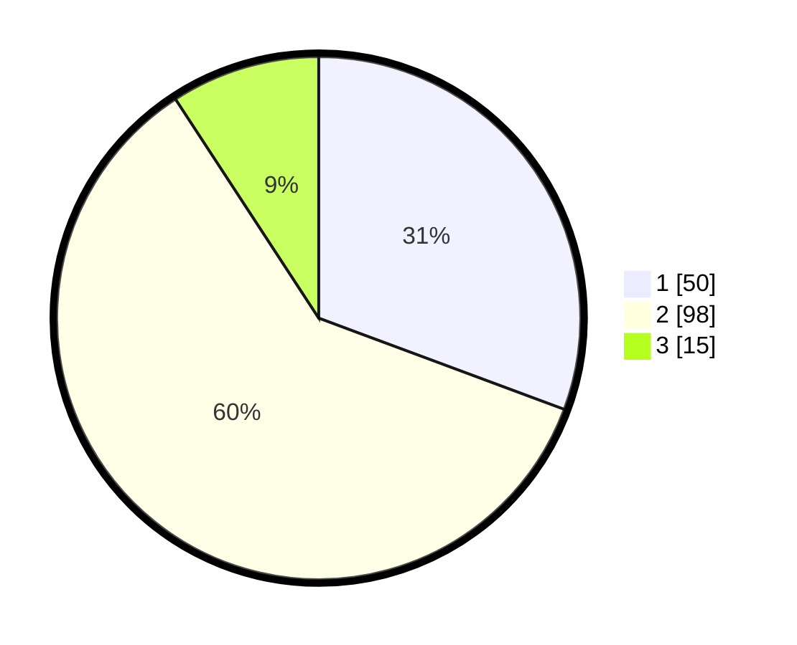

# Hasil

## Grafik

## Tabel

| No. | Nama Paslon    | Suara | Suara (raw) | Persentase |
|:--- |:-------------- | -----:| -----------:| ----------:|
| 1   | ANIES MUHAIMIN | 50    | [50][p-1]   | 30,67      |
| 2   | PRABOWO GIBRAN | 98    | [98][p-2]   | 60,12      |
| 3   | GANJAR MAHFUD  | 15    | [15][p-3]   | 9,20       |

[p-1]: https://github.com/gigit-pemilu/pemilu-2024-32-jawa-barat/blob/main/pilpres/hitung-suara/sub/32-jawa-barat/sub/77-kota-cimahi/sub/02-cimahi-tengah/sub/1001-baros/sub/005-tps/sub/paslon-1.txt
[p-2]: https://github.com/gigit-pemilu/pemilu-2024-32-jawa-barat/blob/main/pilpres/hitung-suara/sub/32-jawa-barat/sub/77-kota-cimahi/sub/02-cimahi-tengah/sub/1001-baros/sub/005-tps/sub/paslon-2.txt
[p-3]: https://github.com/gigit-pemilu/pemilu-2024-32-jawa-barat/blob/main/pilpres/hitung-suara/sub/32-jawa-barat/sub/77-kota-cimahi/sub/02-cimahi-tengah/sub/1001-baros/sub/005-tps/sub/paslon-3.txt

## Foto C Plano

https://sirekap-obj-formc.kpu.go.id/d170/pemilu/ppwp/32/77/02/10/01/3277021001005-20240214-213906--97a092f4-68c9-4ecd-93a2-2df6a24c1f53.jpg

https://sirekap-obj-formc.kpu.go.id/d170/pemilu/ppwp/32/77/02/10/01/3277021001005-20240215-033549--3ff26f43-08ca-4b08-8586-b664ca0daf8b.jpg

https://sirekap-obj-formc.kpu.go.id/d170/pemilu/ppwp/32/77/02/10/01/3277021001005-20240215-002013--3e76f7e7-5cc2-45f9-a00d-59bc9c76fa55.jpg

## Metadata

| Key        | Value               |
| ---------- | ------------------- |
| Time Stamp | 2024-02-19 06:16:00 |

