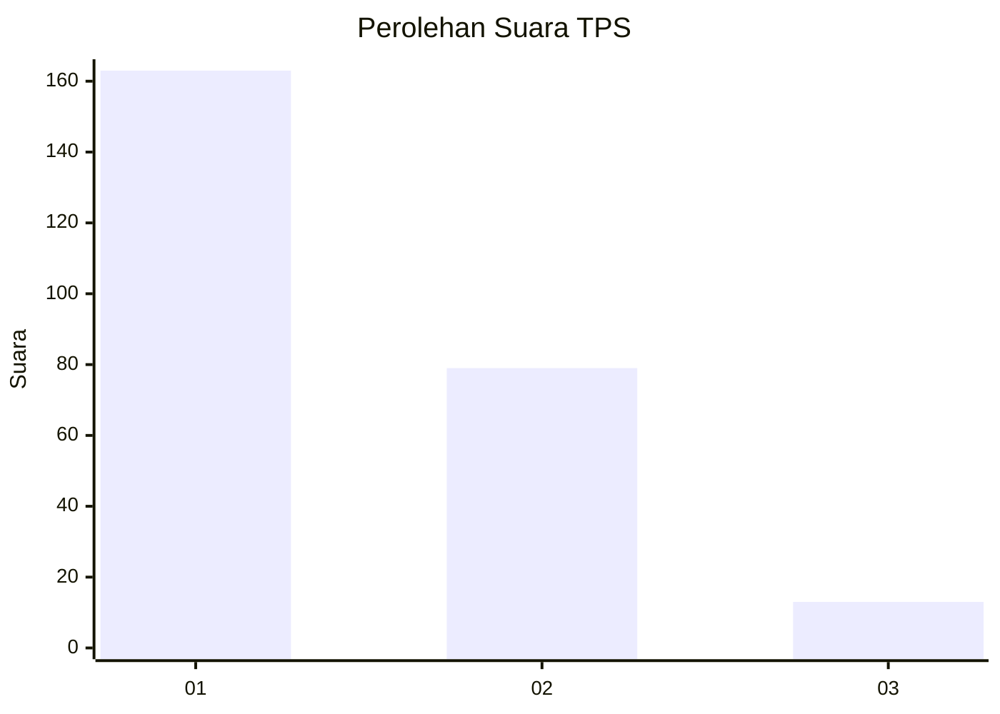
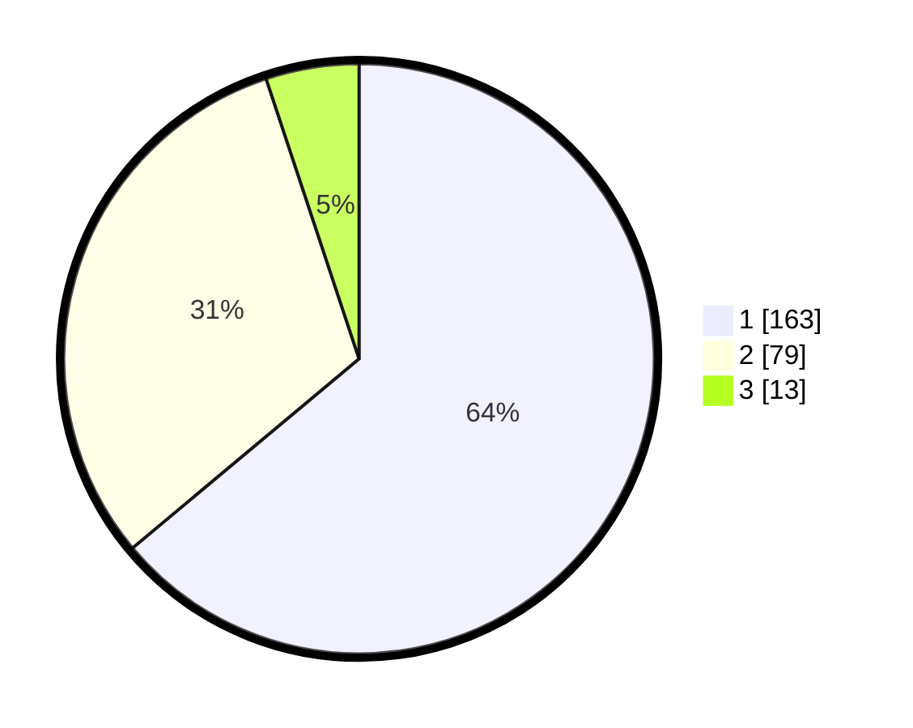

# Hasil

## Grafik

## Tabel

| No. | Nama Paslon    | Suara | Suara (raw) | Persentase |
|:--- |:-------------- | -----:| -----------:| ----------:|
| 1   | ANIES MUHAIMIN | 163   | [163][p-1]  | 63,92      |
| 2   | PRABOWO GIBRAN | 79    | [79][p-2]   | 30,98      |
| 3   | GANJAR MAHFUD  | 13    | [13][p-3]   | 5,10       |

[p-1]: https://github.com/gigit-pemilu/pemilu-2024-32-jawa-barat/blob/main/pilpres/hitung-suara/sub/32-jawa-barat/sub/77-kota-cimahi/sub/02-cimahi-tengah/sub/1002-cigugur-tengah/sub/001-tps/sub/paslon-1.txt
[p-2]: https://github.com/gigit-pemilu/pemilu-2024-32-jawa-barat/blob/main/pilpres/hitung-suara/sub/32-jawa-barat/sub/77-kota-cimahi/sub/02-cimahi-tengah/sub/1002-cigugur-tengah/sub/001-tps/sub/paslon-2.txt
[p-3]: https://github.com/gigit-pemilu/pemilu-2024-32-jawa-barat/blob/main/pilpres/hitung-suara/sub/32-jawa-barat/sub/77-kota-cimahi/sub/02-cimahi-tengah/sub/1002-cigugur-tengah/sub/001-tps/sub/paslon-3.txt

## Foto C Plano

https://sirekap-obj-formc.kpu.go.id/bce3/pemilu/ppwp/32/77/02/10/02/3277021002001-20240214-185013--76cdca59-a88d-4216-a177-1c73e24ede8d.jpg

https://sirekap-obj-formc.kpu.go.id/bce3/pemilu/ppwp/32/77/02/10/02/3277021002001-20240214-185114--662b1cda-5e3c-49b7-9c66-7816612f370c.jpg

https://sirekap-obj-formc.kpu.go.id/bce3/pemilu/ppwp/32/77/02/10/02/3277021002001-20240215-061710--417b3fce-ef99-447e-ab91-8abca86a4d9d.jpg

## Metadata

| Key        | Value               |
| ---------- | ------------------- |
| Time Stamp | 2024-02-15 16:00:26 |

