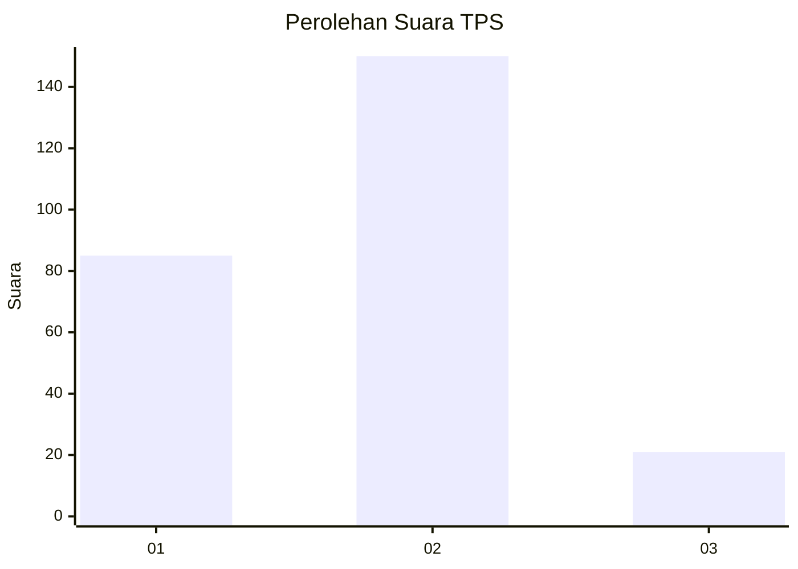
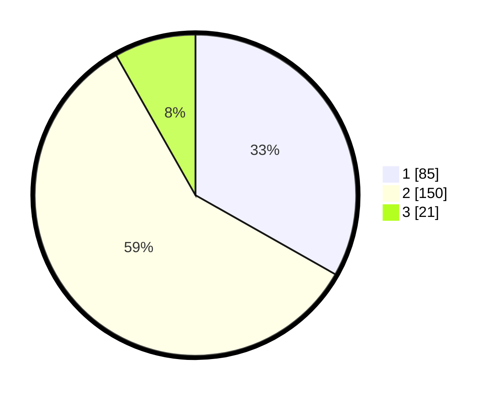

# Hasil

## Grafik

## Tabel

| No. | Nama Paslon    | Suara | Suara (raw) | Persentase |
|:--- |:-------------- | -----:| -----------:| ----------:|
| 1   | ANIES MUHAIMIN | 85    | [85][p-1]   | 33,20      |
| 2   | PRABOWO GIBRAN | 150   | [150][p-2]  | 58,59      |
| 3   | GANJAR MAHFUD  | 21    | [21][p-3]   | 8,20       |

[p-1]: https://github.com/gigit-pemilu/pemilu-2024-32-jawa-barat/blob/main/pilpres/hitung-suara/sub/32-jawa-barat/sub/77-kota-cimahi/sub/03-cimahi-utara/sub/1001-pasirkaliki/sub/004-tps/sub/paslon-1.txt
[p-2]: https://github.com/gigit-pemilu/pemilu-2024-32-jawa-barat/blob/main/pilpres/hitung-suara/sub/32-jawa-barat/sub/77-kota-cimahi/sub/03-cimahi-utara/sub/1001-pasirkaliki/sub/004-tps/sub/paslon-2.txt
[p-3]: https://github.com/gigit-pemilu/pemilu-2024-32-jawa-barat/blob/main/pilpres/hitung-suara/sub/32-jawa-barat/sub/77-kota-cimahi/sub/03-cimahi-utara/sub/1001-pasirkaliki/sub/004-tps/sub/paslon-3.txt

## Foto C Plano

https://sirekap-obj-formc.kpu.go.id/080f/pemilu/ppwp/32/77/03/10/01/3277031001004-20240214-201833--c4aa86c8-2190-4b51-86b0-03f12e2b84a4.jpg

https://sirekap-obj-formc.kpu.go.id/080f/pemilu/ppwp/32/77/03/10/01/3277031001004-20240214-201848--deb71bc0-d3d0-4bbb-a20a-c0feae261f85.jpg

https://sirekap-obj-formc.kpu.go.id/080f/pemilu/ppwp/32/77/03/10/01/3277031001004-20240214-201919--643b85d7-302f-4059-a4cd-2ff95a420d7f.jpg

## Metadata

| Key        | Value               |
| ---------- | ------------------- |
| Time Stamp | 2024-02-17 16:36:25 |

