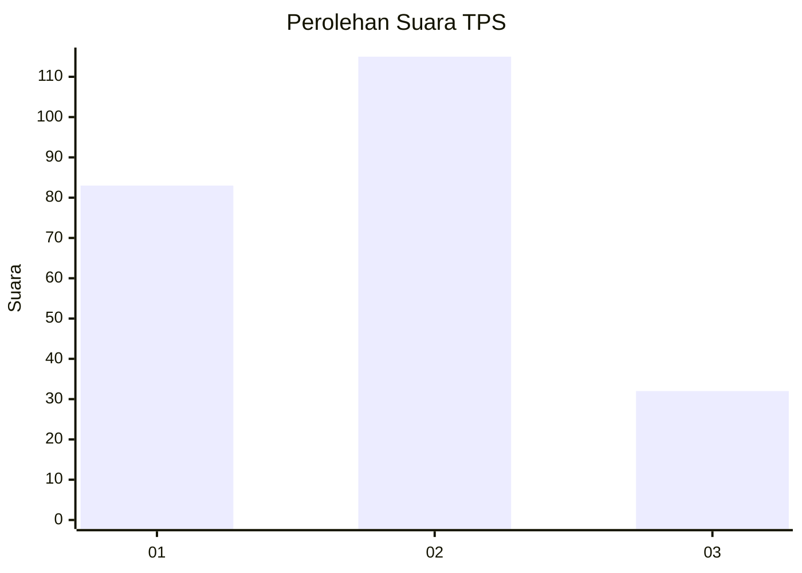
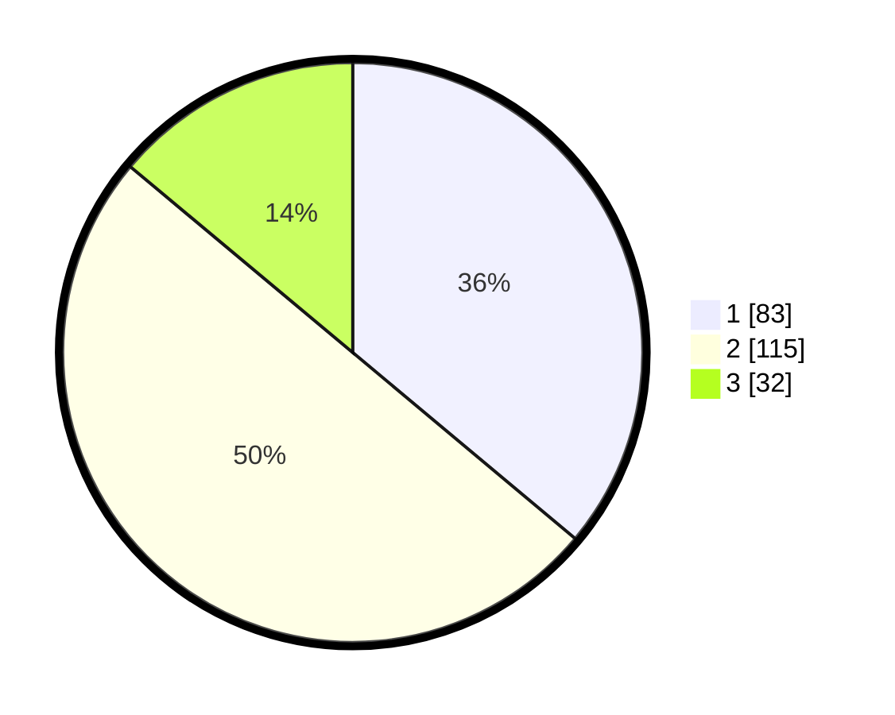

# Hasil

## Grafik

## Tabel

| No. | Nama Paslon    | Suara | Suara (raw) | Persentase |
|:--- |:-------------- | -----:| -----------:| ----------:|
| 1   | ANIES MUHAIMIN | 83    | [83][p-1]   | 36,09      |
| 2   | PRABOWO GIBRAN | 115   | [115][p-2]  | 50,00      |
| 3   | GANJAR MAHFUD  | 32    | [32][p-3]   | 13,91      |

[p-1]: https://github.com/gigit-pemilu/pemilu-2024-32-jawa-barat/blob/main/pilpres/hitung-suara/sub/32-jawa-barat/sub/78-kota-tasikmalaya/sub/02-cipedes/sub/1001-panglayungan/sub/001-tps/sub/paslon-1.txt
[p-2]: https://github.com/gigit-pemilu/pemilu-2024-32-jawa-barat/blob/main/pilpres/hitung-suara/sub/32-jawa-barat/sub/78-kota-tasikmalaya/sub/02-cipedes/sub/1001-panglayungan/sub/001-tps/sub/paslon-2.txt
[p-3]: https://github.com/gigit-pemilu/pemilu-2024-32-jawa-barat/blob/main/pilpres/hitung-suara/sub/32-jawa-barat/sub/78-kota-tasikmalaya/sub/02-cipedes/sub/1001-panglayungan/sub/001-tps/sub/paslon-3.txt

## Foto C Plano

https://sirekap-obj-formc.kpu.go.id/1135/pemilu/ppwp/32/78/02/10/01/3278021001001-20240215-064530--5c71c368-ec12-4ba1-ac57-48752f7057ee.jpg

https://sirekap-obj-formc.kpu.go.id/1135/pemilu/ppwp/32/78/02/10/01/3278021001001-20240215-064645--11b46535-957a-437d-b3a7-c49fad9bc929.jpg

https://sirekap-obj-formc.kpu.go.id/1135/pemilu/ppwp/32/78/02/10/01/3278021001001-20240215-064744--45c943c5-f2a9-494c-87f4-b85ce1f1530c.jpg

## Metadata

| Key        | Value               |
| ---------- | ------------------- |
| Time Stamp | 2024-02-15 22:00:27 |

