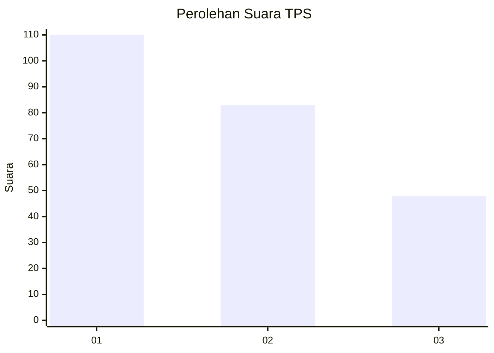
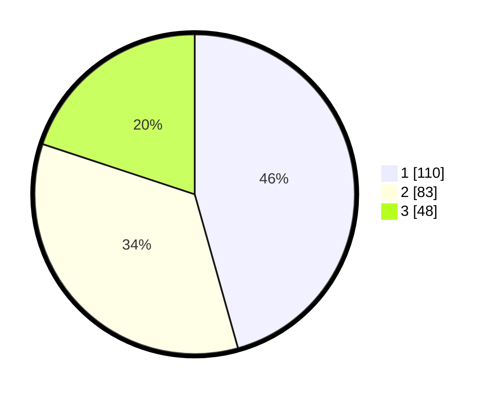

# Hasil

## Grafik

## Tabel

| No. | Nama Paslon    | Suara | Suara (raw) | Persentase |
|:--- |:-------------- | -----:| -----------:| ----------:|
| 1   | ANIES MUHAIMIN | 110   | [110][p-1]  | 45,64      |
| 2   | PRABOWO GIBRAN | 83    | [83][p-2]   | 34,44      |
| 3   | GANJAR MAHFUD  | 48    | [48][p-3]   | 19,92      |

[p-1]: https://github.com/gigit-pemilu/pemilu-2024/blob/main/pilpres/hitung-suara/sub/32-jawa-barat/sub/78-kota-tasikmalaya/sub/02-cipedes/sub/1001-panglayungan/sub/004-tps/sub/paslon-1.txt
[p-2]: https://github.com/gigit-pemilu/pemilu-2024/blob/main/pilpres/hitung-suara/sub/32-jawa-barat/sub/78-kota-tasikmalaya/sub/02-cipedes/sub/1001-panglayungan/sub/004-tps/sub/paslon-2.txt
[p-3]: https://github.com/gigit-pemilu/pemilu-2024/blob/main/pilpres/hitung-suara/sub/32-jawa-barat/sub/78-kota-tasikmalaya/sub/02-cipedes/sub/1001-panglayungan/sub/004-tps/sub/paslon-3.txt

## Foto C Plano

https://sirekap-obj-formc.kpu.go.id/7170/pemilu/ppwp/32/78/02/10/01/3278021001004-20240215-043736--9a95819f-e454-45a1-a442-1a7b43feb2ed.jpg

https://sirekap-obj-formc.kpu.go.id/7170/pemilu/ppwp/32/78/02/10/01/3278021001004-20240215-043922--211995c4-38c8-46e1-8fad-0a4c63d3c51f.jpg

https://sirekap-obj-formc.kpu.go.id/7170/pemilu/ppwp/32/78/02/10/01/3278021001004-20240215-044024--4bbb7384-71eb-4c15-8979-7b63217efe61.jpg

## Metadata

| Key        | Value               |
| ---------- | ------------------- |
| Time Stamp | 2024-02-20 13:00:00 |

