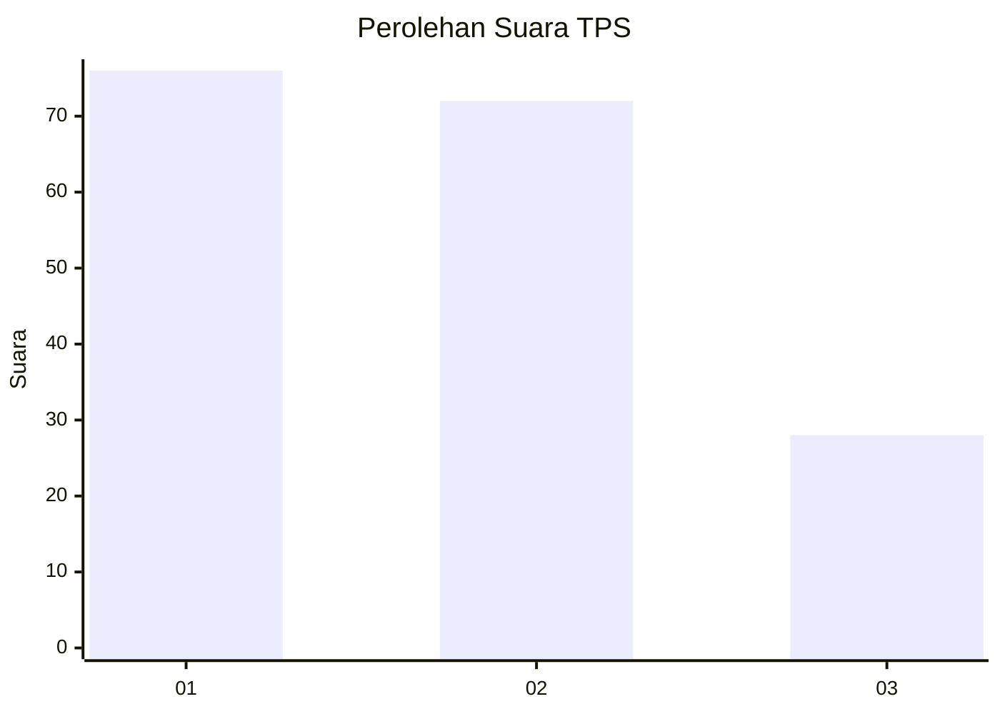
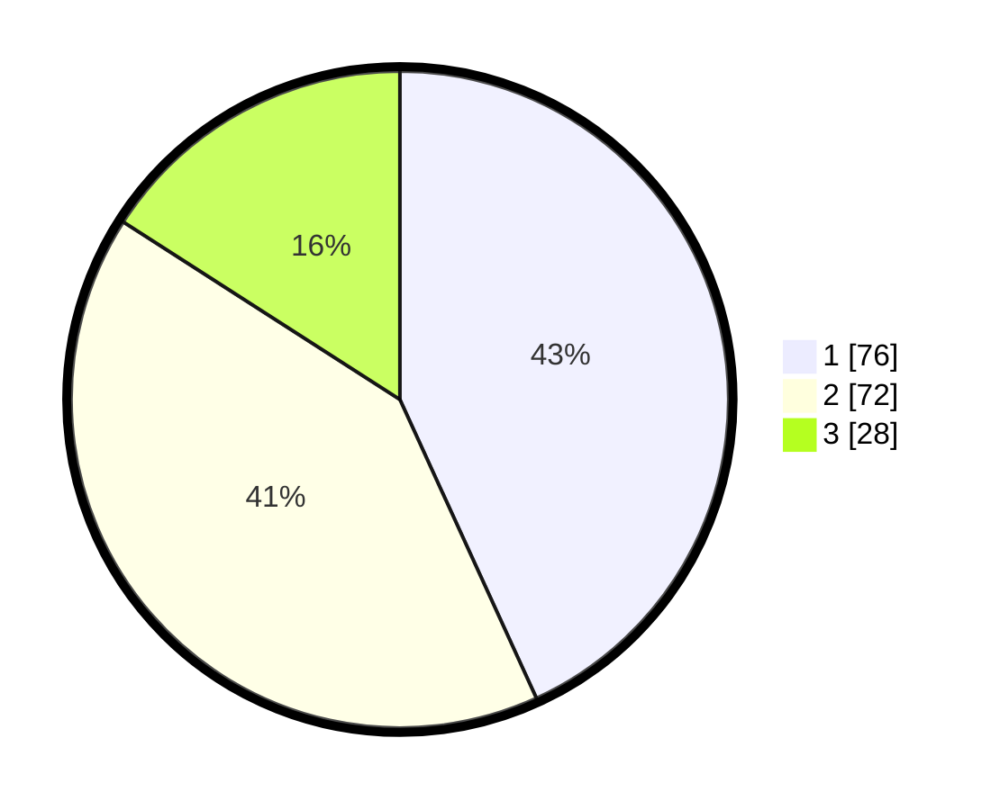

# Hasil

## Grafik

## Tabel

| No. | Nama Paslon    | Suara | Suara (raw) | Persentase |
|:--- |:-------------- | -----:| -----------:| ----------:|
| 1   | ANIES MUHAIMIN | 76    | [76][p-1]   | 43,18      |
| 2   | PRABOWO GIBRAN | 72    | [72][p-2]   | 40,91      |
| 3   | GANJAR MAHFUD  | 28    | [28][p-3]   | 15,91      |

[p-1]: https://github.com/gigit-pemilu/pemilu-2024/blob/main/pilpres/hitung-suara/sub/32-jawa-barat/sub/78-kota-tasikmalaya/sub/02-cipedes/sub/1001-panglayungan/sub/005-tps/sub/paslon-1.txt
[p-2]: https://github.com/gigit-pemilu/pemilu-2024/blob/main/pilpres/hitung-suara/sub/32-jawa-barat/sub/78-kota-tasikmalaya/sub/02-cipedes/sub/1001-panglayungan/sub/005-tps/sub/paslon-2.txt
[p-3]: https://github.com/gigit-pemilu/pemilu-2024/blob/main/pilpres/hitung-suara/sub/32-jawa-barat/sub/78-kota-tasikmalaya/sub/02-cipedes/sub/1001-panglayungan/sub/005-tps/sub/paslon-3.txt

## Foto C Plano

https://sirekap-obj-formc.kpu.go.id/a567/pemilu/ppwp/32/78/02/10/01/3278021001005-20240215-020856--7c8c5d3e-76c4-4bb0-9eff-43a9c5f167ea.jpg

https://sirekap-obj-formc.kpu.go.id/a567/pemilu/ppwp/32/78/02/10/01/3278021001005-20240215-021126--852db320-622f-4a08-9457-2831215660cc.jpg

https://sirekap-obj-formc.kpu.go.id/a567/pemilu/ppwp/32/78/02/10/01/3278021001005-20240215-021314--e99f5388-99e6-41e3-9f4c-bd338c7812e6.jpg

## Metadata

| Key        | Value               |
| ---------- | ------------------- |
| Time Stamp | 2024-02-15 06:00:23 |

