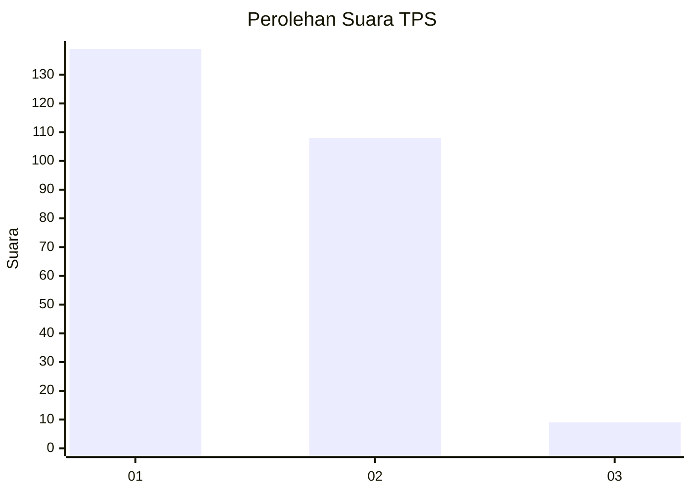
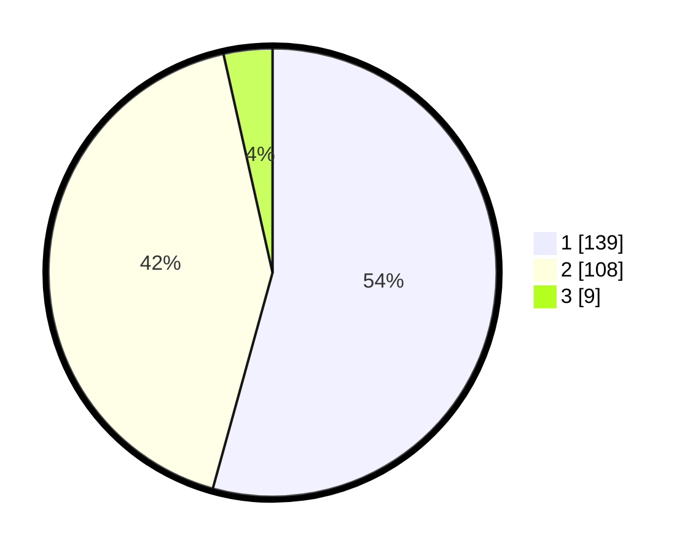

# Hasil

## Grafik

## Tabel

| No. | Nama Paslon    | Suara | Suara (raw) | Persentase |
|:--- |:-------------- | -----:| -----------:| ----------:|
| 1   | ANIES MUHAIMIN | 139   | [139][p-1]  | 54,30      |
| 2   | PRABOWO GIBRAN | 108   | [108][p-2]  | 42,19      |
| 3   | GANJAR MAHFUD  | 9     | [9][p-3]    | 3,52       |

[p-1]: https://github.com/gigit-pemilu/pemilu-2024-32-jawa-barat/blob/main/pilpres/hitung-suara/sub/32-jawa-barat/sub/78-kota-tasikmalaya/sub/02-cipedes/sub/1004-sukamanah/sub/036-tps/sub/paslon-1.txt
[p-2]: https://github.com/gigit-pemilu/pemilu-2024-32-jawa-barat/blob/main/pilpres/hitung-suara/sub/32-jawa-barat/sub/78-kota-tasikmalaya/sub/02-cipedes/sub/1004-sukamanah/sub/036-tps/sub/paslon-2.txt
[p-3]: https://github.com/gigit-pemilu/pemilu-2024-32-jawa-barat/blob/main/pilpres/hitung-suara/sub/32-jawa-barat/sub/78-kota-tasikmalaya/sub/02-cipedes/sub/1004-sukamanah/sub/036-tps/sub/paslon-3.txt

## Foto C Plano

https://sirekap-obj-formc.kpu.go.id/948e/pemilu/ppwp/32/78/02/10/04/3278021004036-20240215-064533--ab0c941c-85e9-4f6b-b393-5fde7b1c4085.jpg

https://sirekap-obj-formc.kpu.go.id/948e/pemilu/ppwp/32/78/02/10/04/3278021004036-20240215-064713--13a45b49-8db6-489b-9768-2b20ce8ad029.jpg

https://sirekap-obj-formc.kpu.go.id/948e/pemilu/ppwp/32/78/02/10/04/3278021004036-20240215-064824--02783c29-e81e-472d-b3af-3bc9f32fecb8.jpg

## Metadata

| Key        | Value               |
| ---------- | ------------------- |
| Time Stamp | 2024-02-20 15:00:00 |

