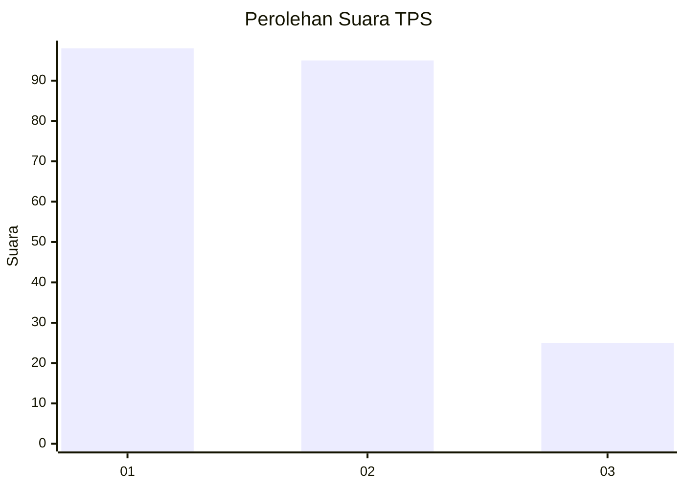
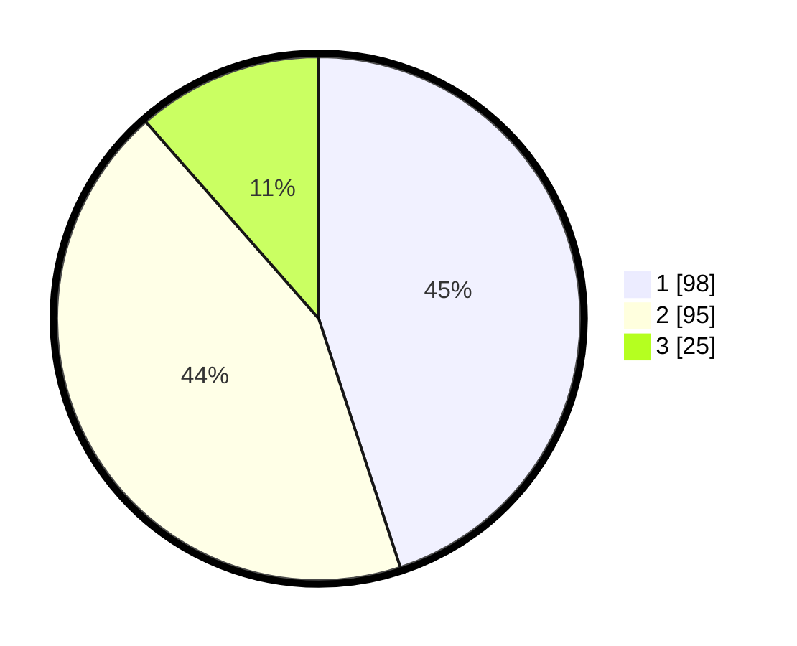

# Hasil

## Grafik

## Tabel

| No. | Nama Paslon    | Suara | Suara (raw) | Persentase |
|:--- |:-------------- | -----:| -----------:| ----------:|
| 1   | ANIES MUHAIMIN | 98    | [98][p-1]   | 44,95      |
| 2   | PRABOWO GIBRAN | 95    | [95][p-2]   | 43,58      |
| 3   | GANJAR MAHFUD  | 25    | [25][p-3]   | 11,47      |

[p-1]: https://github.com/gigit-pemilu/pemilu-2024/blob/main/pilpres/hitung-suara/sub/32-jawa-barat/sub/78-kota-tasikmalaya/sub/03-tawang/sub/1001-tawangsari/sub/006-tps/sub/paslon-1.txt
[p-2]: https://github.com/gigit-pemilu/pemilu-2024/blob/main/pilpres/hitung-suara/sub/32-jawa-barat/sub/78-kota-tasikmalaya/sub/03-tawang/sub/1001-tawangsari/sub/006-tps/sub/paslon-2.txt
[p-3]: https://github.com/gigit-pemilu/pemilu-2024/blob/main/pilpres/hitung-suara/sub/32-jawa-barat/sub/78-kota-tasikmalaya/sub/03-tawang/sub/1001-tawangsari/sub/006-tps/sub/paslon-3.txt

## Foto C Plano

https://sirekap-obj-formc.kpu.go.id/f08c/pemilu/ppwp/32/78/03/10/01/3278031001006-20240214-185214--ea90a2ac-b2b0-432f-be22-541ccbe4511c.jpg

https://sirekap-obj-formc.kpu.go.id/f08c/pemilu/ppwp/32/78/03/10/01/3278031001006-20240214-185306--13216c67-150d-4214-8287-09ed3f3d04a8.jpg

https://sirekap-obj-formc.kpu.go.id/f08c/pemilu/ppwp/32/78/03/10/01/3278031001006-20240214-185355--f6fc927e-8fd7-4035-a1b7-88fe5cdb04d5.jpg

## Metadata

| Key        | Value               |
| ---------- | ------------------- |
| Time Stamp | 2024-02-15 21:01:18 |

