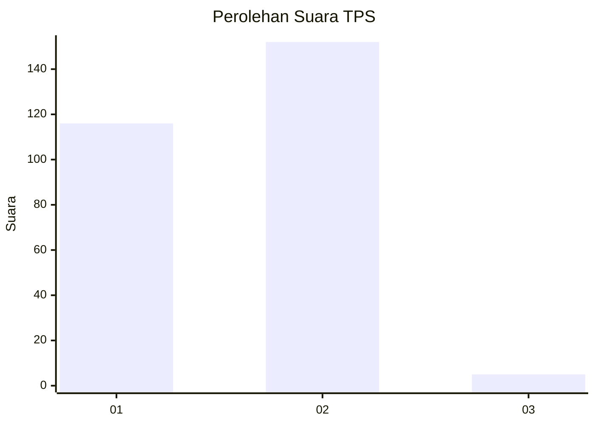
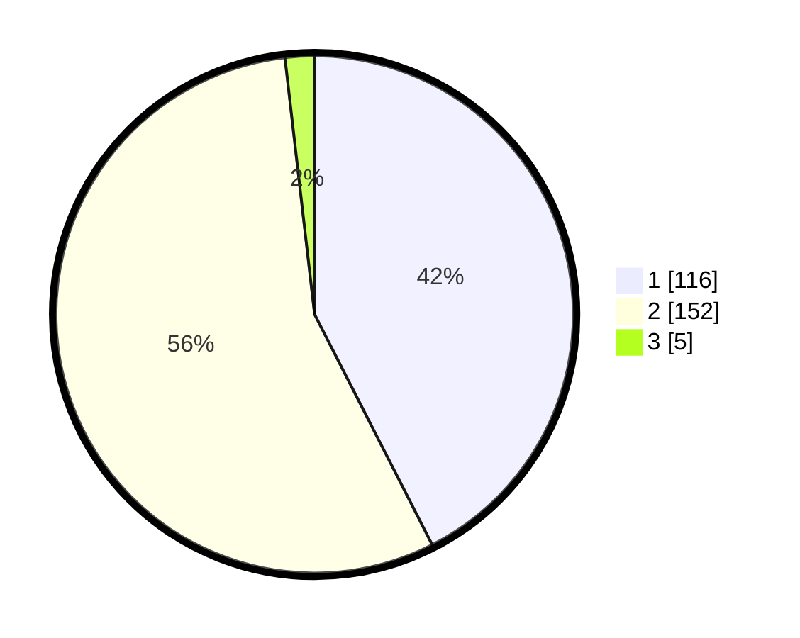

# Hasil

## Grafik

## Tabel

| No. | Nama Paslon    | Suara | Suara (raw) | Persentase |
|:--- |:-------------- | -----:| -----------:| ----------:|
| 1   | ANIES MUHAIMIN | 116   | [116][p-1]  | 42,49      |
| 2   | PRABOWO GIBRAN | 152   | [152][p-2]  | 55,68      |
| 3   | GANJAR MAHFUD  | 5     | [5][p-3]    | 1,83       |

[p-1]: https://github.com/gigit-pemilu/pemilu-2024-32-jawa-barat/blob/main/pilpres/hitung-suara/sub/32-jawa-barat/sub/78-kota-tasikmalaya/sub/03-tawang/sub/1004-cikalang/sub/006-tps/sub/paslon-1.txt
[p-2]: https://github.com/gigit-pemilu/pemilu-2024-32-jawa-barat/blob/main/pilpres/hitung-suara/sub/32-jawa-barat/sub/78-kota-tasikmalaya/sub/03-tawang/sub/1004-cikalang/sub/006-tps/sub/paslon-2.txt
[p-3]: https://github.com/gigit-pemilu/pemilu-2024-32-jawa-barat/blob/main/pilpres/hitung-suara/sub/32-jawa-barat/sub/78-kota-tasikmalaya/sub/03-tawang/sub/1004-cikalang/sub/006-tps/sub/paslon-3.txt

## Foto C Plano

https://sirekap-obj-formc.kpu.go.id/435e/pemilu/ppwp/32/78/03/10/04/3278031004006-20240215-033616--b758dcf9-bb69-49f1-8073-1e81e86b1a26.jpg

https://sirekap-obj-formc.kpu.go.id/435e/pemilu/ppwp/32/78/03/10/04/3278031004006-20240215-031547--f09e4553-4e0d-466d-915f-240395d4fce3.jpg

https://sirekap-obj-formc.kpu.go.id/435e/pemilu/ppwp/32/78/03/10/04/3278031004006-20240215-031809--4e9d935f-6681-4e8e-ab67-bd7342663b58.jpg

## Metadata

| Key        | Value               |
| ---------- | ------------------- |
| Time Stamp | 2024-02-20 16:00:00 |

