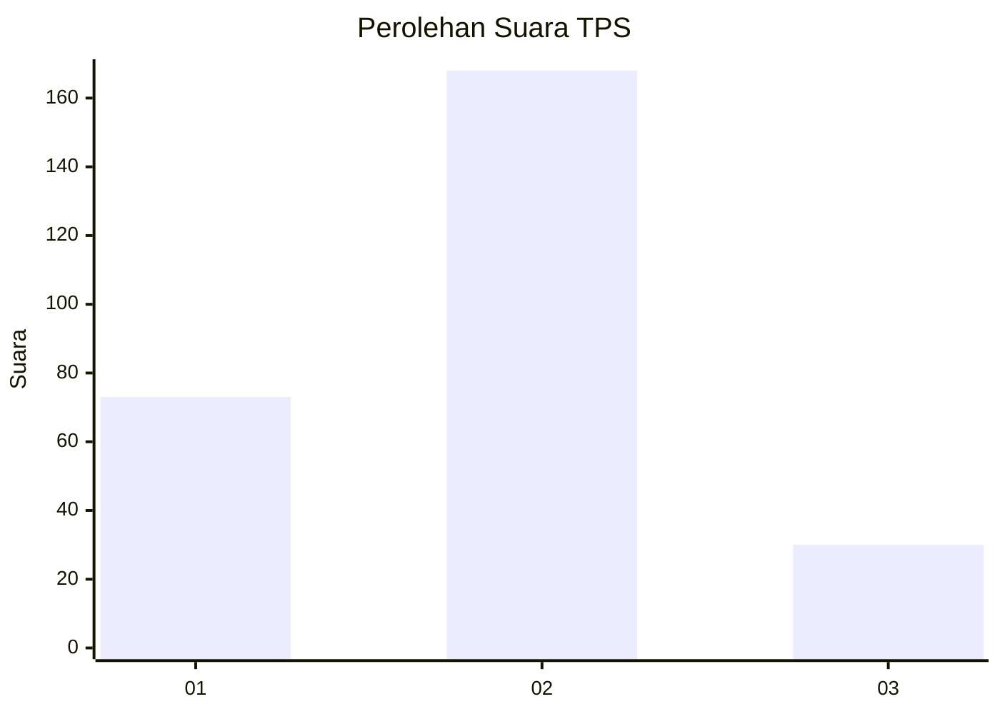
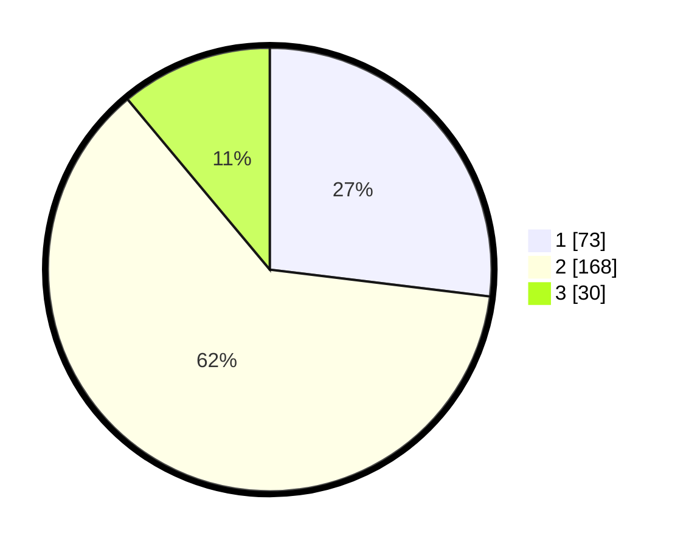

# Hasil

## Grafik

## Tabel

| No. | Nama Paslon    | Suara | Suara (raw) | Persentase |
|:--- |:-------------- | -----:| -----------:| ----------:|
| 1   | ANIES MUHAIMIN | 73    | [73][p-1]   | 26,94      |
| 2   | PRABOWO GIBRAN | 168   | [168][p-2]  | 61,99      |
| 3   | GANJAR MAHFUD  | 30    | [30][p-3]   | 11,07      |

[p-1]: https://github.com/gigit-pemilu/pemilu-2024/blob/main/pilpres/hitung-suara/sub/32-jawa-barat/sub/78-kota-tasikmalaya/sub/03-tawang/sub/1004-cikalang/sub/014-tps/sub/paslon-1.txt
[p-2]: https://github.com/gigit-pemilu/pemilu-2024/blob/main/pilpres/hitung-suara/sub/32-jawa-barat/sub/78-kota-tasikmalaya/sub/03-tawang/sub/1004-cikalang/sub/014-tps/sub/paslon-2.txt
[p-3]: https://github.com/gigit-pemilu/pemilu-2024/blob/main/pilpres/hitung-suara/sub/32-jawa-barat/sub/78-kota-tasikmalaya/sub/03-tawang/sub/1004-cikalang/sub/014-tps/sub/paslon-3.txt

## Foto C Plano

https://sirekap-obj-formc.kpu.go.id/837d/pemilu/ppwp/32/78/03/10/04/3278031004014-20240215-090806--b1103717-2c25-4bea-b689-230b5082ceba.jpg

https://sirekap-obj-formc.kpu.go.id/837d/pemilu/ppwp/32/78/03/10/04/3278031004014-20240215-091228--77838937-4768-4468-9ae9-1a43415b7fe2.jpg

https://sirekap-obj-formc.kpu.go.id/837d/pemilu/ppwp/32/78/03/10/04/3278031004014-20240215-091407--68e61496-8964-4329-97a0-93deabcc4a0f.jpg

## Metadata

| Key        | Value               |
| ---------- | ------------------- |
| Time Stamp | 2024-02-20 16:00:00 |

