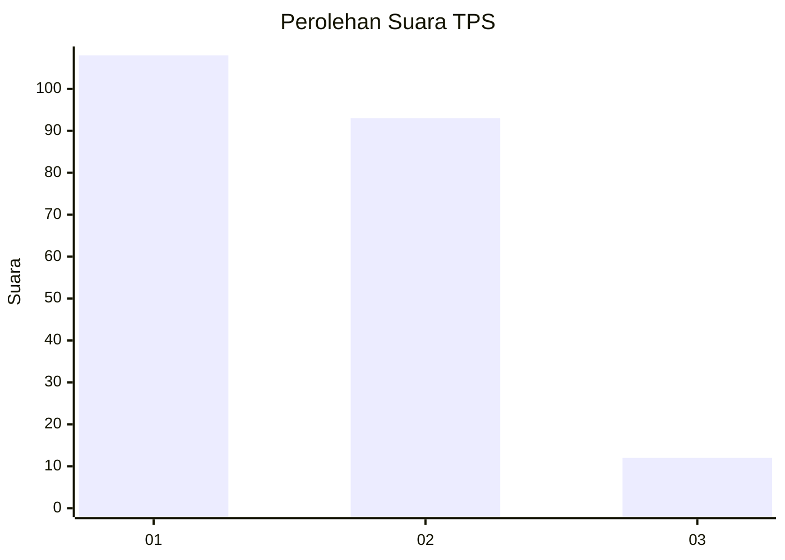
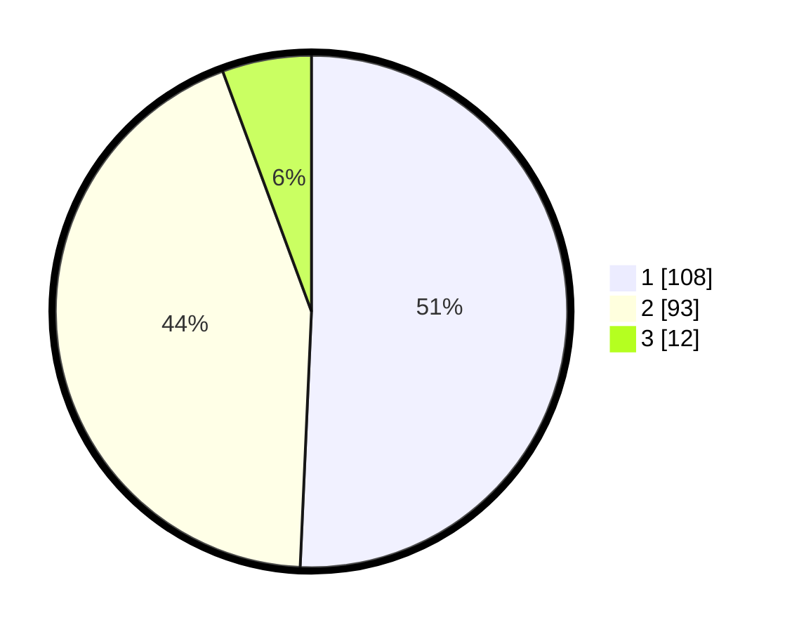

# Hasil

## Grafik

## Tabel

| No. | Nama Paslon    | Suara | Suara (raw) | Persentase |
|:--- |:-------------- | -----:| -----------:| ----------:|
| 1   | ANIES MUHAIMIN | 108   | [108][p-1]  | 50,70      |
| 2   | PRABOWO GIBRAN | 93    | [93][p-2]   | 43,66      |
| 3   | GANJAR MAHFUD  | 12    | [12][p-3]   | 5,63       |

[p-1]: https://github.com/gigit-pemilu/pemilu-2024-32-jawa-barat/blob/main/pilpres/hitung-suara/sub/32-jawa-barat/sub/78-kota-tasikmalaya/sub/04-indihiang/sub/1003-indihiang/sub/004-tps/sub/paslon-1.txt
[p-2]: https://github.com/gigit-pemilu/pemilu-2024-32-jawa-barat/blob/main/pilpres/hitung-suara/sub/32-jawa-barat/sub/78-kota-tasikmalaya/sub/04-indihiang/sub/1003-indihiang/sub/004-tps/sub/paslon-2.txt
[p-3]: https://github.com/gigit-pemilu/pemilu-2024-32-jawa-barat/blob/main/pilpres/hitung-suara/sub/32-jawa-barat/sub/78-kota-tasikmalaya/sub/04-indihiang/sub/1003-indihiang/sub/004-tps/sub/paslon-3.txt

## Foto C Plano

https://sirekap-obj-formc.kpu.go.id/db62/pemilu/ppwp/32/78/04/10/03/3278041003004-20240214-212413--1ba6f5c6-deda-4895-9a5b-fc6527d9c818.jpg

https://sirekap-obj-formc.kpu.go.id/db62/pemilu/ppwp/32/78/04/10/03/3278041003004-20240214-212727--6016e991-cbf3-4bf4-b0e2-d97604343302.jpg

https://sirekap-obj-formc.kpu.go.id/db62/pemilu/ppwp/32/78/04/10/03/3278041003004-20240214-212825--f1eee227-6202-485b-8f59-f2dbbe7b5282.jpg

## Metadata

| Key        | Value               |
| ---------- | ------------------- |
| Time Stamp | 2024-02-20 16:00:00 |

