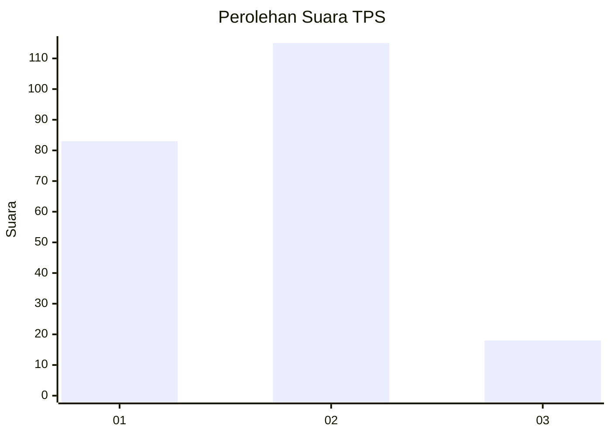
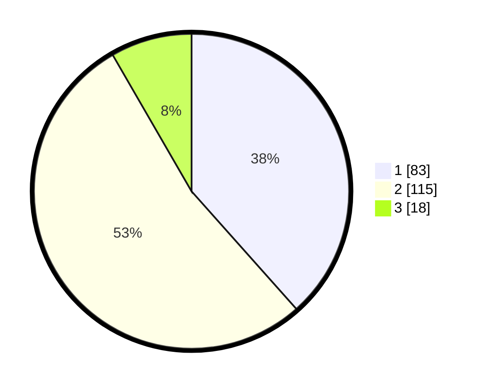

# Hasil

## Grafik

## Tabel

| No. | Nama Paslon    | Suara | Suara (raw) | Persentase |
|:--- |:-------------- | -----:| -----------:| ----------:|
| 1   | ANIES MUHAIMIN | 83    | [83][p-1]   | 38,43      |
| 2   | PRABOWO GIBRAN | 115   | [115][p-2]  | 53,24      |
| 3   | GANJAR MAHFUD  | 18    | [18][p-3]   | 8,33       |

[p-1]: https://github.com/gigit-pemilu/pemilu-2024-32-jawa-barat/blob/main/pilpres/hitung-suara/sub/32-jawa-barat/sub/78-kota-tasikmalaya/sub/04-indihiang/sub/1003-indihiang/sub/005-tps/sub/paslon-1.txt
[p-2]: https://github.com/gigit-pemilu/pemilu-2024-32-jawa-barat/blob/main/pilpres/hitung-suara/sub/32-jawa-barat/sub/78-kota-tasikmalaya/sub/04-indihiang/sub/1003-indihiang/sub/005-tps/sub/paslon-2.txt
[p-3]: https://github.com/gigit-pemilu/pemilu-2024-32-jawa-barat/blob/main/pilpres/hitung-suara/sub/32-jawa-barat/sub/78-kota-tasikmalaya/sub/04-indihiang/sub/1003-indihiang/sub/005-tps/sub/paslon-3.txt

## Foto C Plano

https://sirekap-obj-formc.kpu.go.id/1f5a/pemilu/ppwp/32/78/04/10/03/3278041003005-20240214-212903--1520af21-88dc-4103-9ea4-a2ef80902927.jpg

https://sirekap-obj-formc.kpu.go.id/1f5a/pemilu/ppwp/32/78/04/10/03/3278041003005-20240214-214542--f1e36cf4-90ae-4bdb-9ed8-c4ad97a19d62.jpg

https://sirekap-obj-formc.kpu.go.id/1f5a/pemilu/ppwp/32/78/04/10/03/3278041003005-20240214-175317--a882cad1-cd81-4bd2-9937-b05fb7ed3d2c.jpg

## Metadata

| Key        | Value               |
| ---------- | ------------------- |
| Time Stamp | 2024-02-20 15:00:00 |

