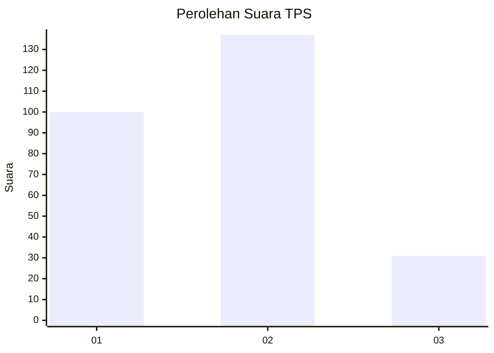
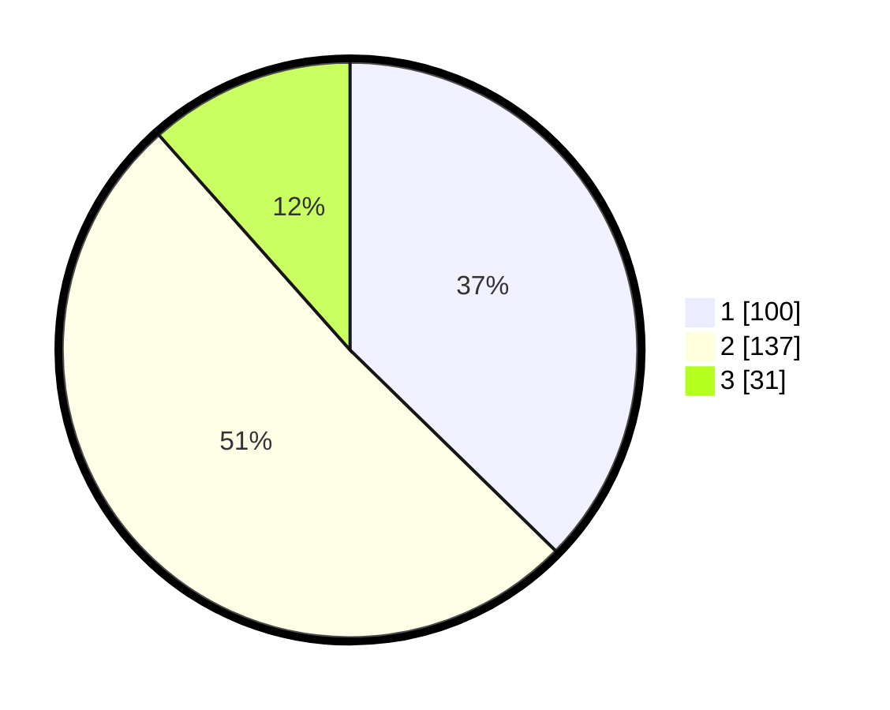

# Hasil

## Grafik

## Tabel

| No. | Nama Paslon    | Suara | Suara (raw) | Persentase |
|:--- |:-------------- | -----:| -----------:| ----------:|
| 1   | ANIES MUHAIMIN | 100   | [100][p-1]  | 37,31      |
| 2   | PRABOWO GIBRAN | 137   | [137][p-2]  | 51,12      |
| 3   | GANJAR MAHFUD  | 31    | [31][p-3]   | 11,57      |

[p-1]: https://github.com/gigit-pemilu/pemilu-2024-32-jawa-barat/blob/main/pilpres/hitung-suara/sub/32-jawa-barat/sub/78-kota-tasikmalaya/sub/04-indihiang/sub/1005-parakannyasag/sub/015-tps/sub/paslon-1.txt
[p-2]: https://github.com/gigit-pemilu/pemilu-2024-32-jawa-barat/blob/main/pilpres/hitung-suara/sub/32-jawa-barat/sub/78-kota-tasikmalaya/sub/04-indihiang/sub/1005-parakannyasag/sub/015-tps/sub/paslon-2.txt
[p-3]: https://github.com/gigit-pemilu/pemilu-2024-32-jawa-barat/blob/main/pilpres/hitung-suara/sub/32-jawa-barat/sub/78-kota-tasikmalaya/sub/04-indihiang/sub/1005-parakannyasag/sub/015-tps/sub/paslon-3.txt

## Foto C Plano

https://sirekap-obj-formc.kpu.go.id/571f/pemilu/ppwp/32/78/04/10/05/3278041005015-20240214-234005--88007d1d-3a31-4c3a-96be-743f960f1f11.jpg

https://sirekap-obj-formc.kpu.go.id/571f/pemilu/ppwp/32/78/04/10/05/3278041005015-20240215-051948--e3476668-0e42-4596-aaeb-61f198567302.jpg

https://sirekap-obj-formc.kpu.go.id/571f/pemilu/ppwp/32/78/04/10/05/3278041005015-20240215-025104--5872111b-5b9d-4308-95b0-035e13c838f7.jpg

## Metadata

| Key        | Value               |
| ---------- | ------------------- |
| Time Stamp | 2024-02-20 15:00:00 |

