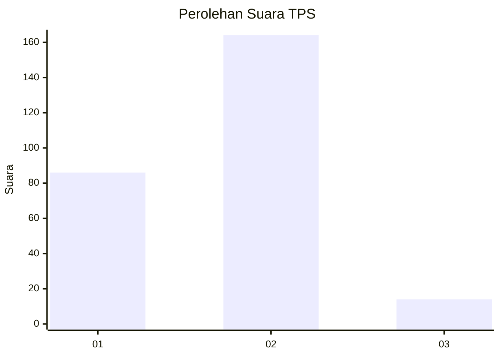
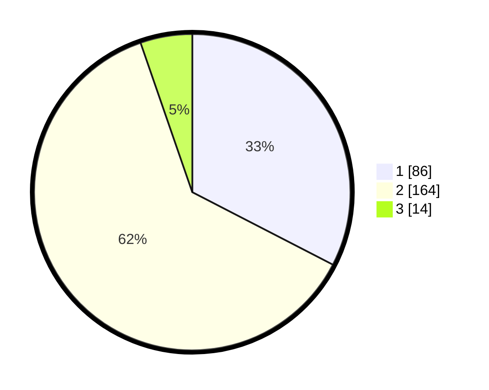

# Hasil

## Grafik

## Tabel

| No. | Nama Paslon    | Suara | Suara (raw) | Persentase |
|:--- |:-------------- | -----:| -----------:| ----------:|
| 1   | ANIES MUHAIMIN | 86    | [86][p-1]   | 32,58      |
| 2   | PRABOWO GIBRAN | 164   | [164][p-2]  | 62,12      |
| 3   | GANJAR MAHFUD  | 14    | [14][p-3]   | 5,30       |

[p-1]: https://github.com/gigit-pemilu/pemilu-2024-32-jawa-barat/blob/main/pilpres/hitung-suara/sub/32-jawa-barat/sub/78-kota-tasikmalaya/sub/05-kawalu/sub/1001-kersamenak/sub/027-tps/sub/paslon-1.txt
[p-2]: https://github.com/gigit-pemilu/pemilu-2024-32-jawa-barat/blob/main/pilpres/hitung-suara/sub/32-jawa-barat/sub/78-kota-tasikmalaya/sub/05-kawalu/sub/1001-kersamenak/sub/027-tps/sub/paslon-2.txt
[p-3]: https://github.com/gigit-pemilu/pemilu-2024-32-jawa-barat/blob/main/pilpres/hitung-suara/sub/32-jawa-barat/sub/78-kota-tasikmalaya/sub/05-kawalu/sub/1001-kersamenak/sub/027-tps/sub/paslon-3.txt

## Foto C Plano

https://sirekap-obj-formc.kpu.go.id/71dd/pemilu/ppwp/32/78/05/10/01/3278051001027-20240215-072114--2183fe40-2eb2-4480-8425-7e9feda56cba.jpg

https://sirekap-obj-formc.kpu.go.id/71dd/pemilu/ppwp/32/78/05/10/01/3278051001027-20240215-072145--8d06d92a-eeef-4b31-9a5b-320df83d0b85.jpg

https://sirekap-obj-formc.kpu.go.id/71dd/pemilu/ppwp/32/78/05/10/01/3278051001027-20240215-011753--b73c5a03-ad08-40f4-b7d9-451ed0857f0d.jpg

## Metadata

| Key        | Value               |
| ---------- | ------------------- |
| Time Stamp | 2024-02-20 15:00:00 |

