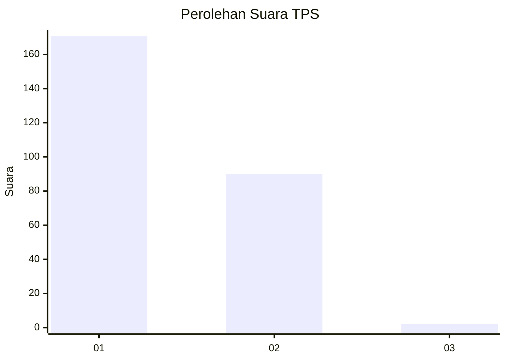
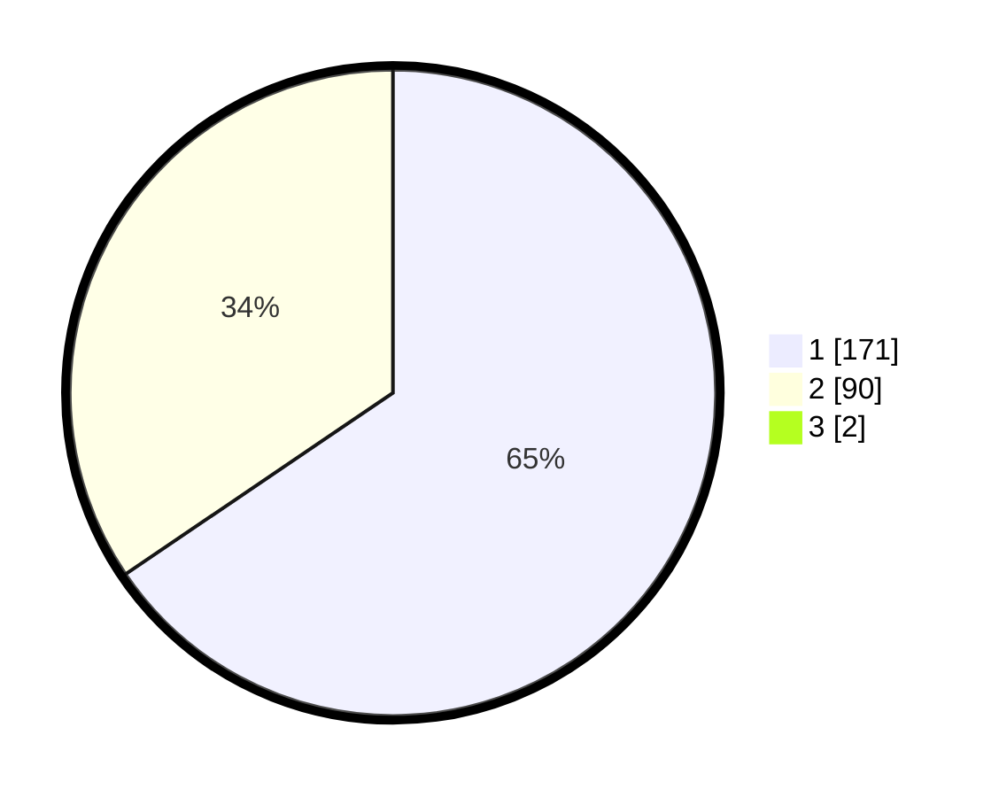

# Hasil

## Grafik

## Tabel

| No. | Nama Paslon    | Suara | Suara (raw) | Persentase |
|:--- |:-------------- | -----:| -----------:| ----------:|
| 1   | ANIES MUHAIMIN | 171   | [171][p-1]  | 65,02      |
| 2   | PRABOWO GIBRAN | 90    | [90][p-2]   | 34,22      |
| 3   | GANJAR MAHFUD  | 2     | [2][p-3]    | 0,76       |

[p-1]: https://github.com/gigit-pemilu/pemilu-2024/blob/main/pilpres/hitung-suara/sub/32-jawa-barat/sub/78-kota-tasikmalaya/sub/05-kawalu/sub/1002-cilamajang/sub/011-tps/sub/paslon-1.txt
[p-2]: https://github.com/gigit-pemilu/pemilu-2024/blob/main/pilpres/hitung-suara/sub/32-jawa-barat/sub/78-kota-tasikmalaya/sub/05-kawalu/sub/1002-cilamajang/sub/011-tps/sub/paslon-2.txt
[p-3]: https://github.com/gigit-pemilu/pemilu-2024/blob/main/pilpres/hitung-suara/sub/32-jawa-barat/sub/78-kota-tasikmalaya/sub/05-kawalu/sub/1002-cilamajang/sub/011-tps/sub/paslon-3.txt

## Foto C Plano

https://sirekap-obj-formc.kpu.go.id/20cb/pemilu/ppwp/32/78/05/10/02/3278051002011-20240215-073405--f546d559-a9c1-4bba-a83d-ce8662f24cca.jpg

https://sirekap-obj-formc.kpu.go.id/20cb/pemilu/ppwp/32/78/05/10/02/3278051002011-20240215-073640--35d2d75c-093a-49c9-a9d4-0f8541b7e28f.jpg

https://sirekap-obj-formc.kpu.go.id/20cb/pemilu/ppwp/32/78/05/10/02/3278051002011-20240215-075052--f30539d4-d237-4068-abef-6a4aaa43a592.jpg

## Metadata

| Key        | Value               |
| ---------- | ------------------- |
| Time Stamp | 2024-02-20 15:00:00 |

