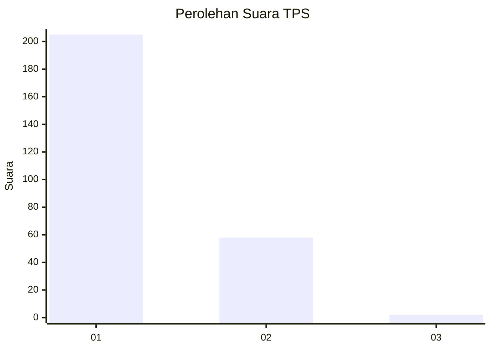
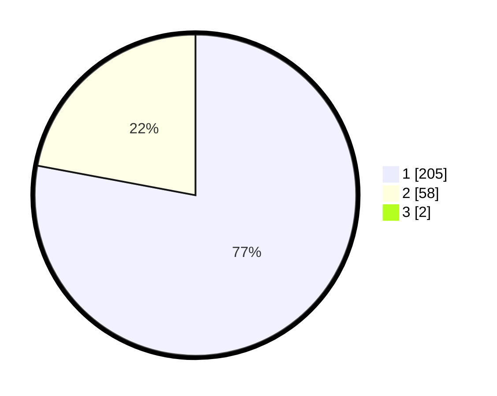

# Hasil

## Grafik

## Tabel

| No. | Nama Paslon    | Suara | Suara (raw) | Persentase |
|:--- |:-------------- | -----:| -----------:| ----------:|
| 1   | ANIES MUHAIMIN | 205   | [205][p-1]  | 77,36      |
| 2   | PRABOWO GIBRAN | 58    | [58][p-2]   | 21,89      |
| 3   | GANJAR MAHFUD  | 2     | [2][p-3]    | 0,75       |

[p-1]: https://github.com/gigit-pemilu/pemilu-2024/blob/main/pilpres/hitung-suara/sub/32-jawa-barat/sub/78-kota-tasikmalaya/sub/05-kawalu/sub/1002-cilamajang/sub/016-tps/sub/paslon-1.txt
[p-2]: https://github.com/gigit-pemilu/pemilu-2024/blob/main/pilpres/hitung-suara/sub/32-jawa-barat/sub/78-kota-tasikmalaya/sub/05-kawalu/sub/1002-cilamajang/sub/016-tps/sub/paslon-2.txt
[p-3]: https://github.com/gigit-pemilu/pemilu-2024/blob/main/pilpres/hitung-suara/sub/32-jawa-barat/sub/78-kota-tasikmalaya/sub/05-kawalu/sub/1002-cilamajang/sub/016-tps/sub/paslon-3.txt

## Foto C Plano

https://sirekap-obj-formc.kpu.go.id/fbf7/pemilu/ppwp/32/78/05/10/02/3278051002016-20240215-071838--f6b8501b-1946-422a-9654-863e052c581f.jpg

https://sirekap-obj-formc.kpu.go.id/fbf7/pemilu/ppwp/32/78/05/10/02/3278051002016-20240215-072100--d5d3fbe7-c04c-430e-bb75-0380666d8dca.jpg

https://sirekap-obj-formc.kpu.go.id/fbf7/pemilu/ppwp/32/78/05/10/02/3278051002016-20240215-072216--be05b7e8-7b56-434b-8274-e8fcd6e9bf36.jpg

## Metadata

| Key        | Value               |
| ---------- | ------------------- |
| Time Stamp | 2024-02-20 17:00:00 |

