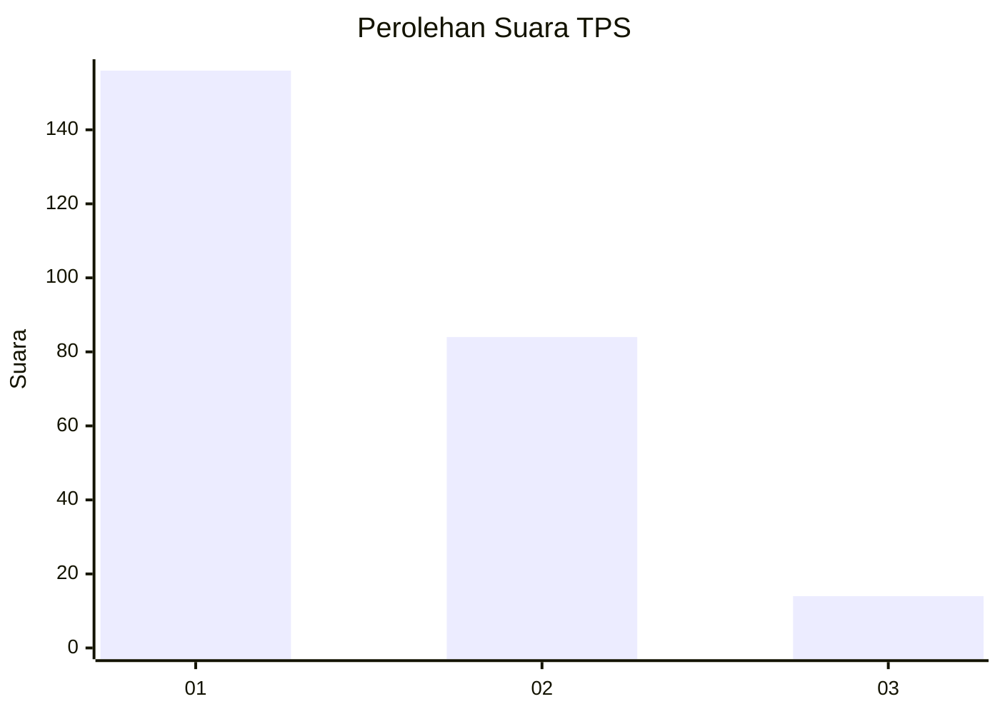
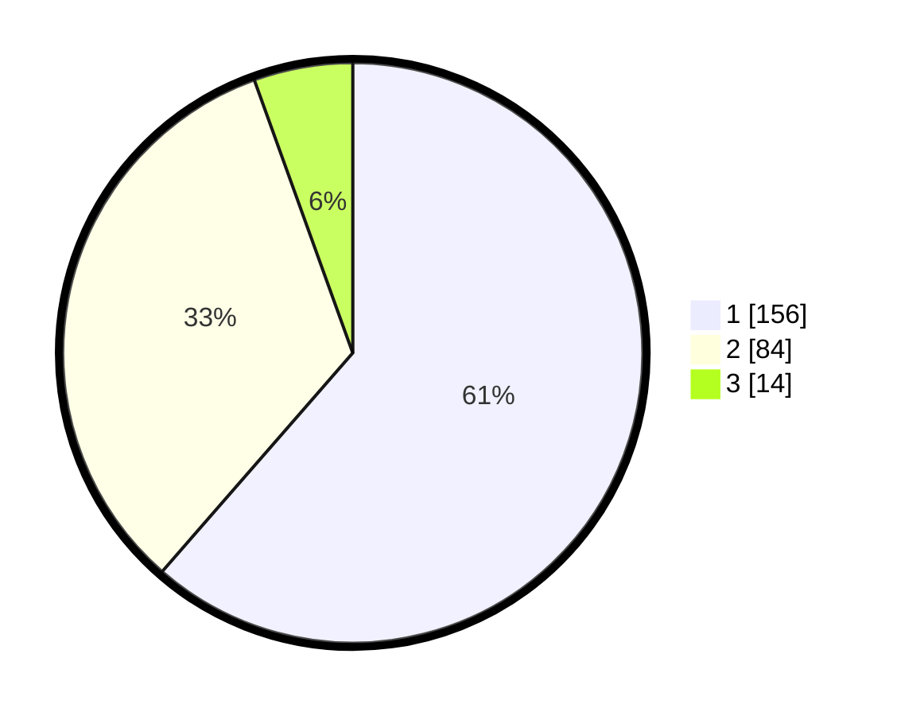

# Hasil

## Grafik

## Tabel

| No. | Nama Paslon    | Suara | Suara (raw) | Persentase |
|:--- |:-------------- | -----:| -----------:| ----------:|
| 1   | ANIES MUHAIMIN | 156   | [156][p-1]  | 61,42      |
| 2   | PRABOWO GIBRAN | 84    | [84][p-2]   | 33,07      |
| 3   | GANJAR MAHFUD  | 14    | [14][p-3]   | 5,51       |

[p-1]: https://github.com/gigit-pemilu/pemilu-2024-32-jawa-barat/blob/main/pilpres/hitung-suara/sub/32-jawa-barat/sub/78-kota-tasikmalaya/sub/05-kawalu/sub/1005-tanjung/sub/001-tps/sub/paslon-1.txt
[p-2]: https://github.com/gigit-pemilu/pemilu-2024-32-jawa-barat/blob/main/pilpres/hitung-suara/sub/32-jawa-barat/sub/78-kota-tasikmalaya/sub/05-kawalu/sub/1005-tanjung/sub/001-tps/sub/paslon-2.txt
[p-3]: https://github.com/gigit-pemilu/pemilu-2024-32-jawa-barat/blob/main/pilpres/hitung-suara/sub/32-jawa-barat/sub/78-kota-tasikmalaya/sub/05-kawalu/sub/1005-tanjung/sub/001-tps/sub/paslon-3.txt

## Foto C Plano

https://sirekap-obj-formc.kpu.go.id/f324/pemilu/ppwp/32/78/05/10/05/3278051005001-20240215-033754--bb09d1cb-74bf-453e-9582-8ea0f0d87fc0.jpg

https://sirekap-obj-formc.kpu.go.id/f324/pemilu/ppwp/32/78/05/10/05/3278051005001-20240215-034006--45f056d6-2d8d-4691-95f2-e1cbaead73fb.jpg

https://sirekap-obj-formc.kpu.go.id/f324/pemilu/ppwp/32/78/05/10/05/3278051005001-20240215-034128--e790b1ca-684c-4727-952c-b563ac87fa21.jpg

## Metadata

| Key        | Value               |
| ---------- | ------------------- |
| Time Stamp | 2024-02-20 15:00:00 |

