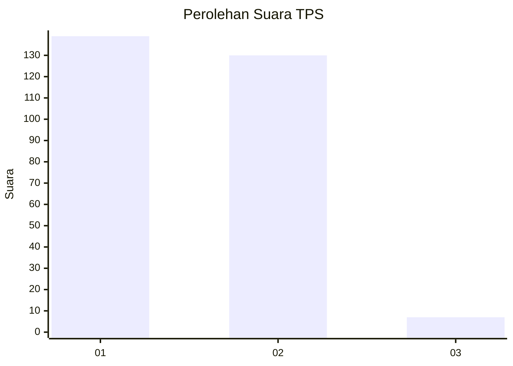
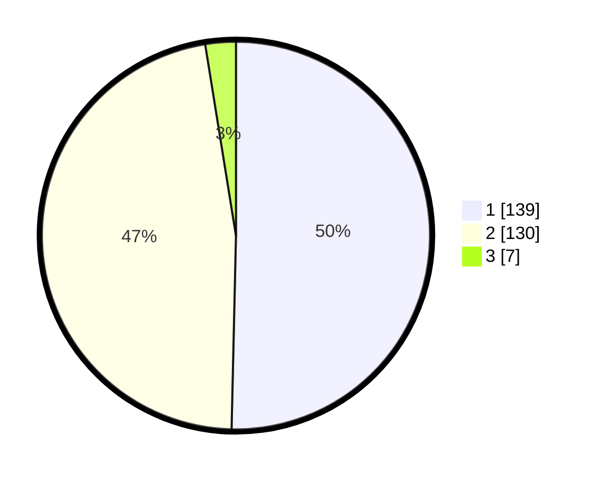

# Hasil

## Grafik

## Tabel

| No. | Nama Paslon    | Suara | Suara (raw) | Persentase |
|:--- |:-------------- | -----:| -----------:| ----------:|
| 1   | ANIES MUHAIMIN | 139   | [139][p-1]  | 50,36      |
| 2   | PRABOWO GIBRAN | 130   | [130][p-2]  | 47,10      |
| 3   | GANJAR MAHFUD  | 7     | [7][p-3]    | 2,54       |

[p-1]: https://github.com/gigit-pemilu/pemilu-2024/blob/main/pilpres/hitung-suara/sub/32-jawa-barat/sub/78-kota-tasikmalaya/sub/05-kawalu/sub/1006-cibeuti/sub/019-tps/sub/paslon-1.txt
[p-2]: https://github.com/gigit-pemilu/pemilu-2024/blob/main/pilpres/hitung-suara/sub/32-jawa-barat/sub/78-kota-tasikmalaya/sub/05-kawalu/sub/1006-cibeuti/sub/019-tps/sub/paslon-2.txt
[p-3]: https://github.com/gigit-pemilu/pemilu-2024/blob/main/pilpres/hitung-suara/sub/32-jawa-barat/sub/78-kota-tasikmalaya/sub/05-kawalu/sub/1006-cibeuti/sub/019-tps/sub/paslon-3.txt

## Foto C Plano

https://sirekap-obj-formc.kpu.go.id/1689/pemilu/ppwp/32/78/05/10/06/3278051006019-20240215-160415--8550cf68-5dc5-4301-9318-50ad248d5821.jpg

https://sirekap-obj-formc.kpu.go.id/1689/pemilu/ppwp/32/78/05/10/06/3278051006019-20240215-154638--73909534-45f0-4a4d-b123-0c4f26734da0.jpg

https://sirekap-obj-formc.kpu.go.id/1689/pemilu/ppwp/32/78/05/10/06/3278051006019-20240215-140102--a1122b10-a085-46cd-a574-6f9994bc3e0e.jpg

## Metadata

| Key        | Value               |
| ---------- | ------------------- |
| Time Stamp | 2024-02-20 17:00:00 |

