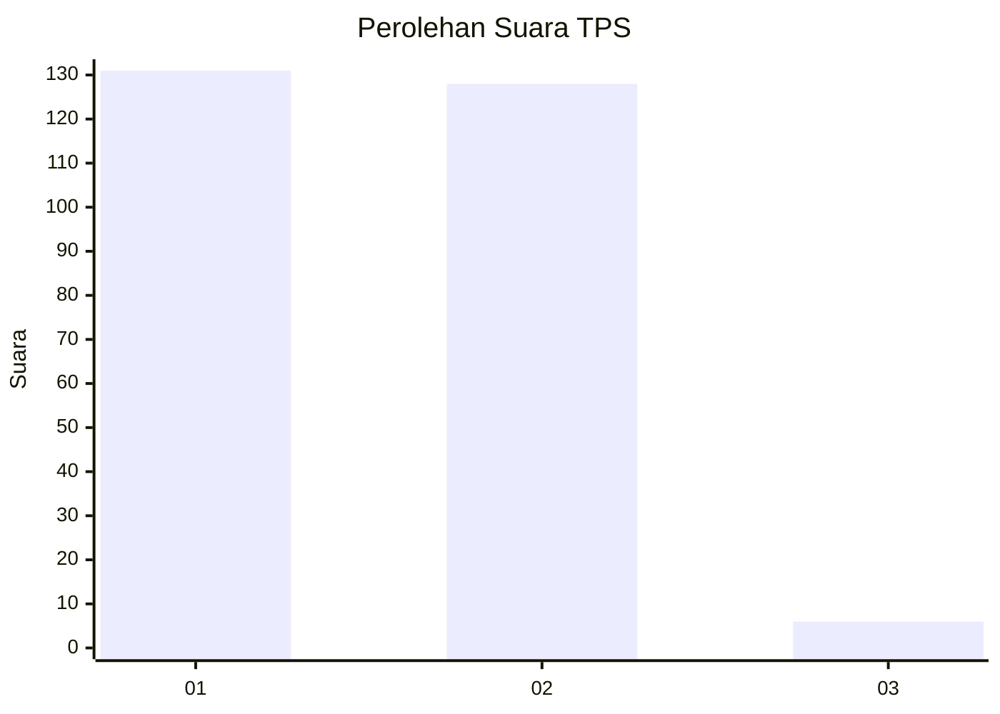
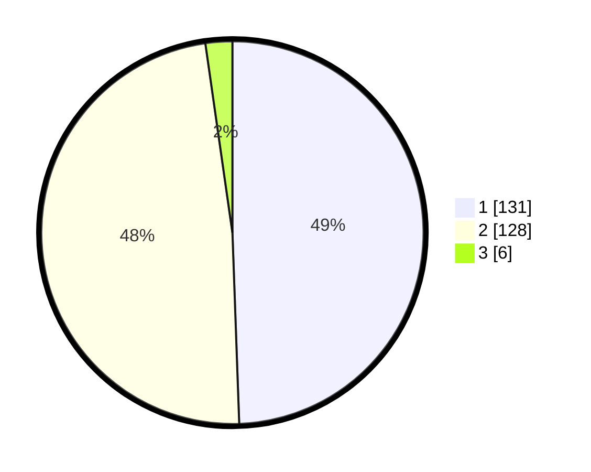

# Hasil

## Grafik

## Tabel

| No. | Nama Paslon    | Suara | Suara (raw) | Persentase |
|:--- |:-------------- | -----:| -----------:| ----------:|
| 1   | ANIES MUHAIMIN | 131   | [131][p-1]  | 49,43      |
| 2   | PRABOWO GIBRAN | 128   | [128][p-2]  | 48,30      |
| 3   | GANJAR MAHFUD  | 6     | [6][p-3]    | 2,26       |

[p-1]: https://github.com/gigit-pemilu/pemilu-2024/blob/main/pilpres/hitung-suara/sub/32-jawa-barat/sub/78-kota-tasikmalaya/sub/05-kawalu/sub/1008-talagasari/sub/008-tps/sub/paslon-1.txt
[p-2]: https://github.com/gigit-pemilu/pemilu-2024/blob/main/pilpres/hitung-suara/sub/32-jawa-barat/sub/78-kota-tasikmalaya/sub/05-kawalu/sub/1008-talagasari/sub/008-tps/sub/paslon-2.txt
[p-3]: https://github.com/gigit-pemilu/pemilu-2024/blob/main/pilpres/hitung-suara/sub/32-jawa-barat/sub/78-kota-tasikmalaya/sub/05-kawalu/sub/1008-talagasari/sub/008-tps/sub/paslon-3.txt

## Foto C Plano

https://sirekap-obj-formc.kpu.go.id/2656/pemilu/ppwp/32/78/05/10/08/3278051008008-20240214-210426--628a7bd0-fb72-44af-ac42-aa353588f8e2.jpg

https://sirekap-obj-formc.kpu.go.id/2656/pemilu/ppwp/32/78/05/10/08/3278051008008-20240214-211114--39919df9-575b-4a79-8ed2-c3701b6ba673.jpg

https://sirekap-obj-formc.kpu.go.id/2656/pemilu/ppwp/32/78/05/10/08/3278051008008-20240215-151852--cbcb7acc-adab-48bf-9c76-30b7a9a0c778.jpg

## Metadata

| Key        | Value               |
| ---------- | ------------------- |
| Time Stamp | 2024-02-15 21:01:18 |

